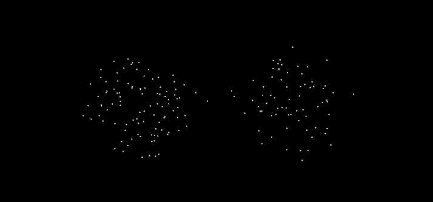
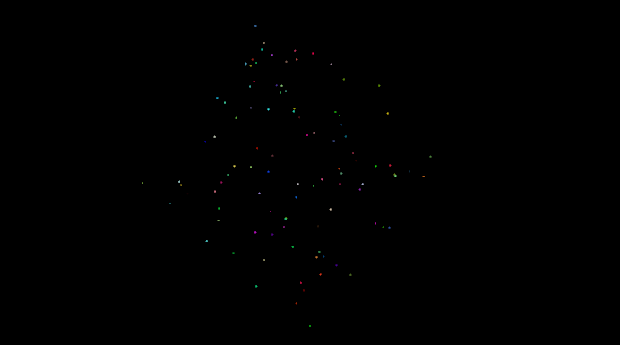

# PCD文件格式

本文档描述PCD(点云数据)文件格式，以及它在点云库(PCL)中的使用方式。

## 为什么要使用新的文件格式？

PCD 文件格式并不是要重新发明轮子，而是为了补充由于某种原因不支持/不支持 PCL 为 nD 点云处理带来的某些扩展的现有文件格式。

PCD 不是第一种支持 3D 点云数据的文件类型。尤其是计算机图形学和计算几何学社区，已经创建了多种格式来描述使用激光扫描仪获取的任意多边形和点云。其中一些格式包括：

- [PLY](http://en.wikipedia.org/wiki/PLY_(file_format)) - 一种多边形文件格式，由 Turk 等人在斯坦福大学开发
- [STL](http://en.wikipedia.org/wiki/STL_(file_format)) - 3D Systems 创建的立体光刻 CAD 软件的原生文件格式
- [OBJ](http://en.wikipedia.org/wiki/Wavefront_.obj_file) - 一种由 Wavefront Technologies 首次开发的几何定义文件格式
- [X3D](http://en.wikipedia.org/wiki/X3D) - 用于表示 3D 计算机图形数据的 ISO 标准基于 XML 的文件格式
- [其他格式](http://en.wikipedia.org/wiki/Category:Graphics_file_formats)

所有上述文件格式都有几个缺点，如下一节所述——这是很自然的，因为它们是在今天的传感技术和算法发明之前，为不同的目的在不同的时间创建的，。

## PCD 版本

在点云库 (PCL) 1.0 版发布之前，PCD 文件格式可能具有不同的修订号。它们用 PCD_Vx 编号（例如，PCD_V5、PCD_V6、PCD_V7 等）并代表 PCD 文件的版本号 0.x。

然而，PCL 中 PCD 文件格式的官方入口点应该是版本**0.7 (PCD_V7)**。

## 文件格式头

每个 PCD 文件都包含一个标头，用于标识和声明存储在文件中的点云数据的某些属性。PCD 的标头必须以 ASCII 编码。

> note:
>
> PCD 文件中指定的每个标题条目以及 ascii 点数据（见下文）使用新行 (\n) 分隔。

从 0.7 版开始，PCD 标头包含以下条目：

- **VERSION** - 指定 PCD 文件版本

- **FIELDS** - 指定点可以具有的每个维度/字段的名称。例子：

  ```
  FIELDS x y z                                # XYZ data
  FIELDS x y z rgb                            # XYZ + colors
  FIELDS x y z normal_x normal_y normal_z     # XYZ + surface normals
  FIELDS j1 j2 j3                             # moment invariants
  ...
  ```

- **SIZE** - 以字节为单位指定每个维度的大小。例子：

  - *无符号字符*/*字符*有 1 个字节
  - *unsigned short* / *short*有 2 个字节
  - *unsigned int* / *int* / *float*有 4 个字节
  - *double*有 8 个字节

- **TYPE** - 将每个维度的类型指定为字符。当前接受的类型是：

  - **I** - 表示有符号类型 int8 ( *char* )、int16 ( *short* ) 和 int32 ( *int* )
  - **U** - 代表无符号类型 uint8 ( *unsigned char* ), uint16 ( *unsigned short* ), uint32 ( *unsigned int* )
  - **F** - 代表浮点类型

- **COUNT** - 指定每个维度有多少个元素。例如，*x*数据通常有 1 个元素，但像*VFH*这样的特征描述符 有 308 个。基本上这是一种在每个点引入 nD 直方图描述符并将它们视为单个连续内存块的方法。默认情况下，如果*COUNT*不存在，则所有维度的计数都设置为 1。

- **WIDTH** - 以点数指定点云数据集的宽度。*宽度*有两个含义：

  - 它可以为无组织的数据集指定云中的总点数（等于**POINTS，**见下文）；
  - 它可以指定有组织的点云数据集的宽度（一行中的总点数）。

  另见**HEIGHT**。

  > note:
  >
  > 一个**有组织的点云**数据集是赋予类似于一个有组织的图像（或矩阵）状的结构，其中，数据被划分为行和列的点云的名称。此类点云的示例包括来自立体相机或飞行时间相机的数据。有组织的数据集的优点在于，通过了解相邻点（例如像素）之间的关系，最近邻操作的效率要高得多，从而加快了计算速度并降低了 PCL 中某些算法的成本。

  

  例子：

  ```
  WIDTH 640     # there are 640 points per line
  ```

- **HEIGHT** - 以点数指定点云数据集的高度。*高度*有两个含义：

  - 它可以指定一个有组织的点云数据集的高度（总行数）；
  - 对于无组织的数据集，它设置为**1**（*因此用于检查数据集是否有组织*）。

  例子：

  ```
  WIDTH 640       # Image-like organized structure, with 480 rows and 640 columns,
  HEIGHT 480      # thus 640*480=307200 points total in the dataset
  ```

  例子：

  ```
  WIDTH 307200
  HEIGHT 1        # unorganized point cloud dataset with 307200 points
  ```

- **VIEWPOINT** - 指定数据集中点的采集视点。这可能会在以后用于构建不同坐标系之间的变换，或用于帮助需要一致方向的表面法线等特征。

  视点信息被指定为平移（tx ty tz）+四元数（qw qx qy qz）。默认值为：

  ```
  VIEWPOINT 0 0 0 1 0 0 0
  ```

- **POINTS** - 指定云中的总点数。从 0.7 版本开始，它的用途有点多余，因此我们希望在未来的版本中将其删除。

  例子：

  ```
  POINTS 307200   # the total number of points in the cloud
  ```

- **DATA** - 指定存储点云数据的数据类型。从 0.7 版本开始，支持两种数据类型：*ascii*和*binary*。有关更多详细信息，请参阅下一节。

> note:
>
> 标题最后一行 ( **DATA** )之后的下一个字节被视为点云数据的一部分，并将被解释为这样。


>  警告:
>
> 必须按照上述顺序**精确**指定标题条目，即：
>
> ```bash
> VERSION
> FIELDS
> SIZE
> TYPE
> COUNT
> WIDTH
> HEIGHT
> VIEWPOINT
> POINTS
> DATA
> ```

## 数据存储类型

从 0.7 版本开始，**.PCD**文件格式使用两种不同的数据存储模式：

- 以**ASCII**格式，每个点都在一个新行上：

  ```
  p_1
  p_2
  p_3
  p_4
  ...
  
  p_n
  ```

>  注意：从 PCL 1.0.1 版开始，NaN 的字符串表示为“nan”。

- 以**二进制**形式，其中数据是pcl::PointCloud.points数组/向量的完整内存副本 。在 Linux 系统上，我们使用mmap / munmap 操作来实现对数据的最快读/写访问。

以简单的 ascii 格式存储点云数据，其中每个点在一行、空格或制表符上分开，上面没有任何其他字符，以及以二进制转储格式存储，使我们能够两全其美：简单性和速度，取决于底层应用程序。ascii 格式允许用户打开点云文件并使用gnuplot等标准软件工具绘制它们 或使用sed、awk等工具操作它们。

## 优于其他文件格式

将 PCD 作为（另一种）文件格式可以看作是 PCL 遭受了未发明在这里综合症。实际上，情况并非如此，因为上述文件格式都没有提供 PCD 文件的灵活性和速度。一些明确说明的优势包括：

- 存储和处理有组织的点云数据集的能力——这对于实时应用和研究领域（如增强现实、机器人技术等）极为重要；
- 二进制mmap / munmap数据类型是将数据加载和保存到磁盘的最快方法。
- 存储不同的数据类型（支持的所有原始类型：char、short、int、float、double）允许点云数据在存储和处理方面灵活高效。无效的点维度通常存储为 NAN 类型。
- 特征描述符的 nD 直方图——对于 3D 感知/计算机视觉应用非常重要

另一个优点是，通过控制文件格式，我们可以最好地将其适应 PCL，从而获得相对于 PCL 应用程序的最高性能，而不是将不同的文件格式适应 PCL 作为本机类型并通过转换引入额外的延迟职能。

> 注意：
>
> 尽管 PCD（点云数据）是PCL 中的*原生*文件格式，但 pcl_io库也应该提供以上述所有其他文件格式保存和加载数据的可能性。

## 例子

下面附上PCD文件的一个片段。它留给读者去解释数据并了解它的含义。:玩得开心!：

```python
# .PCD v.7 - Point Cloud Data file format
VERSION .7
FIELDS x y z rgb
SIZE 4 4 4 4
TYPE F F F F
COUNT 1 1 1 1
WIDTH 213
HEIGHT 1
VIEWPOINT 0 0 0 1 0 0 0
POINTS 213
DATA ascii
0.93773 0.33763 0 4.2108e+06
0.90805 0.35641 0 4.2108e+06
0.81915 0.32 0 4.2108e+06
0.97192 0.278 0 4.2108e+06
0.944 0.29474 0 4.2108e+06
0.98111 0.24247 0 4.2108e+06
0.93655 0.26143 0 4.2108e+06
0.91631 0.27442 0 4.2108e+06
0.81921 0.29315 0 4.2108e+06
0.90701 0.24109 0 4.2108e+06
0.83239 0.23398 0 4.2108e+06
0.99185 0.2116 0 4.2108e+06
0.89264 0.21174 0 4.2108e+06
0.85082 0.21212 0 4.2108e+06
0.81044 0.32222 0 4.2108e+06
0.74459 0.32192 0 4.2108e+06
0.69927 0.32278 0 4.2108e+06
0.8102 0.29315 0 4.2108e+06
0.75504 0.29765 0 4.2108e+06
0.8102 0.24399 0 4.2108e+06
0.74995 0.24723 0 4.2108e+06
0.68049 0.29768 0 4.2108e+06
0.66509 0.29002 0 4.2108e+06
0.69441 0.2526 0 4.2108e+06
0.62807 0.22187 0 4.2108e+06
0.58706 0.32199 0 4.2108e+06
0.52125 0.31955 0 4.2108e+06
0.49351 0.32282 0 4.2108e+06
0.44313 0.32169 0 4.2108e+06
0.58678 0.2929 0 4.2108e+06
0.53436 0.29164 0 4.2108e+06
0.59308 0.24134 0 4.2108e+06
0.5357 0.2444 0 4.2108e+06
0.50043 0.31235 0 4.2108e+06
0.44107 0.29711 0 4.2108e+06
0.50727 0.22193 0 4.2108e+06
0.43957 0.23976 0 4.2108e+06
0.8105 0.21112 0 4.2108e+06
0.73555 0.2114 0 4.2108e+06
0.69907 0.21082 0 4.2108e+06
0.63327 0.21154 0 4.2108e+06
0.59165 0.21201 0 4.2108e+06
0.52477 0.21491 0 4.2108e+06
0.49375 0.21006 0 4.2108e+06
0.4384 0.19632 0 4.2108e+06
0.43425 0.16052 0 4.2108e+06
0.3787 0.32173 0 4.2108e+06
0.33444 0.3216 0 4.2108e+06
0.23815 0.32199 0 4.808e+06
0.3788 0.29315 0 4.2108e+06
0.33058 0.31073 0 4.2108e+06
0.3788 0.24399 0 4.2108e+06
0.30249 0.29189 0 4.2108e+06
0.23492 0.29446 0 4.808e+06
0.29465 0.24399 0 4.2108e+06
0.23514 0.24172 0 4.808e+06
0.18836 0.32277 0 4.808e+06
0.15992 0.32176 0 4.808e+06
0.08642 0.32181 0 4.808e+06
0.039994 0.32283 0 4.808e+06
0.20039 0.31211 0 4.808e+06
0.1417 0.29506 0 4.808e+06
0.20921 0.22332 0 4.808e+06
0.13884 0.24227 0 4.808e+06
0.085123 0.29441 0 4.808e+06
0.048446 0.31279 0 4.808e+06
0.086957 0.24399 0 4.808e+06
0.3788 0.21189 0 4.2108e+06
0.29465 0.19323 0 4.2108e+06
0.23755 0.19348 0 4.808e+06
0.29463 0.16054 0 4.2108e+06
0.23776 0.16054 0 4.808e+06
0.19016 0.21038 0 4.808e+06
0.15704 0.21245 0 4.808e+06
0.08678 0.21169 0 4.808e+06
0.012746 0.32168 0 4.808e+06
-0.075715 0.32095 0 4.808e+06
-0.10622 0.32304 0 4.808e+06
-0.16391 0.32118 0 4.808e+06
0.00088411 0.29487 0 4.808e+06
-0.057568 0.29457 0 4.808e+06
-0.0034333 0.24399 0 4.808e+06
-0.055185 0.24185 0 4.808e+06
-0.10983 0.31352 0 4.808e+06
-0.15082 0.29453 0 4.808e+06
-0.11534 0.22049 0 4.808e+06
-0.15155 0.24381 0 4.808e+06
-0.1912 0.32173 0 4.808e+06
-0.281 0.3185 0 4.808e+06
-0.30791 0.32307 0 4.808e+06
-0.33854 0.32148 0 4.808e+06
-0.21248 0.29805 0 4.808e+06
-0.26372 0.29905 0 4.808e+06
-0.22562 0.24399 0 4.808e+06
-0.25035 0.2371 0 4.808e+06
-0.29941 0.31191 0 4.808e+06
-0.35845 0.2954 0 4.808e+06
-0.29231 0.22236 0 4.808e+06
-0.36101 0.24172 0 4.808e+06
-0.0034393 0.21129 0 4.808e+06
-0.07306 0.21304 0 4.808e+06
-0.10579 0.2099 0 4.808e+06
-0.13642 0.21411 0 4.808e+06
-0.22562 0.19323 0 4.808e+06
-0.24439 0.19799 0 4.808e+06
-0.22591 0.16041 0 4.808e+06
-0.23466 0.16082 0 4.808e+06
-0.3077 0.20998 0 4.808e+06
-0.3413 0.21239 0 4.808e+06
-0.40551 0.32178 0 4.2108e+06
-0.50568 0.3218 0 4.2108e+06
-0.41732 0.30844 0 4.2108e+06
-0.44237 0.28859 0 4.2108e+06
-0.41591 0.22004 0 4.2108e+06
-0.44803 0.24236 0 4.2108e+06
-0.50623 0.29315 0 4.2108e+06
-0.50916 0.24296 0 4.2108e+06
-0.57019 0.22334 0 4.2108e+06
-0.59611 0.32199 0 4.2108e+06
-0.65104 0.32199 0 4.2108e+06
-0.72566 0.32129 0 4.2108e+06
-0.75538 0.32301 0 4.2108e+06
-0.59653 0.29315 0 4.2108e+06
-0.65063 0.29315 0 4.2108e+06
-0.59478 0.24245 0 4.2108e+06
-0.65063 0.24399 0 4.2108e+06
-0.70618 0.29525 0 4.2108e+06
-0.76203 0.31284 0 4.2108e+06
-0.70302 0.24183 0 4.2108e+06
-0.77062 0.22133 0 4.2108e+06
-0.41545 0.21099 0 4.2108e+06
-0.45004 0.19812 0 4.2108e+06
-0.4475 0.1673 0 4.2108e+06
-0.52031 0.21236 0 4.2108e+06
-0.55182 0.21045 0 4.2108e+06
-0.5965 0.21131 0 4.2108e+06
-0.65064 0.2113 0 4.2108e+06
-0.72216 0.21286 0 4.2108e+06
-0.7556 0.20987 0 4.2108e+06
-0.78343 0.31973 0 4.2108e+06
-0.87572 0.32111 0 4.2108e+06
-0.90519 0.32263 0 4.2108e+06
-0.95526 0.34127 0 4.2108e+06
-0.79774 0.29271 0 4.2108e+06
-0.85618 0.29497 0 4.2108e+06
-0.79975 0.24326 0 4.2108e+06
-0.8521 0.24246 0 4.2108e+06
-0.91157 0.31224 0 4.2108e+06
-0.95031 0.29572 0 4.2108e+06
-0.92223 0.2213 0 4.2108e+06
-0.94979 0.24354 0 4.2108e+06
-0.78641 0.21505 0 4.2108e+06
-0.87094 0.21237 0 4.2108e+06
-0.90637 0.20934 0 4.2108e+06
-0.93777 0.21481 0 4.2108e+06
0.22244 -0.0296 0 4.808e+06
0.2704 -0.078167 0 4.808e+06
0.24416 -0.056883 0 4.808e+06
0.27311 -0.10653 0 4.808e+06
0.26172 -0.10653 0 4.808e+06
0.2704 -0.1349 0 4.808e+06
0.24428 -0.15599 0 4.808e+06
0.19017 -0.025297 0 4.808e+06
0.14248 -0.02428 0 4.808e+06
0.19815 -0.037432 0 4.808e+06
0.14248 -0.03515 0 4.808e+06
0.093313 -0.02428 0 4.808e+06
0.044144 -0.02428 0 4.808e+06
0.093313 -0.03515 0 4.808e+06
0.044144 -0.03515 0 4.808e+06
0.21156 -0.17357 0 4.808e+06
0.029114 -0.12594 0 4.2108e+06
0.036583 -0.15619 0 4.2108e+06
0.22446 -0.20514 0 4.808e+06
0.2208 -0.2369 0 4.808e+06
0.2129 -0.208 0 4.808e+06
0.19316 -0.25672 0 4.808e+06
0.14497 -0.27484 0 4.808e+06
0.030167 -0.18748 0 4.2108e+06
0.1021 -0.27453 0 4.808e+06
0.1689 -0.2831 0 4.808e+06
0.13875 -0.28647 0 4.808e+06
0.086993 -0.29568 0 4.808e+06
0.044924 -0.3154 0 4.808e+06
-0.0066125 -0.02428 0 4.808e+06
-0.057362 -0.02428 0 4.808e+06
-0.0066125 -0.03515 0 4.808e+06
-0.057362 -0.03515 0 4.808e+06
-0.10653 -0.02428 0 4.808e+06
-0.15266 -0.025282 0 4.808e+06
-0.10653 -0.03515 0 4.808e+06
-0.16036 -0.037257 0 4.808e+06
0.0083286 -0.1259 0 4.2108e+06
0.0007442 -0.15603 0 4.2108e+06
-0.1741 -0.17381 0 4.808e+06
-0.18502 -0.02954 0 4.808e+06
-0.20707 -0.056403 0 4.808e+06
-0.23348 -0.07764 0 4.808e+06
-0.2244 -0.10653 0 4.808e+06
-0.23604 -0.10652 0 4.808e+06
-0.20734 -0.15641 0 4.808e+06
-0.23348 -0.13542 0 4.808e+06
0.0061083 -0.18729 0 4.2108e+06
-0.066235 -0.27472 0 4.808e+06
-0.17577 -0.20789 0 4.808e+06
-0.10861 -0.27494 0 4.808e+06
-0.15584 -0.25716 0 4.808e+06
-0.0075775 -0.31546 0 4.808e+06
-0.050817 -0.29595 0 4.808e+06
-0.10306 -0.28653 0 4.808e+06
-0.1319 -0.2831 0 4.808e+06
-0.18716 -0.20571 0 4.808e+06
-0.18369 -0.23729 0 4.808e+06
```

> 详情见[The PCD (Point Cloud Data) file format](https://pcl.readthedocs.io/projects/tutorials/en/latest/pcd_file_format.html#pcd-file-format) 

# 从PCD文件读取点云

代码：

```python
# 加载点云
cloud = pcl.PointCloud.PointXYZ()
reader = pcl.io.PCDReader()
reader.read("../../data/bunny.pcd", cloud)
```

# 本地保存PCD点云数据

代码：

```python
 # 加载点云
a = np.random.ranf(300).reshape(-1, 3)
cloud = pcl.PointCloud.PointXYZ.from_array(a)
pcl.io.savePCDFileASCII("./save_pcd.pcd", cloud)
```

# 连接两个点云

* 连接点：

在python里面连接两个点云方法非常多，下面介绍使用Numpy实现两个点云的连接。

```python
# 加载点云
a = np.random.ranf(300).reshape(-1, 3)
cloud1 = pcl.PointCloud.PointXYZ.from_array(a)

b = np.random.ranf(210).reshape(-1, 3)
cloud2 = pcl.PointCloud.PointXYZ.from_array(b + 1)

# 拼接两个点云，这里使用Numpy进行拼接
c = np.vstack((cloud1.xyz, cloud2.xyz))
cloud = pcl.PointCloud.PointXYZ.from_array(c)
```

原理非常简单，点云数据实质上为矩阵数据（PointXYZ维度为为nx3，PointNormal维度为nx7）,在点云拼接时保证两个点云的类型一致即可。




* 连接字段

需要用到PCL中的pcl::concatenateFields，但是**pclpy似乎并未实现该函数**。

这里要求连接的两个点云的个数一致。下面将PointXYZ的点云和Normal类型的法线组合成PointNormal类型的点云：

```python
# 连接字段 pclpy似乎没有实现pcl::concatenateFields，这里使用Numpy进行拼接
a_n = np.random.ranf(size_a*4).reshape(-1, 4)    # 随机生成一点法线
d = np.hstack((a, a_n))   # 拼接字段
cloud_dn = pcl.PointCloud.PointNormal.from_array(d)
```

为了便于观察，下面将PointXYZ和RGB拼接成PointXYZRGB

```python
a_c = np.random.ranf(size_a*3).reshape(-1, 3)*255    # 随机生成颜色
cloud_dc = pcl.PointCloud.PointXYZRGB.from_array(a, a_c)
```




实际上，pclpy作者也提供了读取其他格式比如las等点云文件，有兴趣的可以参考[三维重建工具——pclpy使用教程](https://blog.csdn.net/weixin_44456692/article/details/115163270)

# 读取硬件

这一块儿包括

* [PCL 中的 OpenNI Grabber 框架](https://pcl.readthedocs.io/projects/tutorials/en/latest/openni_grabber.html#openni-grabber)

* [Velodyne 高清 LiDAR (HDL) 采集器](https://pcl.readthedocs.io/projects/tutorials/en/latest/hdl_grabber.html#hdl-grabber)
* [Velodyne 高清 LiDAR (HDL) 采集器](https://pcl.readthedocs.io/projects/tutorials/en/latest/hdl_grabber.html#hdl-grabber)
* [PCL Dinast Grabber 框架](https://pcl.readthedocs.io/projects/tutorials/en/latest/dinast_grabber.html#dinast-grabber)
* [从 Ensenso 相机获取点云](https://pcl.readthedocs.io/projects/tutorials/en/latest/ensenso_cameras.html#ensenso-cameras)

* [从 davidSDK 扫描仪获取点云/网格](https://pcl.readthedocs.io/projects/tutorials/en/latest/davidsdk.html#david-sdk)
* [从 DepthSense 相机获取点云](https://pcl.readthedocs.io/projects/tutorials/en/latest/depth_sense_grabber.html#depth-sense-grabber)

遗憾的是，这些硬件我一个也没有，就先不做啦（贫穷限制了我o(╥﹏╥)o）

