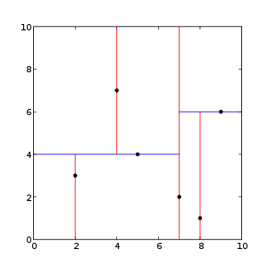
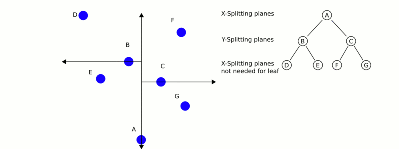

# 如何使用 KdTree 进行搜索

在本教程中，我们将介绍如何使用 KdTree 查找特定点或位置的 K 个最近邻，然后我们还将介绍如何查找用户指定的某个半径内的所有邻居（在这种情况下是随机的 ）。

# 理论入门

kd 树或 k 维树是计算机科学中使用的一种数据结构，用于在具有 k 维的空间中组织一定数量的点。它是一个二叉搜索树，对其施加了其他约束。Kd 树对于范围和最近邻搜索非常有用。出于我们的目的，我们通常只会处理三维的点云，因此我们所有的 kd 树都是三维的。kd 树的每一层使用垂直于相应轴的超平面沿特定维度拆分所有子节点。在树的根部，所有子节点都将根据第一维进行拆分（即，如果第一维坐标小于根，它将在左子树中，如果大于根，则显然将在左子树中右子树）。树中的每一层都在下一个维度上进行划分，一旦所有其他维度都用尽，则返回到第一个维度。构建 kd 树的最有效方法是使用像 Quick Sort 那样的分区方法，将中点放在根处，将一维值较小的所有内容放在左侧，右侧较大。然后在左子树和右子树上重复此过程，直到要分区的最后一棵树仅由一个元素组成。

来自[[维基百科\]](https://pcl.readthedocs.io/projects/tutorials/en/latest/random_sample_consensus.html#wikipedia)：



这是一个二维 kd 树的例子



这是最近邻搜索如何工作的演示。

# pclpy代码

见[kdTreeDemo.py](./kdTreeDemo.py) 

```python
import pclpy
from pclpy import pcl
import numpy as np

if __name__ == '__main__':
    # 生成点云数据
    cloud_size = 100
    a = np.random.ranf(cloud_size * 3).reshape(-1, 3) * 1024
    cloud = pcl.PointCloud.PointXYZ.from_array(a)

    kdtree = pcl.kdtree.KdTreeFLANN.PointXYZ()
    kdtree.setInputCloud(cloud)
    searchPoint = pcl.point_types.PointXYZ()
    searchPoint.x = np.random.ranf(1) * 1024
    searchPoint.y = np.random.ranf(1) * 1024
    searchPoint.z = np.random.ranf(1) * 1024
    # k最近邻搜索
    k = 8
    pointIdxNKNSearch = pclpy.pcl.vectors.Int([0] * k)
    pointNKNSquaredDistance = pclpy.pcl.vectors.Float([0] * k)
    print('K nearest neighbor search at (', searchPoint.x,
          '', searchPoint.y,
          '', searchPoint.z,
          ') with k =', k, '\n')
    if kdtree.nearestKSearch(searchPoint, k, pointIdxNKNSearch, pointNKNSquaredDistance) > 0:
        for i in range(len(pointIdxNKNSearch)):
            print("  ", cloud.x[pointIdxNKNSearch[i]],
                  " ", cloud.y[pointIdxNKNSearch[i]],
                  " ", cloud.z[pointIdxNKNSearch[i]],
                  " (squared distance: ", pointNKNSquaredDistance[i], ")", "\n")

    # 使用半径最近邻搜索
    pointIdxNKNSearch = pclpy.pcl.vectors.Int()
    pointNKNSquaredDistance = pclpy.pcl.vectors.Float()

    radius = np.random.ranf(1) * 256.0
    print("Neighbors within radius search at (", searchPoint.x,
          " ", searchPoint.y, " ", searchPoint.z, ") with radius=",
          radius, '\n')
    if kdtree.radiusSearch(searchPoint, radius, pointIdxNKNSearch, pointNKNSquaredDistance) > 0:
        for i in range(len(pointIdxNKNSearch)):
            print("  ", cloud.x[pointIdxNKNSearch[i]],
                  " ", cloud.y[pointIdxNKNSearch[i]],
                  " ", cloud.z[pointIdxNKNSearch[i]],
                  " (squared distance: ", pointNKNSquaredDistance[i], ")", "\n")
```

# 说明

以下代码首先利用Numpy使用随机数据创建和填充 PointCloud。

```python
# 生成点云数据
cloud_size = 100
a = np.random.ranf(cloud_size * 3).reshape(-1, 3) * 1024
cloud = pcl.PointCloud.PointXYZ.from_array(a)
```

下一段代码创建我们的 kdtree 对象并将我们随机创建的云设置为输入。然后我们创建一个“searchPoint”，它被分配了随机坐标。

```python
kdtree = pcl.kdtree.KdTreeFLANN.PointXYZ()
kdtree.setInputCloud(cloud)
searchPoint = pcl.point_types.PointXYZ()
searchPoint.x = np.random.ranf(1) * 1024
searchPoint.y = np.random.ranf(1) * 1024
searchPoint.z = np.random.ranf(1) * 1024
```

现在我们创建一个整数（并将其设置为 10）和两个向量，用于存储来自搜索的 K 个最近邻。

```python
k = 8
pointIdxNKNSearch = pclpy.pcl.vectors.Int([0] * k)
pointNKNSquaredDistance = pclpy.pcl.vectors.Float([0] * k)
print('K nearest neighbor search at (', searchPoint.x,
      '', searchPoint.y,
      '', searchPoint.z,
      ') with k =', k, '\n')
```

假设我们的 KdTree 返回 0 个以上的最近邻，它然后打印出所有 10 个最近邻的位置到我们的随机“searchPoint”，这些位置已经存储在我们之前创建的向量中。

```python
if kdtree.nearestKSearch(searchPoint, k, pointIdxNKNSearch, pointNKNSquaredDistance) > 0:
    for i in range(len(pointIdxNKNSearch)):
        print("  ", cloud.x[pointIdxNKNSearch[i]],
        " ", cloud.y[pointIdxNKNSearch[i]],
        " ", cloud.z[pointIdxNKNSearch[i]],
        " (squared distance: ", pointNKNSquaredDistance[i], ")", "\n")
```

下面再演示一下使用半径最近邻搜索，在某个（随机生成的）半径内找到给定“searchPoint”的所有邻居。再次创建了 2 个向量来存储有关我们邻居的信息。

```python
# 使用半径最近邻搜索
pointIdxNKNSearch = pclpy.pcl.vectors.Int()
pointNKNSquaredDistance = pclpy.pcl.vectors.Float()

radius = np.random.ranf(1) * 256.0
print("Neighbors within radius search at (", searchPoint.x,
          " ", searchPoint.y, " ", searchPoint.z, ") with radius=",
          radius, '\n')
```

同样，和以前一样，如果我们的 KdTree 在指定半径内返回 0 个以上的邻居，它会打印出这些点的坐标，这些点已经存储在我们的向量中。

```python
if kdtree.radiusSearch(searchPoint, radius, pointIdxNKNSearch, pointNKNSquaredDistance) > 0:
        for i in range(len(pointIdxNKNSearch)):
            print("  ", cloud.x[pointIdxNKNSearch[i]],
                  " ", cloud.y[pointIdxNKNSearch[i]],
                  " ", cloud.z[pointIdxNKNSearch[i]],
                  " (squared distance: ", pointNKNSquaredDistance[i], ")", "\n")
```

# 运行

运行kdTreeDemo.py，即可

运行结果：

> K nearest neighbor search at ( 737.6050415039062  750.3650512695312  411.2821960449219 ) with k = 8 
>
>    753.9883   643.7369   456.1752  (squared distance:  13653.359375 ) 
>
>    828.60803   626.9191   501.09518  (squared distance:  31586.8125 ) 
>
>    760.72687   627.8939   539.5448  (squared distance:  31985.091796875 ) 
>
>    810.8796   972.1281   278.54584  (squared distance:  72166.953125 ) 
>
>    598.6487   507.64853   444.17035  (squared distance:  79301.8125 ) 
>
>    649.69885   946.6329   597.18005  (squared distance:  80806.5625 ) 
>
>    476.53268   646.1927   467.837  (squared distance:  82209.1015625 ) 
>
>    878.47424   922.55475   621.521  (squared distance:  93693.7734375 ) 
>
> Neighbors within radius search at ( 737.6050415039062   750.3650512695312   411.2821960449219 ) with radius= [203.92877983] 
>
>    753.9883   643.7369   456.1752  (squared distance:  13653.359375 ) 
>
>    828.60803   626.9191   501.09518  (squared distance:  31586.8125 ) 
>
>    760.72687   627.8939   539.5448  (squared distance:  31985.091796875 )


> 注意：由于我们的数据是随生成的，每次结果都不一样，甚至有时候可能KdTree 返回 0 最近邻，这时候就没有输出了。

