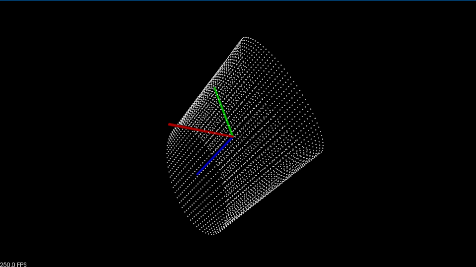

# CloudViewer 

CloudViewer 是一种直接、简单的点云可视化，旨在让我们使用尽可能少的代码来查看云。

> 注意：CloudViewer 类**不**打算在多线程应用程序中使用！请查看 [:pcl:`PCLVisualizer`](https://pcl.readthedocs.io/projects/tutorials/en/latest/cloud_viewer.html#id1)的[文档](https://pcl.readthedocs.io/projects/tutorials/en/latest/pcl_visualizer.html#pcl-visualizer)或阅读线程安全可视化的[PCLVisualizer](https://pcl.readthedocs.io/projects/tutorials/en/latest/pcl_visualizer.html#pcl-visualizer)教程。

## 使用CloudViewer

如果我们只想使用几行代码在我们的应用程序中可视化某些内容，请使用如下代码段：

```python
# 加载点云
cloud = pcl.PointCloud.PointXYZ()
reader = pcl.io.PCDReader()
reader.read("../../data/bunny.pcd", cloud)

# 可视化
viewer = pcl.visualization.CloudViewer("viewer")
viewer.showCloud(cloud, "sample cloud")  # 显示点云
while not viewer.wasStopped(10):
    pass
```

## 使用PCLVisualizer后端（失败）

下面展示了如何在可视化线程上运行代码。PCLVisualizer 是 CloudViewer 的后端，但它在自己的线程中运行。要访问它，必须使用回调函数，以避免可视化并发问题。但是必须注意避免代码中的竞争条件，因为我们将从可视化线程调用回调。

```python
import pclpy
from pclpy import pcl

def viewerOneOff(viewer):
    viewer.setBackgroundColor(1.0, 0.5, 1.0)
    o = pcl.point_types.PointXYZ()
    o.x = 1
    o.y = 0
    o.z = 0
    viewer.addSphere(o, 0.25, "sphere", 0)
    print('i only run once')


def viewerPsycho(viewer):
    i = 0
    ss = "Once per viewer loop: " + str(i)
    viewer.removeShape("text", 0)
    viewer.addText(ss, 200, 300, "text", 0)


if __name__ == '__main__':
    # 加载点云
    cloud = pcl.PointCloud.PointXYZRGB()
    reader = pcl.io.PCDReader()
    reader.read("../../data/bunny_color.pcd", cloud)

    # 可视化
    viewer = pcl.visualization.CloudViewer('Cloud Viewer')
    # 阻塞，直到点云真正渲染
    viewer.showCloud(cloud)
    # 使用下面的函数来访问底层更高级/强大的功能
    # 使用PCLVisualizer

    # # 这只会被调用一次
    viewer.runOnVisualizationThreadOnce(viewerOneOff)

    # 每次可视化迭代都会调用这个函数一次
    viewer.runOnVisualizationThread(viewerPsycho)
    while not viewer.wasStopped(10):
        pass
```

遗憾的是，这个例子没有跑起来，报错：

> TypeError: runOnVisualizationThreadOnce(): incompatible function arguments. The following argument types are supported:
>     1. (self: pclpy.pcl.visualization.CloudViewer, x: boost::function1<void,pcl::visualization::PCLVisualizer & __ptr64>) -> None
>
> Invoked with: <pclpy.pcl.visualization.CloudViewer object at 0x000002AE98B04E30>, <function viewerOneOff at 0x000002AE95522E18>

应该是没有绑定好类型。

# 可视化range image

遗憾的是，pclpy尚未绑定RangeImage类。此功能暂时无法完成

> https://github.com/davidcaron/pclpy/issues/57

但是从点云生成深度图是一个经常用到的功能，后面可能会开源自己写的一个点云转深度图算法。

也可以参考一下现有的一些资料：

* https://zhuanlan.zhihu.com/p/371455421

* [python_kitti_激光点云变换到图像平面并保存成int16灰度图](https://blog.csdn.net/shyjhyp11/article/details/113180123)

# PCLVisualizer

PCLVisualizer 是 PCL 的全功能可视化类。虽然使用起来比 CloudViewer 更复杂，但它也更强大，提供显示法线、绘制形状和多个视口等功能。

本教程将使用代码示例来说明 PCLVisualizer 的一些功能，从显示单个点云开始。

代码见[03_pcl_visualizer_demo.py](./03_pcl_visualizer_demo.py)

```python
import pclpy
from pclpy import pcl
import numpy as np
import sys


def printUsage(progName):
    # 帮助函数
    print('Usage:', progName, ' [options]\n',
          "Options:\n",
          "-------------------------------------------\n",
          "-h           this help\n",
          "-s           Simple visualisation example\n",
          "-r           RGB colour visualisation example\n",
          "-c           Custom colour visualisation example\n"
          "-n           Normals visualisation example\n",
          "-a           Shapes visualisation example\n",
          "-v           Viewports example\n",
          "-i           Interaction Customization example\n",
          )


def simpleVis(cloud):
    # Open 3D viewer and add point cloud
    viewer = pcl.visualization.PCLVisualizer("3D viewer")
    viewer.setBackgroundColor(0, 0, 0)
    viewer.addPointCloud(cloud, "sample cloud")
    viewer.setPointCloudRenderingProperties(0, 1, "sample cloud")
    viewer.addCoordinateSystem(1)
    viewer.initCameraParameters()
    return viewer


def rgbVis(cloud):
    # Open 3D viewer and add point cloud
    viewer = pcl.visualization.PCLVisualizer("3D viewer")
    viewer.setBackgroundColor(0, 0, 0)
    rgb = pcl.visualization.PointCloudColorHandlerRGBField.PointXYZRGB(cloud)

    viewer.addPointCloud(cloud, rgb, "sample cloud")
    viewer.setPointCloudRenderingProperties(0, 1, "sample cloud")
    viewer.addCoordinateSystem(1)
    viewer.initCameraParameters()
    return viewer


def customColourVis(cloud):
    # Open 3D viewer and add point cloud
    viewer = pcl.visualization.PCLVisualizer("3D viewer")
    viewer.setBackgroundColor(0, 0, 0)
    single_color  = pcl.visualization.PointCloudColorHandlerCustom.PointXYZ(cloud, 0.0, 255.0, 0.0)
    viewer.addPointCloud(cloud, single_color , "sample cloud")
    viewer.setPointCloudRenderingProperties(0, 3, "sample cloud")
    viewer.addCoordinateSystem(1)
    viewer.initCameraParameters()
    return viewer


def normalsVis(cloud, normals):
    # Open 3D viewer and add cloud and normals
    viewer = pcl.visualization.PCLVisualizer("3D viewer")
    viewer.setBackgroundColor(0, 0, 0)
    rgb = pcl.visualization.PointCloudColorHandlerRGBField.PointXYZRGB(cloud)
    viewer.addPointCloud(cloud, rgb, "sample cloud")
    viewer.setPointCloudRenderingProperties(0, 1, "sample cloud")
    viewer.addPointCloudNormals(cloud, normals, 10, 0.05, 'normals')  # 经过测试，法线显示报错：no override found for "VtkActor"
    viewer.addCoordinateSystem(1)
    viewer.initCameraParameters()
    return viewer


def shapesVis(cloud):
    # Open 3D viewer and add point cloud
    viewer = pcl.visualization.PCLVisualizer("3D viewer")
    viewer.setBackgroundColor(0, 0, 0)
    rgb = pcl.visualization.PointCloudColorHandlerRGBField.PointXYZRGB(cloud)
    viewer.addPointCloud(cloud, rgb, "sample cloud")
    viewer.setPointCloudRenderingProperties(0, 1, "sample cloud")
    viewer.addCoordinateSystem(1)
    viewer.initCameraParameters()
    # 在点云上添加一些直线、椭圆 经过测试，除了addSphere报错：no override found for "VTKPolyDataMapper"，其他都还OK
    xyzCloud = pcl.PointCloud.PointXYZ().from_array(cloud.xyz)
    viewer.addLine(xyzCloud.points[0], xyzCloud.points[cloud.size() - 1], 'line')  # 起点、终点
    # viewer.addSphere(xyzCloud.points[0], 0.2, 0.5, 0.5, 0.0, 'sphere')  # 中心，半径、RGB
    # 在其他位置添加一些平面、锥
    coeffs = pcl.ModelCoefficients()
    coeffs.values.append(0.0)
    coeffs.values.append(0.0)
    coeffs.values.append(1.0)
    coeffs.values.append(0.0)
    viewer.addPlane(coeffs, 'plane')
    coeffs = pcl.ModelCoefficients()
    coeffs.values.append(0.3)
    coeffs.values.append(0.3)
    coeffs.values.append(0.0)
    coeffs.values.append(0.0)
    coeffs.values.append(1.0)
    coeffs.values.append(0.0)
    coeffs.values.append(5.0)
    viewer.addCone(coeffs, 'cone')
    return viewer


def viewportsVis(cloud, normals1, normals2):
    # Open 3D viewer and add point cloud and normals
    viewer = pcl.visualization.PCLVisualizer("viewer")
    v0 = 1
    viewer.createViewPort(0.0, 0.0, 0.5, 1.0, v0)
    viewer.setBackgroundColor(0.0, 0.0, 0.0, v0)
    viewer.addText("Radius: 0.05", 10, 10, "v1 text", v0)
    rgb = pcl.visualization.PointCloudColorHandlerRGBField.PointXYZRGB(cloud)
    viewer.addPointCloud(cloud, rgb, "sample cloud1", v0)

    v1 = 2
    viewer.createViewPort(0.5, 0.0, 1.0, 1.0, v1)
    viewer.setBackgroundColor(0.3, 0.3, 0.3, v1)
    viewer.addText("Radius: 0.1", 10, 10, "v2 text", v1)
    single_color = pcl.visualization.PointCloudColorHandlerCustom.PointXYZRGB(cloud, 0.0, 255.0, 0.0)
    viewer.addPointCloud(cloud, single_color, "sample cloud2", v1)

    viewer.setPointCloudRenderingProperties(0, 3, "sample cloud1", v0)
    viewer.setPointCloudRenderingProperties(0, 3, "sample cloud2", v1)
    viewer.addCoordinateSystem(1.0)

    # viewer.addPointCloudNormals(cloud, cloud_normals1, 10, 0.05, 'normals1', v0)  # 法线无法显示，报错：no override found for "VtkActor"
    # viewer.addPointCloudNormals(cloud, cloud_normals2, 10, 0.05, 'normals2', v1)
    return viewer


def keyboardEventOccurred(event):
    if event.getKeySym() == 'r' and event.keyDown():
        print('r was pressed => removing all text')
        for i in range(text_id[0] + 1):
            str = 'text{:2d}'.format(i)
            viewer.removeShape(str)
        text_id[0] = 0


def mouseEventOccurred(event):
    if event.getButton() == pcl.visualization.MouseEvent.LeftButton and \
            event.getType() == pcl.visualization.MouseEvent.MouseButtonRelease:
        print("Left mouse button released at position (", event.getX(), ", ", event.getY(), ")")
        str = 'text{:2d}'.format(text_id[0])
        text_id[0] += 1
        viewer.addText("clicked here", event.getX(), event.getY(), str)


def interactionCustomizationVis():
    viewer = pcl.visualization.PCLVisualizer()
    viewer.setBackgroundColor(0, 0, 0)
    viewer.addCoordinateSystem(1.0)
    global text_id
    text_id = [0]
    viewer.registerKeyboardCallback(keyboardEventOccurred)
    viewer.registerMouseCallback(mouseEventOccurred)
    return viewer


if __name__ == '__main__':
    # 生成点云
    basic_cloud = pcl.PointCloud.PointXYZ()
    point_cloud = pcl.PointCloud.PointXYZRGB()
    print('Generating example point clouds.')
    r, g, b = 255, 15, 15
    for z in np.linspace(-1, 1, 40):
        for angle in np.linspace(0, 360, 72):
            basic_point = pcl.point_types.PointXYZ()
            basic_point.x = 0.5 * np.cos(np.deg2rad(angle))
            basic_point.y = np.sin(np.deg2rad(angle))
            basic_point.z = z
            basic_cloud.push_back(basic_point)

            point = pcl.point_types.PointXYZRGB()
            point.x = basic_point.x
            point.y = basic_point.y
            point.z = basic_point.z
            point.r = np.uint8(r)
            point.g = np.uint8(g)
            point.b = np.uint8(b)

            point_cloud.push_back(point)
            if z < 0.0:
                r -= 12
                g += 12
            else:
                g -= 12
                b += 12
    basic_cloud.width = basic_cloud.size()
    basic_cloud.height = 1
    point_cloud.width = point_cloud.size()
    point_cloud.height = 1

    # 使用0.05的搜索半径计算表面法线
    ne = pcl.features.NormalEstimation.PointXYZRGB_Normal()
    ne.setInputCloud(point_cloud)
    tree = pcl.search.KdTree.PointXYZRGB()
    ne.setSearchMethod(tree)
    cloud_normals1 = pcl.PointCloud.Normal()
    ne.setRadiusSearch(0.05)
    ne.compute(cloud_normals1)

    # 使用0.01的搜索半径计算表面法线
    cloud_normals2 = pcl.PointCloud.Normal()
    ne.setRadiusSearch(0.1)
    ne.compute(cloud_normals2)

    # 可视化
    viewer = None
    if len(sys.argv) == 1:
        printUsage(sys.argv[0])
        sys.exit()
    if sys.argv[1] == '-h':
        printUsage(sys.argv[0])
        sys.exit()
    if sys.argv[1] == '-s':
        print("Simple visualisation example")
        viewer = simpleVis(basic_cloud)
    elif sys.argv[1] == '-r':
        print("RGB colour visualisation example")
        viewer = rgbVis(point_cloud)
    elif sys.argv[1] == '-c':
        print("Custom colour visualisation example")
        viewer = customColourVis(basic_cloud)
    elif sys.argv[1] == '-n':
        print("Normals visualisation example")
        viewer = normalsVis(point_cloud, cloud_normals1)
    elif sys.argv[1] == '-a':
        print("Shapes visualisation example")
        viewer = shapesVis(point_cloud)
    elif sys.argv[1] == '-v':
        print("Viewports example")
        viewer = viewportsVis(point_cloud, cloud_normals1, cloud_normals2)
    elif sys.argv[1] == '-i':
        print("Interaction Customization example")
        viewer = interactionCustomizationVis()

    # 主循环
    while not viewer.wasStopped():
        viewer.spinOnce(10)

```

## 可视化点云

此示例使用 PCLVisualizer 显示单个 PointXYZ 云。它还说明了更改背景颜色和显示轴。代码在函数中`simpleVis`。

运行代码：

```bash
cd tutorial/04_Visualization
python 03_pcl_visualizer_demo.py -s
```



### 说明

该`simpleVis`函数展示了如何对点云进行最基本的可视化。

```python
def simpleVis(cloud):
    # Open 3D viewer and add point cloud
    viewer = pcl.visualization.PCLVisualizer("3D viewer")
    viewer.setBackgroundColor(0, 0, 0)
    viewer.addPointCloud(cloud, "sample cloud")
    viewer.setPointCloudRenderingProperties(0, 1, "sample cloud")
    viewer.addCoordinateSystem(0.1)
    viewer.initCameraParameters()
    return viewer
```

让我们一行一行地看一下这个函数。

```python
viewer = pcl.visualization.PCLVisualizer("3D viewer")
```

这将创建查看器对象，并为其提供一个标题以显示在标题栏中。

```python
viewer.setBackgroundColor (0, 0, 0);
```

查看器的背景颜色可以设置为我们喜欢的任何 RGB 颜色。在这种情况下，我们将其设置为黑色。

```python
viewer.addPointCloud(cloud, "sample cloud");
```

这是最重要的一步。我们将点云添加到查看器，为其提供一个 ID 字符串，可用于在其他方法中识别到该点云。可以通过多次调用`addPointCloud()`来添加多个点云 ，每次都提供一个新的 ID。如果要更新已显示的点云，则必须首先调用`removePointCloud()`并提供要更新的点云 的 ID。（注意：PCL 1.1 及更高版本提供了一种新的 API 方法： `updatePointCloud()`允许更新点云，而无需先手动调用`removePointCloud()`。）

这是`addPointCloud()`许多变体中最基本的。其他的用于处理不同的点类型、显示法线等。我们将在本教程中说明其他一些内容，或者我们可以查看[PCLVisualizer 文档](http://docs.pointclouds.org/1.0.0/classpcl_1_1visualization_1_1_p_c_l_visualizer.html)以获取更多详细信息。

> 有必要说明一下，PCL中需要显示的指定点云类型viewer->addPointCloud< pcl::PointXYZ > (cloud, "sample cloud")，pclpy中不需要这样做。

```python
viewer.setPointCloudRenderingProperties(0, 1, "sample cloud")
```

这一行更改渲染点的大小。我们可以使用此方法控制在查看器中渲染点云的样式。,参数0， 1表示pcl::visualization::PCL_VISUALIZER_POINT_SIZE, 1，也可以控制点云的其他渲染属性，详情请参考PCL文档。

```python
viewer.addCoordinateSystem(0.1)
```

查看复杂的点云通常会让人迷失方向。为了让自己与世界坐标系保持一致，可以将坐标轴显示出来。轴将显示为沿 X（红色）、Y（绿色）和 Z（蓝色）轴的三个圆柱体。可以使用`scale`参数控制轴的大小。在这种情况下，我们将其设置为 1.0（如果没有给出值，这也恰好是默认值）。此方法的另一种版本可用于将轴放置在世界上的任何一点。

```python
viewer.initCameraParameters()
```

设置一些相机参数

`simpleVis`函数返回一个viewer，在代码最后会显示结果：

```python
while not viewer.wasStopped():
        viewer.spinOnce(10)
```

在循环中，每次调用都`spinOnce`让查看器有时间处理事件，从而使其具有交互性。

## 显示RGB点云

通常，点云不会使用简单的 PointXYZ 类型。一种常见的点类型是 PointXYZRGB，它也包含颜色数据。除此之外，我们可能希望为特定的点云着色，以使其在查看器中可区分。PCLVizualizer 提供了用于显示带有存储在其中的颜色数据的点云或为点云分配颜色的工具。

### RGB点云

许多设备，例如 Microsoft Kinect，使用 RGB 数据生成点云。PCLVisualizer 可以使用此数据显示云来为每个点着色。`rgbVis`函数中的代码显示了如何执行此操作。

运行代码：

```bash
python 03_pcl_visualizer_demo.py -r
```


### 说明

`rgbVis`函数与之前的示例相比没有太大变化。

```python
def rgbVis(cloud):
    # Open 3D viewer and add point cloud
    viewer = pcl.visualization.PCLVisualizer("3D viewer")
    viewer.setBackgroundColor(0, 0, 0)
    rgb = pcl.visualization.PointCloudColorHandlerRGBField.PointXYZRGB(cloud)
    viewer.addPointCloud(cloud, rgb, "sample cloud")
    viewer.setPointCloudRenderingProperties(0, 1, "sample cloud")
    viewer.addCoordinateSystem(0.1)
    viewer.initCameraParameters()
    return viewer
```

首先，请注意点类型与上一个简单示例不同。我们现在使用一种 RGB点数据类型。这个很重要; 如果点中没有 RGB 字段（点类型不一定必须是`PointXYZRGB`，只要它具有三个颜色字段），PCLVisualizer 将不知道使用什么颜色。

```python
rgb = pcl.visualization.PointCloudColorHandlerRGBField.PointXYZRGB(cloud)
```

接下来，在设置查看器的背景颜色后，我们创建一个颜色处理程序对象。PCLVisualizer 使用这样的对象来显示自定义数据。在这种情况下，对象将从每个点获取 RGB 颜色字段，供查看者在绘制它们时使用。许多其他处理程序用于广泛的目的。我们将在下一个代码示例中看到另一个颜色处理程序，但处理程序也存在用于绘制任何其他字段作为颜色和从点云绘制几何图形等目的。有关详细信息，请参阅[文档](http://docs.pointclouds.org/1.0.0/group__visualization.html)。

```python
viewer.addPointCloud(cloud, rgb, "sample cloud")
```

最后，当我们添加点云时，我们在将点云添加到查看器时指定颜色处理程序。

## 显示自定义颜色

上一个代码演示了为点云的每一个点点赋予不同的颜色（在构建RGB点云时操作），这里我们可以为点云赋予单一颜色。

在`customColourVis`函数中，我们将点云的颜色设置为绿色。（我们还增加了点的大小，使颜色更明显。）

运行代码：

```bash
python 03_pcl_visualizer_demo.py -c
```


### 说明

`customColourVis`函数：

```python
def customColourVis(cloud):
    # Open 3D viewer and add point cloud
    viewer = pcl.visualization.PCLVisualizer("3D viewer")
    viewer.setBackgroundColor(0, 0, 0)
    single_color  = pcl.visualization.PointCloudColorHandlerCustom.PointXYZ(cloud, 0.0, 255.0, 0.0)
    viewer.addPointCloud(cloud, single_color , "sample cloud")
    viewer.setPointCloudRenderingProperties(0, 1, "sample cloud")
    viewer.addCoordinateSystem(0.1)
    viewer.initCameraParameters()
    return viewer
```

同样，此示例中的大部分代码与之前的示例相比没有太大变化。

```python
single_color  = pcl.visualization.PointCloudColorHandlerCustom.PointXYZ(cloud, 0.0, 255.0, 0.0)
```

这次使用的点类型又回到了PointXYZ。为点云设置自定义颜色处理程序时，点云数据类型是什么并不重要。

```
viewer.addPointCloud(cloud, single_color , "sample cloud")
```

与前面的示例一样，再调用 `addPointCloud()`.

## 显示法线和其他信息（有bug）

显示法线是理解点云的重要一步。PCLVisualizer 类能够绘制法线以及其他有趣的点云信息，例如主曲率和几何形状。

`normalsVis` 函数中的代码示例展示了如何显示点云的法线。本教程不会解释计算法线的代码。有关详细信息，请参阅法线计算教程。

<font color='red'>经过测试，法线显示报错：no override found for "VtkActor" </font>

这应该是是pclpy的一个bug，见 [issues#58](https://github.com/davidcaron/pclpy/issues/58) 

`normalsVis`函数如下：

```python
def normalsVis(cloud, normals):
    # Open 3D viewer and add cloud and normals
    viewer = pcl.visualization.PCLVisualizer("3D viewer")
    viewer.setBackgroundColor(0, 0, 0)
    rgb = pcl.visualization.PointCloudColorHandlerRGBField.PointXYZRGB(cloud)
    viewer.addPointCloud(cloud, rgb, "sample cloud")
    viewer.setPointCloudRenderingProperties(0, 1, "sample cloud")
    viewer.addPointCloudNormals(cloud, normals, 10, 0.05, 'normals')  # 经过测试，法线显示报错：no override found for "VtkActor"
    viewer.addCoordinateSystem(0.1)
    viewer.initCameraParameters()
    return viewer
```

### 解释

与之前的代码类似。

```
viewer.addPointCloudNormals(cloud, normals, 10, 0.05, 'normals')
```

参数解释：此方法的参数设置要显示的法线数（这里，每十个法线显示一次）和为每个法线绘制的线的长度（在本例中为 0.05）。

## 显示形状

PCLVisualizer 允许在视图中绘制各种原始形状。这通常用于可视化点云处理算法的结果，例如，通过在它们周围绘制透明球体来可视化哪些点簇已被识别为目标。

该`shapesVis`函数中的示例代码说明了一些用于向查看器添加形状的方法。它添加了四种形状：

- 从云中的第一个点到云中的最后一个点的线。
- 原点处的平面。
- 以云中第一个点为中心的球体。
- 沿 Y 轴的圆锥体。

运行代码：

```bash
python 03_pcl_visualizer_demo.py -a
```


<font color='red'>经过测试，除了添加球体addSphere()报错：no override found for "VTKPolyDataMapper"，应该是pclpy的bug，其余形状显示都正常</font>

### 说明

`shapesVis`函数：

```python
def shapesVis(cloud):
    # Open 3D viewer and add point cloud
    viewer = pcl.visualization.PCLVisualizer("3D viewer")
    viewer.setBackgroundColor(0, 0, 0)
    rgb = pcl.visualization.PointCloudColorHandlerRGBField.PointXYZRGB(cloud)
    viewer.addPointCloud(cloud, rgb, "sample cloud")
    viewer.setPointCloudRenderingProperties(0, 1, "sample cloud")
    viewer.addCoordinateSystem(0.1)
    viewer.initCameraParameters()
    # 在点云上添加一些直线、椭圆 经过测试，除了addSphere报错：no override found for "VTKPolyDataMapper"，其他都还OK
    xyzCloud = pcl.PointCloud.PointXYZ().from_array(cloud.xyz)
    viewer.addLine(xyzCloud.points[0], xyzCloud.points[cloud.size() - 1], 'line')  # 起点、终点
    # viewer.addSphere(xyzCloud.points[0], 0.2, 0.5, 0.5, 0.0, 'sphere')  # 中心，半径、RGB
    # 在其他位置添加一些平面、锥
    coeffs = pcl.ModelCoefficients()
    coeffs.values.append(0.0)
    coeffs.values.append(0.0)
    coeffs.values.append(1.0)
    coeffs.values.append(0.0)
    viewer.addPlane(coeffs, 'plane')
    coeffs = pcl.ModelCoefficients()
    coeffs.values.append(0.3)
    coeffs.values.append(0.3)
    coeffs.values.append(0.0)
    coeffs.values.append(0.0)
    coeffs.values.append(1.0)
    coeffs.values.append(0.0)
    coeffs.values.append(5.0)
    viewer.addCone(coeffs, 'cone')
    return viewer
```

绘制形状的代码示例的相关部分在点云添加到查看器后开始。

```python
viewer.addLine(xyzCloud.points[0], xyzCloud.points[cloud.size() - 1], 'line')  # 起点、终点
```

这行（代码）添加了一条从点云中的第一个点到最后一个点的线（在空间中）。例如，此方法可用于显示点云之间的对应关系。在这种情况下，线条使用默认颜色，但我们也可以指定线条的颜色。在点云的点上绘制形状非常常见，并且可以使用各种形状。

```python
viewer.addSphere(xyzCloud.points[0], 0.2, 0.5, 0.5, 0.0, 'sphere')  # 中心，半径、RGB
```

添加了一个以云中第一个点为中心、半径为 0.2 的球体。还为球体赋予了颜色。

> 这行代码暂时注释掉了，因为出现了bug，no override found for "VTKPolyDataMapper"。

```python
coeffs = pcl.ModelCoefficients()
coeffs.values.append(0.0)
coeffs.values.append(0.0)
coeffs.values.append(1.0)
coeffs.values.append(0.0)
viewer.addPlane(coeffs, 'plane')
```

接下来，我们在绘图中添加一个平面。在这种情况下，我们使用标准平面方程 (ax + by + cz + d = 0) 指定平面。我们的平面将以原点为中心并沿 Z 轴定向。许多形状绘制函数以这种方式指定系数。

```python
coeffs = pcl.ModelCoefficients()
coeffs.values.append(0.3)
coeffs.values.append(0.3)
coeffs.values.append(0.0)
coeffs.values.append(0.0)
coeffs.values.append(1.0)
coeffs.values.append(0.0)
coeffs.values.append(5.0)
viewer.addCone(coeffs, 'cone')
```

最后，我们添加一个锥体。我们再次使用模型系数来指定锥体的参数。

> pycpy的coeffs类似乎没有clear()方法，所以这里重新构造了一个coeffs。

## 显示多个视口

我们通常希望并排比较多个点云。虽然我们可以在同一个视口中绘制它们，但这可能会令人困惑。PCLVisualizer 允许我们在单独的视口中绘制多个点云，从而轻松进行比较。

`viewportsVis`函数中的代码使用视口来演示比较为点云计算的法线。为同一云计算两组法线，但使用不同的搜索半径。第一次，搜索半径为 0.05。第二次是 0.1。0.05 半径搜索的法线以黑色背景显示在视口中。0.1 半径搜索的法线以灰色背景显示在视口中。

并排比较两组法线，可以立即看出不同算法参数的影响。通过这种方式，我们可以试验算法的参数以找到合适的设置，快速查看结果。

> 注意：<font color='red'>由于pclpy中法线显示会报错：no override found for "VtkActor"，这里仅演示多窗口效果，不再显示法线。</font>

运行代码：

```bash
python 03_pcl_visualizer_demo.py -v
```


### 说明

`viewportsVis`函数：

```python
def viewportsVis(cloud, normals1, normals2):
    # Open 3D viewer and add point cloud and normals
    viewer = pcl.visualization.PCLVisualizer("viewer")
    v0 = 1
    viewer.createViewPort(0.0, 0.0, 0.5, 1.0, v0)
    viewer.setBackgroundColor(0.0, 0.0, 0.0, v0)
    viewer.addText("Radius: 0.05", 10, 10, "v1 text", v0)
    rgb = pcl.visualization.PointCloudColorHandlerRGBField.PointXYZRGB(cloud)
    viewer.addPointCloud(cloud, rgb, "sample cloud1", v0)

    v1 = 2
    viewer.createViewPort(0.5, 0.0, 1.0, 1.0, v1)
    viewer.setBackgroundColor(0.3, 0.3, 0.3, v1)
    viewer.addText("Radius: 0.1", 10, 10, "v2 text", v1)
    single_color = pcl.visualization.PointCloudColorHandlerCustom.PointXYZRGB(cloud, 0.0, 255.0, 0.0)
    viewer.addPointCloud(cloud, single_color, "sample cloud2", v1)

    viewer.setPointCloudRenderingProperties(0, 3, "sample cloud1", v0)
    viewer.setPointCloudRenderingProperties(0, 3, "sample cloud2", v1)
    viewer.addCoordinateSystem(1.0)

    # viewer.addPointCloudNormals(cloud, cloud_normals1, 10, 0.05, 'normals1', v0)  # 法线无法显示，报错：no override found for "VtkActor"
    # viewer.addPointCloudNormals(cloud, cloud_normals2, 10, 0.05, 'normals2', v1)
    return viewer
```

下面是代码详细解释：

```python
viewer = pcl.visualization.PCLVisualizer("viewer")
```

首先创建点云查看器。

```python
v0 = 1
viewer.createViewPort(0.0, 0.0, 0.5, 1.0, v0)
viewer.setBackgroundColor(0.0, 0.0, 0.0, v0)
viewer.addText("Radius: 0.05", 10, 10, "v1 text", v0)
rgb = pcl.visualization.PointCloudColorHandlerRGBField.PointXYZRGB(cloud)
viewer.addPointCloud(cloud, rgb, "sample cloud1", v0)
```

下一步是创建一个新的视口。这四个参数是 X 轴和 Y 轴上视口的最小和最大范围，介于 0 和 1 之间。我们正在创建一个将填充窗口左半部分的视口。我们必须存储在第五个参数中传回的视口 ID ，并在我们只想影响该视口的所有其他调用中使用它。

我们还设置了这个视口的背景颜色，根据我们使用视口区分的内容给它一个标签，并使用 RGB 颜色处理程序将我们的点云添加到它。

```python
v1 = 2
viewer.createViewPort(0.5, 0.0, 1.0, 1.0, v1)
viewer.setBackgroundColor(0.3, 0.3, 0.3, v1)
viewer.addText("Radius: 0.1", 10, 10, "v2 text", v1)
single_color = pcl.visualization.PointCloudColorHandlerCustom.PointXYZRGB(cloud, 0.0, 255.0, 0.0)
viewer.addPointCloud(cloud, single_color, "sample cloud2", v1)
```

然后我们对第二个视口再次做同样的事情，让它占据窗口的右半部分。我们将此视口设为灰色阴影，以便在演示程序中轻松区分。我们添加相同的点云，但这次我们给它一个自定义颜色处理程序。

```python
viewer.setPointCloudRenderingProperties(0, 3, "sample cloud1", v0)
viewer.setPointCloudRenderingProperties(0, 3, "sample cloud2", v1)
viewer.addCoordinateSystem(1.0)
```

这三行为所有视口全局设置了一些属性。大多数 PCLVisualizer 方法都接受可选的视口 ID 参数。当它被指定时，它们只影响那个视口。如果不是，就像在这种情况下一样，它们会影响所有视口。

```python
viewer.addPointCloudNormals(cloud, cloud_normals1, 10, 0.05, 'normals1', v0)  # 法线无法显示，报错：no override found for "VtkActor"
viewer.addPointCloudNormals(cloud, cloud_normals2, 10, 0.05, 'normals2', v1)
```

最后，我们添加法线到每个视口。因为pclpy显示法线会报错，所以这两行在源码中被注释掉。

## 自定义交互

我们有时会觉得默认鼠标和键绑定提供的交互选项不能满足我们的需求，我们可能希望扩展功能，例如在按下鼠标左键后注释某些位置的鼠标操作，输入r清空所有注释的键盘操作等。`interactionCustomizationVis`函数是一个简单的例子。

> 在 Mac 平台上，如果使用 7.0 之前的 VTK 版本，则需要将可执行文件构建为应用程序包，以获得适当的鼠标和键盘交互支持。有关如何执行此操作的更多说明，请参阅[Cocoa VTK Wiki](http://www.vtk.org/Wiki/Cocoa_VTK#Use_Application_Bundles)。

在本教程的这一部分中，我们将了解如何捕获鼠标和键盘事件。通过右键单击窗口，将出现一个 2D 文本，我们可以通过按“r”删除所有文本实例。结果应该是这样的：


### 说明

`interactionCustomizationVis`函数：

```python
def interactionCustomizationVis():
    viewer = pcl.visualization.PCLVisualizer()
    viewer.setBackgroundColor(0, 0, 0)
    viewer.addCoordinateSystem(1.0)
    global text_id
    text_id = [0]
    viewer.registerKeyboardCallback(keyboardEventOccurred)
    viewer.registerMouseCallback(mouseEventOccurred)
    return viewer
```

下面是详细解释：

```python
viewer = pcl.visualization.PCLVisualizer()
viewer.setBackgroundColor(0, 0, 0)
viewer.addCoordinateSystem(1.0)
```

首先，实例化查看器，并设置一些属性参数。

```python
viewer.registerKeyboardCallback(keyboardEventOccurred)
viewer.registerMouseCallback(mouseEventOccurred)
```

这两行代码将注册这两个方法，`keyboardEventOccurred` 并分别`mouseEventOccurred`给键盘和鼠标事件回调。

> 注意：这里的写法与PCL不同，没有将指向智能指针的指针强制转换为`void*`的第二个参数。

```python
def mouseEventOccurred(event):
    if event.getButton() == pcl.visualization.MouseEvent.LeftButton and \
            event.getType() == pcl.visualization.MouseEvent.MouseButtonRelease:
        print("Left mouse button released at position (", event.getX(), ", ", event.getY(), ")")
        str = 'text{:2d}'.format(text_id[0])
        text_id[0] += 1
        viewer.addText("clicked here", event.getX(), event.getY(), str)
```

这是处理鼠标事件的方法。每次注册任何类型的鼠标事件时，都会调用此函数。为了准确地查看该事件是什么，我们需要从`event`实例中提取该信息。在我们的例子中，我们正在寻找鼠标左键释放。每当这样的事件发生时，我们将在鼠标点击的位置写一个小文本。

> 注意：文本不支持中文！

```python
def keyboardEventOccurred(event):
    if event.getKeySym() == 'r' and event.keyDown():
        print('r was pressed => removing all text')
        for i in range(text_id[0] + 1):
            str = 'text{:2d}'.format(i)
            viewer.removeShape(str)
        text_id[0] = 0
```

相同的方法适用于键盘事件。我们检查按下了什么键，我们所做的操作是删除所有由我们的鼠标点击创建的文本。请注意，当按下“r”时，3D 相机仍会根据 PCLVisualizer 中“r”的原始绑定重置。因此，我们的键盘事件不会覆盖基类的功能。

# PCLPlotter

PCLPlotter 提供了一个非常简单易用的绘图界面。人们可以在库中可视化所有类型的图 - 从多项式函数到直方图 - 无需使用任何其他软件（如 MATLAB）。当本教程中介绍了一些特定概念时，请仔细阅读[文档](http://docs.pointclouds.org/trunk/a01175.html)以了解确切的函数用法。

> 想比于C++，在python中，可使用的绘图工具太多了，Matplotlib等，但这里还是简单介绍一下PCL提供的这个绘图工具。

<font color='red'>事实上，pclpy作者只绑定了PCLPlotter类的绘制直方图addHistogramData()方法，未绑定绘制多项式addPlotData()方法</font>

下面展示一下使用Plotter绘制直方图，见[04_Plotter_demo.py](./04_Plotter.py)

```python
import pclpy
from pclpy import pcl
import numpy as np
import sys

if __name__ == '__main__':
    # 定义一个plotter
    plotter = pcl.visualization.PCLPlotter()

    # 定义一个多项式函数，y=x^2
    # func1 = np.array([0, 1, 0])
    # plotter.addPlotData(func1, -10, 10, "y = x^2") # 未实现
    
    data = pcl.vectors.Float([1, 2, 3, 3, 4, 5, 6, 6, 6])
    plotter.addHistogramData(data, 10, "Histogram")
    
    # 显示结果
    plotter.plot()
```

运行代码后，结果：


还提供了一系列API用于设置直方图属性（背景颜色、Title、Range、WindowSize等），在此不再演示，感兴趣的大家可以玩一玩儿。

# 使用pclpy和pyqt制作点云可视化工具

~有时间再鼓捣

