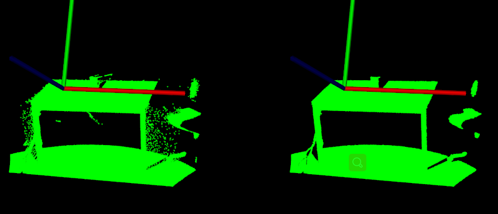

# PassThrough滤波器

在本教程中，我们将学习如何沿指定维度执行简单滤波——即截断用户给定范围之内或之外的值。

## 代码

见[01_passthrough.py](./01_passthrough.py)

```python
import pclpy
from pclpy import pcl
import numpy as np

if __name__ == '__main__':
    # 生成点云数据
    cloud_size = 5
    a = np.random.ranf(cloud_size * 3).reshape(-1, 3) * 1024
    cloud = pcl.PointCloud.PointXYZ.from_array(a)
    cloud_filtered = pcl.PointCloud.PointXYZ()

    print('Cloud before filtering:')
    for point in cloud.points:
        print(point.x, ' ',
              point.y, ' ',
              point.z, ' ')

    # 滤波
    pa = pcl.filters.PassThrough.PointXYZ()
    pa.setInputCloud(cloud)
    pa.setFilterFieldName('z')
    pa.setFilterLimits(0.0, 512.0)
    # pa.setFilterLimitsNegative(True)
    pa.filter(cloud_filtered)

    print('Cloud after filtering: ')
    for point in cloud_filtered.points:
        print(point.x, ' ',
              point.y, ' ',
              point.z, ' ')

```

## 说明

现在，让我们一块一块地分解代码。

在以下几行中，我们定义点云结构，填充输入云，并将其内容输出。

```python
# 生成点云数据
cloud_size = 5
a = np.random.ranf(cloud_size * 3).reshape(-1, 3) * 1024
cloud = pcl.PointCloud.PointXYZ.from_array(a)
cloud_filtered = pcl.PointCloud.PointXYZ()

print('Cloud before filtering:')
for point in cloud.points:
print(point.x, ' ',
point.y, ' ',
point.z, ' ')
```

然后，我们创建 PassThrough 过滤器对象，并设置其参数。过滤器字段名称设置为 z 坐标，接受的间隔值设置为 (0.0, 512.0)。

```python
# 滤波
pa = pcl.filters.PassThrough.PointXYZ()
pa.setInputCloud(cloud)
pa.setFilterFieldName('z')
pa.setFilterLimits(0.0, 512.0)
# pa.setFilterLimitsNegative(True) # 控制过滤掉范围内还是范围内的点，默认为Flase，即0-512内的点被保留
pa.filter(cloud_filtered)
```

最后我们显示过滤后的点云内容。

```python
print('Cloud after filtering: ')
for point in cloud_filtered.points:
    print(point.x, ' ',
          point.y, ' ',
          point.z, ' ')
```

代码运行结果：

> Cloud before filtering:
> 146.46043395996094   66.91458892822266   680.2495727539062  
> 285.97113037109375   928.7750854492188   103.92285919189453  
> 54.649166107177734   502.4694519042969   644.9364624023438  
> 101.58480072021484   512.3605346679688   55.14574432373047  
> 117.5413818359375   558.5945434570312   861.4681396484375  
> Cloud after filtering: 
> 285.97113037109375   928.7750854492188   103.92285919189453  
> 101.58480072021484   512.3605346679688   55.14574432373047  

# VoxelGrid 滤波器

在本教程中，我们将学习如何使用体素化网格方法对点云数据集进行下采样（即减少点数）。

`VoxelGrid`类。在输入点云数据上创建一个*3D 体素网格*（将体素网格视为空间中的一组微小的 3D 框）。然后在每个*体素*（即 3D 框）中，所有存在的点都将用它们的质心进行近似（即*下采样*）。这种方法比用体素的中心近似它们要慢一些，但它更准确地表示下表面。

## 代码

见[02_voxel_grid.py](./02_voxel_grid.py)

数据下载：[table_scene_lms400.pcd](https://raw.github.com/PointCloudLibrary/data/master/tutorials/table_scene_lms400.pcd) 

```python
import pclpy
from pclpy import pcl
import numpy as np

if __name__ == '__main__':
 	# 读取点云数据
    cloud = pcl.PointCloud.PointXYZ()
    cloud_filtered = pcl.PointCloud.PointXYZ()
    reader = pcl.io.PCDReader()
    reader.read('../../data/table_scene_lms400.pcd', cloud)
    print("PointCloud before filtering: ",
          cloud.width * cloud.height, " data points ")

    # 创建滤波器
    vox = pcl.filters.VoxelGrid.PointXYZ()
    vox.setInputCloud(cloud)
    vox.setLeafSize(0.01, 0.01, 0.01)
    vox.filter(cloud_filtered)
    print("PointCloud before filtering: ",
          cloud_filtered.width * cloud_filtered.height, " data points ")

    writer = pcl.io.PCDWriter()
    writer.write("table_scene_lms400_downsampled.pcd", cloud_filtered)
```

## 说明

现在，让我们一块一块地分解代码。

以下代码行将从磁盘读取点云数据。

```python
reader = pcl.io.PCDReader()
reader.read('../../data/table_scene_lms400.pcd', cloud)
```

然后，创建一个*pcl::VoxelGrid*滤波器，LeafSize为 1cm，传递输入数据，计算输出并存储在*cloud_filtered 中*。

```python
# 创建滤波器
vox = pcl.filters.VoxelGrid.PointXYZ()
vox.setInputCloud(cloud)
vox.setLeafSize(0.01, 0.01, 0.01)
vox.filter(cloud_filtered)
```

最后，将数据写入磁盘供以后检查。

```python
writer = pcl.io.PCDWriter()
writer.write("table_scene_lms400_downsampled.pcd", cloud_filtered)
```

运行02_voxel_grid.py，结果如下：

> PointCloud before filtering:  460400  data points 
> PointCloud before filtering:  41049  data points 

# SOR去除异常值

在本教程中，我们将学习如何使用统计分析技术从点云数据集中去除噪声测量值，例如异常值。

## 背景

激光扫描通常会生成不同点密度的点云数据集。此外，测量误差会导致稀疏的异常值，从而进一步破坏测量结果。这使得局部点云特征的估计变得复杂，例如表面法线或曲率变化，导致计算错误，进而可能导致点云配准失败。其中一些不规则异常值可以通过对每个点的邻域进行统计分析来解决，并修剪不符合特定标准的那些。我们使用基于输入数据集中点到邻居距离分布的计算移除稀疏异常值。对于每个点，我们计算从它到所有邻居的平均距离。通过假设结果分布是具有均值和标准差的高斯分布，

下图显示了稀疏异常值分析和去除的效果：原始数据集显示在左侧，而结果数据集显示在右侧。该图显示了过滤前后点邻域中的平均 k 最近邻距离。


## 代码

见[03_statistical_removal.py](./03_statistical_removal.py)， 数据下载：[table_scene_lms400.pcd](https://raw.github.com/PointCloudLibrary/data/master/tutorials/table_scene_lms400.pcd) 

代码：

```python
import pclpy
from pclpy import pcl
import numpy as np
import pclpy
from pclpy import pcl
import numpy as np


def compareCloudShow(cloud, cloud_filtered):
    # Open 3D viewer and add point cloud and normals
    viewer = pcl.visualization.PCLVisualizer("viewer")
    v0 = 1
    viewer.createViewPort(0.0, 0.0, 0.5, 1.0, v0)
    viewer.setBackgroundColor(0.0, 0.0, 0.0, v0)
    single_color = pcl.visualization.PointCloudColorHandlerCustom.PointXYZ(cloud, 0.0, 255.0, 0.0)
    viewer.addPointCloud(cloud, single_color, "sample cloud1", v0)

    v1 = 2
    viewer.createViewPort(0.5, 0.0, 1.0, 1.0, v1)
    viewer.setBackgroundColor(0.0, 0.0, 0.0, v1)
    single_color = pcl.visualization.PointCloudColorHandlerCustom.PointXYZ(cloud_filtered, 0.0, 255.0, 0.0)
    viewer.addPointCloud(cloud_filtered, single_color, "sample cloud2", v1)

    viewer.setPointCloudRenderingProperties(0, 1, "sample cloud1", v0)
    viewer.setPointCloudRenderingProperties(0, 1, "sample cloud2", v1)
    viewer.addCoordinateSystem(1.0)
    while not viewer.wasStopped():
        viewer.spinOnce(10)


if __name__ == '__main__':
    # 读取点云数据
    cloud = pcl.PointCloud.PointXYZ()
    cloud_filtered_inliers = pcl.PointCloud.PointXYZ()
    cloud_filtered_outliers = pcl.PointCloud.PointXYZ()
    reader = pcl.io.PCDReader()
    reader.read('../../data/table_scene_lms400.pcd', cloud)
    print("PointCloud before filtering: ",
          cloud.width * cloud.height, " data points ")

    # 创建sor滤波器
    sor = pcl.filters.StatisticalOutlierRemoval.PointXYZ()
    sor.setInputCloud(cloud)
    sor.setMeanK(50)
    sor.setStddevMulThresh(1.0)
    sor.filter(cloud_filtered_inliers)
    print("PointCloud before filtering: ",
          cloud_filtered_inliers.width * cloud_filtered_inliers.height, " data points ")

    writer = pcl.io.PCDWriter()
    writer.write("table_scene_lms400_inliers.pcd", cloud_filtered_inliers)

    sor.setNegative(True)
    sor.filter(cloud_filtered_outliers)
    writer.write("table_scene_lms400_outliers.pcd", cloud_filtered_outliers)

    # 主循环
    compareCloudShow(cloud, cloud_filtered_inliers)
if __name__ == '__main__':
    # 读取点云数据
    cloud = pcl.PointCloud.PointXYZ()
    cloud_filtered_inliers = pcl.PointCloud.PointXYZ()
    cloud_filtered_outliers = pcl.PointCloud.PointXYZ()
    reader = pcl.io.PCDReader()
    reader.read('../../data/table_scene_lms400.pcd', cloud)
    print("PointCloud before filtering: ",
          cloud.width * cloud.height, " data points ")

    # 创建sor滤波器
    sor = pcl.filters.StatisticalOutlierRemoval.PointXYZ()
    sor.setInputCloud(cloud)
    sor.setMeanK(50)
    sor.setStddevMulThresh(1.0)
    sor.filter(cloud_filtered_inliers)
    print("PointCloud before filtering: ",
          cloud_filtered_inliers.width * cloud_filtered_inliers.height, " data points ")

    writer = pcl.io.PCDWriter()
    writer.write("table_scene_lms400_inliers.pcd", cloud_filtered_inliers)

    sor.setNegative(True)
    sor.filter(cloud_filtered_outliers)
    writer.write("table_scene_lms400_outliers.pcd", cloud_filtered_outliers)

    # 主循环
    compareCloudShow(cloud, cloud_filtered_inliers)
```

## 说明

现在，让我们一块一块地分解代码。

以下代码行将从磁盘读取点云数据。

```python
# 读取点云数据
cloud = pcl.PointCloud.PointXYZ()
cloud_filtered_inliers = pcl.PointCloud.PointXYZ()
cloud_filtered_outliers = pcl.PointCloud.PointXYZ()
reader = pcl.io.PCDReader()
reader.read('../../data/table_scene_lms400.pcd', cloud)
print("PointCloud before filtering: ",
cloud.width * cloud.height, " data points ")
```

然后，创建一个*pcl::StatisticalOutlierRemoval*滤波器。每个点要分析的邻居数设置为50，标准差乘数为1。这意味着所有距离查询点的平均距离大于1个标准差的点都将被标记为离群值并删除。输出被计算并存储在 *cloud_filtered 中*。

```python
# 创建sor滤波器
sor = pcl.filters.StatisticalOutlierRemoval.PointXYZ()
sor.setInputCloud(cloud)
sor.setMeanK(50)
sor.setStddevMulThresh(1.0)
sor.filter(cloud_filtered_inliers)
```

剩余的数据（内点）被写入磁盘供以后检查。

```python
writer = pcl.io.PCDWriter()
writer.write("table_scene_lms400_inliers.pcd", cloud_filtered_inliers)
```

然后，setNegative(True)以获得异常值（例如，被过滤的点）。

```python
sor.setNegative(True)
sor.filter(cloud_filtered_outliers)
```

并将数据写回磁盘。

```python
writer.write("table_scene_lms400_outliers.pcd", cloud_filtered_outliers)
```

可视化结果：

```python
compareCloudShow(cloud, cloud_filtered_inliers)
```

## 运行

运行即可03_statistical_removal.py。

结果：

内点：



外点：


# 参数模型投影

在本教程中，我们将学习如何将点投影到参数模型（例如平面、球体等）上。参数模型通过一组系数给出——在平面的情况下，通过其方程：ax + by + cz + d = 0。

## 代码

见[04_project_inliers.py](./04_project_inliers.py)

```python
import pclpy
from pclpy import pcl
import numpy as np

if __name__ == '__main__':
    # 生成点云数据
    cloud_size = 1000
    a = np.random.ranf(cloud_size * 3).reshape(-1, 3) * 1024
    cloud = pcl.PointCloud.PointXYZ.from_array(a)
    cloud_projected = pcl.PointCloud.PointXYZ()

    print('Cloud before projection:')
    for point in cloud.points:
        print(point.x, ' ',
              point.y, ' ',
              point.z, ' ')

    # 创建一个平面，系数为：x=y=0, z=1
    coeffs = pcl.ModelCoefficients()
    coeffs.values.append(0.0)
    coeffs.values.append(0.0)
    coeffs.values.append(1.0)
    coeffs.values.append(0.0)

    # 创建滤波器
    proj = pcl.filters.ProjectInliers.PointXYZ()
    proj.setModelType(0)
    proj.setInputCloud(cloud)
    proj.setModelCoefficients(coeffs)
    proj.filter(cloud_projected)

    print('Cloud after  projection:')
    for point in cloud_projected.points:
        print(point.x, ' ',
              point.y, ' ',
              point.z, ' ')
    # 主循环
    filterCloudShow(cloud, cloud_projected)
```

## 说明

首先填充一个点云数据，并输出

```python
# 生成点云数据
cloud_size = 1000
a = np.random.ranf(cloud_size * 3).reshape(-1, 3) * 1024
cloud = pcl.PointCloud.PointXYZ.from_array(a)
cloud_projected = pcl.PointCloud.PointXYZ()

print('Cloud before projection:')
for point in cloud.points:
    print(point.x, ' ',
          point.y, ' ',
          point.z, ' ')
```

然后填写 ModelCoefficients 值。在这种情况下，我们使用平面模型，其中 ax+by+cz+d=0，其中 a=b=d=0，并且 c=1，或者换言之，XY 平面。

```python
# 创建一个平面，系数为：x=y=0, z=1
coeffs = pcl.ModelCoefficients()
coeffs.values.append(0.0)
coeffs.values.append(0.0)
coeffs.values.append(1.0)
coeffs.values.append(0.0)
```

接着创建 ProjectInliers 对象并使用上面定义的 ModelCoefficients 作为要投影到的模型。

```python
# 创建滤波器
proj = pcl.filters.ProjectInliers.PointXYZ()
proj.setModelType(0)	# 0表示SACMODEL_PLANE 
proj.setInputCloud(cloud)
proj.setModelCoefficients(coeffs)
proj.filter(cloud_projected)
```

其中setModelType()可选参数如下：

| SACMODEL_PLANE                 | 0    |
| ------------------------------ | ---- |
| SACMODEL_LINE                  | 1    |
| SACMODEL_CIRCLE2D              | 2    |
| SACMODEL_CIRCLE3D              | 3    |
| SACMODEL_SPHERE                | 4    |
| SACMODEL_CYLINDER              | 5    |
| SACMODEL_CONE                  | 6    |
| SACMODEL_TORUS                 | 7    |
| SACMODEL_PARALLEL_LINE         | 8    |
| SACMODEL_PERPENDICULAR_PLANE   | 9    |
| SACMODEL_PARALLEL_LINES        | 10   |
| SACMODEL_NORMAL_PLANE          | 11   |
| SACMODEL_NORMAL_SPHERE         | 12   |
| SACMODEL_REGISTRATION          | 13   |
| SACMODEL_REGISTRATION_2D       | 14   |
| SACMODEL_PARALLEL_PLANE        | 15   |
| SACMODEL_NORMAL_PARALLEL_PLANE | 16   |
| SACMODEL_STICK                 | 17   |

> 参考： [SacModel](https://pointclouds.org/documentation/namespacepcl.html#a801a3c83fe807097c9aded5534df1394a18287528357b660304c7898255b0f265) 

输出投影点并可视化

```python
print('Cloud after  projection:')
for point in cloud_projected.points:
    print(point.x, ' ',
          point.y, ' ',
          point.z, ' ')
# 主循环
filterCloudShow(cloud, cloud_projected)
```

## 运行

运行代码

```
python 04_project_inliers.py
```

结果：


terminal也会输出相应的点。

# 从 PointCloud 中提取索引

在本教程中，我们将学习如何使用[:pcl:`ExtractIndices `](https://pcl.readthedocs.io/projects/tutorials/en/latest/extract_indices.html#id1)过滤器根据分割算法输出的索引从点云中提取点云的子集。为了不使教程复杂化，这里不解释分割算法。请查看[平面模型分割](https://pcl.readthedocs.io/projects/tutorials/en/latest/planar_segmentation.html#planar-segmentation)教程以获取更多信息。

## 代码

见[05_extract_indices.py](./05_extract_indices.py) 

```python
import pclpy
from pclpy import pcl
import numpy as np


def compareCloudShow(cloud, cloud_filtered):
    # Open 3D viewer and add point cloud and normals
    viewer = pcl.visualization.PCLVisualizer("viewer")
    v0 = 1
    viewer.createViewPort(0.0, 0.0, 0.5, 1.0, v0)
    viewer.setBackgroundColor(0.0, 0.0, 0.0, v0)
    single_color = pcl.visualization.PointCloudColorHandlerCustom.PointXYZ(cloud, 0.0, 255.0, 0.0)
    viewer.addPointCloud(cloud, single_color, "sample cloud1", v0)

    v1 = 2
    viewer.createViewPort(0.5, 0.0, 1.0, 1.0, v1)
    viewer.setBackgroundColor(0.0, 0.0, 0.0, v1)
    single_color = pcl.visualization.PointCloudColorHandlerCustom.PointXYZ(cloud_filtered, 0.0, 255.0, 0.0)
    viewer.addPointCloud(cloud_filtered, single_color, "sample cloud2", v1)

    viewer.setPointCloudRenderingProperties(0, 1, "sample cloud1", v0)
    viewer.setPointCloudRenderingProperties(0, 1, "sample cloud2", v1)
    viewer.addCoordinateSystem(1.0)
    while not viewer.wasStopped():
        viewer.spinOnce(10)


if __name__ == '__main__':
    # 读取点云数据
    cloud = pcl.PointCloud.PointXYZ()
    cloud_filtered = pcl.PointCloud.PointXYZ()
    cloud_p = pcl.PointCloud.PointXYZ()
    cloud_f = pcl.PointCloud.PointXYZ()
    reader = pcl.io.PCDReader()
    reader.read('../../data/table_scene_lms400.pcd', cloud)
    print("PointCloud before filtering: ",
          cloud.width * cloud.height, " data points ")

    # 创建sor滤波器
    sor = pcl.filters.StatisticalOutlierRemoval.PointXYZ()
    sor.setInputCloud(cloud)
    sor.setMeanK(50)
    sor.setStddevMulThresh(1.0)
    sor.filter(cloud_filtered)
    # 可视化滤波效果
    compareCloudShow(cloud, cloud_filtered)

    coeffs = pcl.ModelCoefficients()
    inliers = pcl.PointIndices()
    # 创建分割object
    seg = pcl.segmentation.SACSegmentation.PointXYZ()
    # 可选项
    seg.setOptimizeCoefficients(True)
    # 设置
    seg.setModelType(0)  # 0为pcl::SACMODEL_PLANE
    seg.setMethodType(0)  # 0为pcl::SAC_RANSAC
    seg.setMaxIterations(1000)
    seg.setDistanceThreshold(0.01)

    # 创建滤波object
    extract = pcl.filters.ExtractIndices.PointXYZ()
    nr_points = cloud_filtered.size()
    while cloud_filtered.size() > nr_points * 0.3:
        # 从保留的点云中分割最大的平面成分
        seg.setInputCloud(cloud_filtered)
        seg.segment(inliers, coeffs)
        if len(inliers.indices) == 0:
            print('Could not estimate a planar model for the given dataset.')
            break

        # 提取内点(平面成分)
        extract.setInputCloud(cloud_filtered)
        extract.setIndices(inliers)
        extract.setNegative(False)
        extract.filter(cloud_p)
        # 可视化提取出来的平面
        compareCloudShow(cloud_filtered, cloud_p)
        print('PointCloud representing the planar component: ',
              cloud_p.width * cloud_p.height, 'data points.')

        # 再次滤波，提取外点（非平面成分）
        extract.setNegative(True)
        extract.filter(cloud_f)
        cloud_filtered.swap(cloud_f)  # 等价于cloud_filtered = cloud_f
```


## 说明

现在，让我们一块一块地分解代码，跳过显而易见的部分。

从加载 .PCD 文件数据后，我们创建一个sor，对数据进行下采样。这里数据下采样背后的基本原理只是为了加快速度——更少的点意味着在分割循环中花费的时间更少。

```python
# 创建sor滤波器
sor = pcl.filters.StatisticalOutlierRemoval.PointXYZ()
sor.setInputCloud(cloud)
sor.setMeanK(50)
sor.setStddevMulThresh(1.0)
sor.filter(cloud_filtered)
```

下一个代码块处理参数分割。为了使教程简单，现在将跳过它的解释。请参阅 **分割**教程（特别是[平面模型分割](https://pcl.readthedocs.io/projects/tutorials/en/latest/planar_segmentation.html#planar-segmentation)）以获取更多信息。

```python
coeffs = pcl.ModelCoefficients()
inliers = pcl.PointIndices()
# 创建分割object
seg = pcl.segmentation.SACSegmentation.PointXYZ()
# 可选项
seg.setOptimizeCoefficients(True)
# 设置
seg.setModelType(0)  # 0为pcl::SACMODEL_PLANE
seg.setMethodType(0)  # 0为pcl::SAC_RANSAC
seg.setMaxIterations(1000)
seg.setDistanceThreshold(0.01)
```

其中分割方法seg.setMethodType()，可选项有

| SAC_RANSAC  | 0    |
| ----------- | ---- |
| SAC_LMEDS   | 1    |
| SAC_MSAC    | 2    |
| SAC_RRANSAC | 3    |
| SAC_RMSAC   | 4    |
| SAC_MLESAC  | 5    |
| SAC_PROSAC  | 6    |

> 参考： [method_types](https://pointclouds.org/documentation/namespacepcl.html#af681d81612b8475461f95bb45eb458de) 

开始分割

```python
# 创建滤波object
extract = pcl.filters.ExtractIndices.PointXYZ()
nr_points = cloud_filtered.size()
while cloud_filtered.size() > nr_points * 0.3:
    # 从保留的点云中分割最大的平面成分
    seg.setInputCloud(cloud_filtered)
    seg.segment(inliers, coeffs)
    if len(inliers.indices) == 0:
        print('Could not estimate a planar model for the given dataset.')
        break

    # 提取内点(平面成分)
    extract.setInputCloud(cloud_filtered)
    extract.setIndices(inliers)
    extract.setNegative(False)
    extract.filter(cloud_p)
    # 可视化提取出来的平面
    compareCloudShow(cloud_filtered, cloud_p)
    print('PointCloud representing the planar component: ',
          cloud_p.width * cloud_p.height, 'data points.')

    # 再次滤波，提取外点（非平面成分）
    extract.setNegative(True)
    extract.filter(cloud_f)
    cloud_filtered.swap(cloud_f)  # 等价于cloud_filtered = cloud_f
```

为了处理多个模型，我们循环运行这个过程，每个模型提取出来后，我们回去获取剩余的点，并进行迭代。内*点*是从分割过程中获得的。

## 运行

运行代码：

```bash
python 05_extract_indices.py
```

结果：

面1


面2


# Conditional /RadiusOutlier 移除外点

本文档演示了如何使用 filter 模块中的几种不同方法从 PointCloud 中删除异常值。首先，我们将看看如何使用 ConditionalRemoval 滤波器来滤除给定输入点云中不满足一个或多个给定条件的所有索引。然后我们将学习如何使用 RadiusOutlierRemoval 过滤器，该过滤器删除那些在指定范围内少于一定数量的邻居的点。

> <font color='red'>pclpy未完成ConditionalRemoval方法。所以后面只演示RadiusOutlier 方法</font>

## RadiusOutlierRemoval 背景

下图有助于形象化 RadiusOutlierRemoval 过滤器对象的作用。用户指定多个邻居，每个索引必须在指定半径内具有这些邻居才能保留在 PointCloud 中。例如，如果指定了 1 个邻居，则只会从 PointCloud 中删除黄色点。如果指定了 2 个邻居，那么黄色和绿色点都将从 PointCloud 中删除。


## 代码

见[06_remove_outliers.py](./06_remove_outliers.py)

```python
import pclpy
from pclpy import pcl
import numpy as np


def compareCloudShow(cloud, cloud_filtered):
    # Open 3D viewer and add point cloud and normals
    viewer = pcl.visualization.PCLVisualizer("viewer")
    v0 = 1
    viewer.createViewPort(0.0, 0.0, 0.5, 1.0, v0)
    viewer.setBackgroundColor(0.0, 0.0, 0.0, v0)
    single_color = pcl.visualization.PointCloudColorHandlerCustom.PointXYZ(cloud, 0.0, 255.0, 0.0)
    viewer.addPointCloud(cloud, single_color, "sample cloud1", v0)

    v1 = 2
    viewer.createViewPort(0.5, 0.0, 1.0, 1.0, v1)
    viewer.setBackgroundColor(0.0, 0.0, 0.0, v1)
    single_color = pcl.visualization.PointCloudColorHandlerCustom.PointXYZ(cloud_filtered, 0.0, 255.0, 0.0)
    viewer.addPointCloud(cloud_filtered, single_color, "sample cloud2", v1)

    viewer.setPointCloudRenderingProperties(0, 1, "sample cloud1", v0)
    viewer.setPointCloudRenderingProperties(0, 1, "sample cloud2", v1)
    viewer.addCoordinateSystem(1.0)
    while not viewer.wasStopped():
        viewer.spinOnce(10)


if __name__ == '__main__':
    # 读取点云数据
    cloud = pcl.PointCloud.PointXYZ()
    cloud_filtered = pcl.PointCloud.PointXYZ()
    cloud_p = pcl.PointCloud.PointXYZ()
    cloud_f = pcl.PointCloud.PointXYZ()
    reader = pcl.io.PCDReader()
    reader.read('../../data/table_scene_lms400.pcd', cloud)
    print("PointCloud before filtering: ",
          cloud.width * cloud.height, " data points ")

    # 创建ror滤波器
    ror = pcl.filters.RadiusOutlierRemoval.PointXYZ()
    ror.setInputCloud(cloud)
    ror.setRadiusSearch(0.01)
    ror.setMinNeighborsInRadius(10)
    ror.setKeepOrganized(True)
    ror.filter(cloud_filtered)

    # 可视化滤波效果
    compareCloudShow(cloud, cloud_filtered)
```

## 说明

RadiusOutlierRemoval滤波方法的调用与前面的类似，在此简单介绍有以下：

```python
# 创建ror滤波器
ror = pcl.filters.RadiusOutlierRemoval.PointXYZ()
ror.setInputCloud(cloud)
ror.setRadiusSearch(0.01)
ror.setMinNeighborsInRadius(10)
ror.setKeepOrganized(True)
ror.filter(cloud_filtered)
```

创建 RadiusOutlierRemoval 过滤器对象，设置其参数并将其应用于我们的输入点云。搜索半径设置为 0.01，并且一个点必须在该半径内至少有10 个相邻点才能保留为 PointCloud 的一部分。

## 运行

运行代码：

```bash
python 06_remove_outliers.py
```

运行结果：


