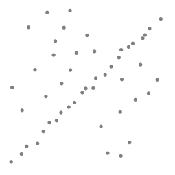
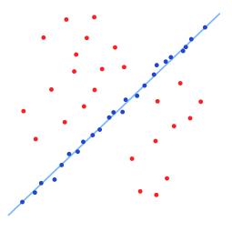
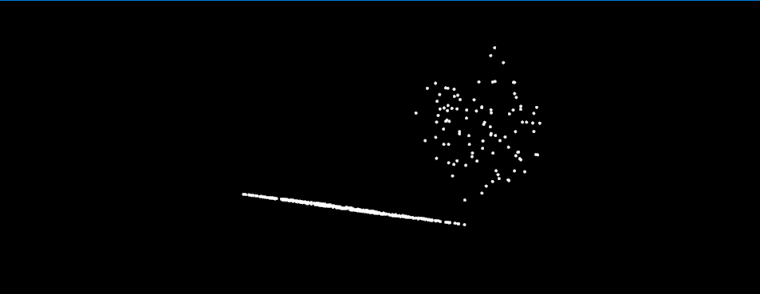
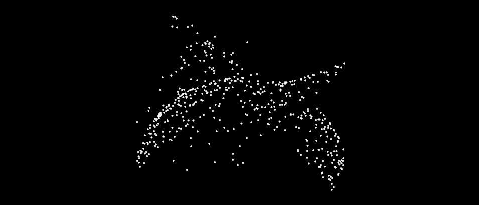

# 使用随机采样一致性识别模型

在本教程中，我们将学习如何使用带有平面模型的 RandomSampleConsensus 来获得适合该模型的点云。

## 理论入门

“RANdom SAmple Consensus”的缩写是RANSAC，它是一种迭代方法，用于从包含异常值的一组数据中估计数学模型的参数。该算法由 Fischler 和 Bolles 于 1981 年发布。 RANSAC 算法假设我们正在查看的所有数据都包含内部值和异常值。Inliers 可以通过具有一组特定参数值的模型来解释，而异常值在任何情况下都不适合该模型。另一个必要的假设是有一个程序可以从数据中最佳地估计所选模型的参数。

来自[[维基百科\]](https://pcl.readthedocs.io/projects/tutorials/en/latest/random_sample_consensus.html#wikipedia)：

> *RANSAC 算法的输入是一组观测数据值、一个可以解释或拟合观测的参数化模型，以及一些置信参数。*
>
> *RANSAC 通过迭代选择原始数据的随机子集来实现其目标。这些数据是假设的内点，然后按如下方式测试该假设：*
>
> > 1. *模型被拟合到假设的内点，即模型的所有自由参数都是从内点重建的。*
> > 2. *然后针对拟合模型测试所有其他数据，如果某个点与估计模型拟合良好，则也将其视为假设的内点。*
> > 3. *如果足够多的点被归类为假设的内点，则估计模型相当好。*
> > 4. *该模型是从所有假设的内点重新估计的，因为它只是从初始的假设内点集估计出来的。*
> > 5. *最后，通过估计内点相对于模型的误差来评估模型。*
>
> *这个过程重复固定的次数，每次都会产生一个模型，因为太少的点被归类为内点而被拒绝，或者是一个带有相应误差度量的精炼模型。在后一种情况下，如果其误差低于上次保存的模型，我们将保留精度最高的模型。*
>
> *…*
>
> *RANSAC 的一个优点是它能够对模型参数进行鲁棒估计，即，即使数据集中存在大量异常值，它也可以高度准确地估计参数。==RANSAC 的一个缺点是计算这些参数所需的时间没有上限==。当计算的迭代次数有限时，获得的解可能不是最佳的，甚至可能不是很好地拟合数据的解。通过这种方式，RANSAC 提供了一种权衡；通过计算更多的迭代次数，可以增加生成合理模型的概率。RANSAC 的另一个缺点是它需要设置特定于问题的阈值。*
>
> ==*RANSAC 只能为特定数据集估计一个模型。对于存在两个（或更多）模型时的任何一种模型方法，RANSAC 可能无法找到任何一个。*==

[
](https://pcl.readthedocs.io/projects/tutorials/en/latest/_images/random_sample_example1.png)[](https://pcl.readthedocs.io/projects/tutorials/en/latest/_images/random_sample_example2.png)

上图（来自[[维基百科\]](https://pcl.readthedocs.io/projects/tutorials/en/latest/random_sample_consensus.html#wikipedia)）显示了 RANSAC 算法在二维数据集上的简单应用。我们左边的图像是包含内部值和异常值的数据集的可视化表示。右侧的图像以红色显示所有异常值，以蓝色显示内部值。蓝线是 RANSAC 所做工作的结果。在这种情况下，我们试图拟合数据的模型是一条线，看起来它非常适合我们的数据。

## 代码

见[01_random_sample_consensus.py](./01_random_sample_consensus.py)

```python
import pclpy
from pclpy import pcl
import numpy as np
import sys


def simpleVis(cloud):
    # Open 3D viewer and add point cloud
    viewer = pcl.visualization.PCLVisualizer()
    viewer.setBackgroundColor(0, 0, 0)
    viewer.addPointCloud(cloud, 'sample cloud')
    viewer.setPointCloudRenderingProperties(0, 3, 'sample cloud')
    # viewer.addCoordinateSystem(1.0, 'global')
    viewer.initCameraParameters()
    return viewer


def printUsage(program):
    print('Usage:', program, ' [options]\n',
          "Options:\n",
          "-------------------------------------------\n",
          "-p          显示带异常值的平面点云\n",
          "-s          显示带异常值的球形点云\n",
          "-pf         显示根据平面模型的随机采样一致性得到的平面点云\n",
          "-sf         显示根据球形模型的随机采样一致性得到的球形点云\n",
          )


if __name__ == '__main__':
    # 生成点云数据
    cloud = pcl.PointCloud.PointXYZ()
    final = pcl.PointCloud.PointXYZ()
    size = 500

    point = pcl.point_types.PointXYZ()

    if len(sys.argv) == 1:
        printUsage(sys.argv[0])
        exit()
    elif sys.argv[1] == '-p' or sys.argv[1] == '-pf':
        for i in range(size):
            point.x = np.random.rand() * 1024
            point.y = np.random.rand() * 1024
            if i % 5 == 0:
                point.z = np.random.rand() * 1024  # 1/5的外点
            else:
                point.z = -(point.x + point.y)  # 剩下的是平面z=-(x+y)上的点
            cloud.push_back(point)
    elif sys.argv[1] == '-s' or sys.argv[1] == '-sf':
        for i in range(size):
            point.x = np.random.rand() * 1024
            point.y = np.random.rand() * 1024
            if i % 5 == 0:
                point.z = np.random.rand() * 1024  # 1/5的外点
            elif i % 2 == 0:
                point.z = np.sqrt(np.fabs(1024 ** 2 - point.x ** 2 - point.y ** 2))  # 剩下的是圆x^2+y^2+z^2=1024^2上的点
            else:
                point.z = -np.sqrt(np.fabs(1024 ** 2 - point.x ** 2 - point.y ** 2))
            cloud.push_back(point)
    else:
        printUsage(sys.argv[0])
        exit()
    inliers = pcl.vectors.Int()

    # 创建随机采样一致性实例并计算估计模型
    model_s = pcl.sample_consensus.SampleConsensusModelSphere.PointXYZ(cloud)
    model_p = pcl.sample_consensus.SampleConsensusModelPlane.PointXYZ(cloud)

    if sys.argv[1] == '-pf':
        ransac = pcl.sample_consensus.RandomSampleConsensus.PointXYZ(model_p)
        ransac.setDistanceThreshold(0.01)
        ransac.computeModel()
        ransac.getInliers(inliers)
    elif sys.argv[1] == '-sf':
        ransac = pcl.sample_consensus.RandomSampleConsensus.PointXYZ(model_s)
        ransac.setDistanceThreshold(0.01)
        ransac.computeModel()
        ransac.getInliers(inliers)

    # 将所有通过模型计算的内点复制到另外一个点云 pclpy中未完成copyPointCloud函数
    extract = pcl.filters.ExtractIndices.PointXYZ()
    extract.setInputCloud(cloud)
    extract.setIndices(inliers)
    extract.setNegative(False)
    extract.filter(final)
    viewer = None
    if sys.argv[1] == '-p' or sys.argv[1] == '-s':
        viewer = simpleVis(cloud)
    elif sys.argv[1] == '-pf' or sys.argv[1] == '-sf':
        viewer = simpleVis(final)
    while not viewer.wasStopped():
        viewer.spinOnce(10)
```

## 说明

首先初始化两个 PointClouds 并用点填充其中之一。大部分点都在指定的模型上面，但其中的一小部分 (1/5) 处于随机位置，即外点。

```python
# 生成点云数据
cloud = pcl.PointCloud.PointXYZ()
final = pcl.PointCloud.PointXYZ()
size = 500

point = pcl.point_types.PointXYZ()

if len(sys.argv) == 1:
    printUsage(sys.argv[0])
    exit()
elif sys.argv[1] == '-p' or sys.argv[1] == '-pf':
    for i in range(size):
        point.x = np.random.rand() * 1024
        point.y = np.random.rand() * 1024
        if i % 5 == 0:
            point.z = np.random.rand() * 1024  # 1/5的外点
        else:
            point.z = -(point.x + point.y)  # 剩下的是平面z=-(x+y)上的点
        cloud.push_back(point)
elif sys.argv[1] == '-s' or sys.argv[1] == '-sf':
    for i in range(size):
        point.x = np.random.rand() * 1024
        point.y = np.random.rand() * 1024
        if i % 5 == 0:
            point.z = np.random.rand() * 1024  # 1/5的外点
        elif i % 2 == 0:
            point.z = np.sqrt(np.fabs(1024 ** 2 - point.x ** 2 - point.y ** 2))  # 剩下的是圆x^2+y^2+z^2=1024^2上的点
        else:
            point.z = -np.sqrt(np.fabs(1024 ** 2 - point.x ** 2 - point.y ** 2))
        cloud.push_back(point)
```

接下来，我们创建一个整数向量，它可以存储来自 PointCloud 的内点的位置，现在我们可以使用来自输入云的平面或球体模型构建我们的 RandomSampleConsensus 对象。

```python
inliers = pcl.vectors.Int()

# 创建随机采样一致性实例并计算估计模型
model_s = pcl.sample_consensus.SampleConsensusModelSphere.PointXYZ(cloud)
model_p = pcl.sample_consensus.SampleConsensusModelPlane.PointXYZ(cloud)

if sys.argv[1] == '-pf':
    ransac = pcl.sample_consensus.RandomSampleConsensus.PointXYZ(model_p)
    ransac.setDistanceThreshold(0.01)
    ransac.computeModel()
    ransac.getInliers(inliers)
elif sys.argv[1] == '-sf':
    ransac = pcl.sample_consensus.RandomSampleConsensus.PointXYZ(model_s)
    ransac.setDistanceThreshold(0.01)
    ransac.computeModel()
    ransac.getInliers(inliers)
```

然后提取内点到新点云

```python
# 将所有通过模型计算的内点复制到另外一个点云 pclpy中未完成copyPointCloud函数
extract = pcl.filters.ExtractIndices.PointXYZ()
extract.setInputCloud(cloud)
extract.setIndices(inliers)
extract.setNegative(False)
extract.filter(final)
```

> 根据内点索引提取也可以使用copyPointClou()函数，但是pclpy未实现该函数，所以这里使用索引滤波来提取内点。

## 运行

有四种运行模式，在printUsage()中解释的很清楚。

* 显示带异常值的平面点云

进入01_random_sample_consensus.py文件夹，在terminal中输入

```bash
python  01_random_sample_consensus.py -p
```

在键盘上点击“r”，使点云居中



* 显示根据平面模型的随机采样一致性得到的平面点云

在terminal中输入

```bash
python  01_random_sample_consensus.py -pf
```


* 显示带异常值的球形点云

在terminal中输入

```bash
python  01_random_sample_consensus.py -s
```



* 显示根据球形模型的随机采样一致性得到的球形点云

在terminal中输入

```bash
python  01_random_sample_consensus.py -sf
```


> 参考：https://pcl.readthedocs.io/projects/tutorials/en/latest/index.html#sample-consensus

