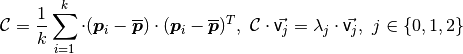
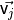
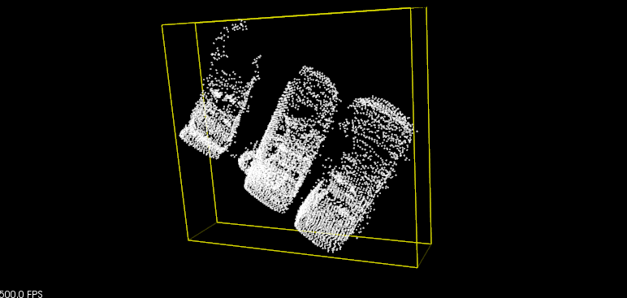
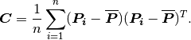
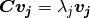

# PCL中的3D特征

本文档介绍了 PCL 中的 3D 特征估计方法，并作为对pcl::Feature类内部结构感兴趣的用户或开发人员的指南。

## 理论入门

来自[[RusuDissertation\]](https://pcl.readthedocs.io/projects/tutorials/en/latest/how_features_work.html#rusudissertation)：

> *在他们原生表示中，* **点** *如 3D 映射系统概念中定义的那样，使用它们的笛卡尔坐标 x、y、z 相对于给定原点简单地表示。假设坐标系的原点不随时间变化，则在 t1 和 t2 处获取的两个点 p1 和 p2 可能具有相同的坐标。然而，比较这些点是一个不适定的问题，因为即使它们在某些距离度量（例如欧几里德度量）方面相等，但它们可以在完全不同的表面上进行采样，因此当与其他点放在一起时代表完全不同的信息在他们附近的周围点。那是因为不能保证世界在 t1 和 t2 之间没有改变。一些采集设备可能会提供采样点的额外信息，*
>
> *由于各种原因需要比较点的应用程序需要更好的特性和度量，以便能够区分几何表面。因此，作为具有笛卡尔坐标的单一实体的 3D 点的概念消失了，* *取而代之的**是一个新概念，即***局部描述符** *。文献中有大量描述相同概念的不同命名方案，例如* **形状描述符** *或* **几何特征，** *但对于本文档的其余部分，它们将被称为* **点特征表示。**
>
> *…*
>
> *通过包括周围的邻居，可以在特征公式中推断和捕获底层采样表面几何形状，这有助于解决歧义比较问题。理想情况下，对于位于相同或相似表面上的点，结果特征将非常相似（相对于某些度量），而对于不同表面上的点，结果特征将非常相似，如下图所示。一个* **好的** *点特征表示与* **坏的** *点特征表示不同**，它能够在以下情况下捕获相同的局部表面特征：*
>
> > - **刚性变换**——*即数据中的 3D 旋转和 3D 平移不应影响合成特征向量 F 估计；*
> > - **变化的采样密度**-*原则上，一个或多或少密集采样的局部表面补丁应该具有相同的特征向量签名；*
> > - **噪声**-*在数据中存在轻微噪声的情况下，点特征表示必须在其特征向量中保留相同或非常相似的值。*


通常，PCL 特征使用近似方法来计算查询点的最近邻居，使用快速 kd 树查询。我们对两种类型的查询感兴趣：

- 确定查询点的**k**（用户给定参数）邻居（也称为*k-search*）；
- 确定一个查询点在半径为**r**的球体内的**所有邻居**（也称为*radius-search*）。

> 注意：
>
> 有关正确的**k**或**r**值应该是什么的讨论，请参阅[[RusuDissertation\]](https://pcl.readthedocs.io/projects/tutorials/en/latest/how_features_work.html#rusudissertation)。

## 专业术语

对于本文的其余部分，我们将进行某些缩写并引入某些符号，以简化文本解释。请参阅下表以了解所使用的每个术语的参考。

## 如何传递输入

由于 PCL 中几乎所有类都继承自基本pcl::PCLBase类，因此pcl::Feature类以两种不同的方式接受输入数据：

> 1. 
>    一个完整的点云数据集，通过**setInputCloud (PointCloudConstPtr &)** -**强制**
>
>    任何特征估计类都将尝试估计给定输入云中**每个**点的特征。
>
> 2. 点云数据集的子集，通过**setInputCloud (PointCloudConstPtr &)**和**setIndices (IndicesConstPtr &) 给出**-**可选**
>
>    任何特征估计类都将尝试估计给定输入云中每个点的特征，该点在给定索引列表中具有索引。*默认情况下，如果没有给出一组索引，则将考虑云中的所有点。**

此外，可以通过附加调用**setSearchSurface (PointCloudConstPtr &)**指定要使用的点邻居集。此调用是可选的，当未给出搜索面时，默认使用输入点云数据集。

因为**setInputCloud()**总是需要的，所以我们可以使用*<setInputCloud(), setIndices(), setSearchSurface()>*创建最多四种组合。假设我们有两个点云，P={p_1, p_2, ...p_n} 和 Q={q_1, q_2, ..., q_n}。下图显示了所有四种情况：


- **setIndices() = false, setSearchSurface() = false** - 这无疑是 PCL 中最常用的情况，其中用户只是输入单个 PointCloud 数据集并期望*在云中的所有点*估计某个特征。

  由于我们不希望根据是否给出一组索引和/或搜索表面来维护不同的实现副本，因此每当**索引 = false 时**，PCL 都会创建一组内部索引（作为std::vector<int>）基本上指向整个数据集（索引=1..N，其中 N 是云中的点数）。

  在上图中，这对应于最左边的情况。首先，我们估计 p_1 的最近邻居，然后是 p_2 的最近邻居，依此类推，直到我们用尽 P 中的所有点。

- **setIndices() = true, setSearchSurface() = false** - 如前所述，特征估计方法只会计算那些在给定索引向量中有索引的点的特征；

  在上图中，这对应于第二种情况。在这里，我们假设 p_2 的索引不是给定的索引向量的一部分，因此不会在 p2 估计邻居或特征。

- **setIndices() = false, setSearchSurface() = true** - 与第一种情况一样，将对作为输入给出的所有点的特征进行估计，但是，在**setSearchSurface() 中**给出的底层相邻表面将用于获取输入的最近邻点，而不是输入云本身；

  在上图中，这对应于第三种情况。如果 Q={q_1, q_2} 是另一个作为输入给出的云，不同于 P，并且 P 是 Q 的搜索表面，那么 q_1 和 q_2 的邻居将从 P 计算。

- **setIndices() = true, setSearchSurface() = true** - 这可能是最罕见的情况，其中索引和搜索表面都被给出。在这种情况下，将使用**setSearchSurface() 中**给出的搜索表面信息，**仅为**<input,indices> 对中的一个子集估计特征。

  最后，在上图中，这对应于最后一个（最右边）的情况。在这里，我们假设 q_2 的索引不是为 Q 给出的索引向量的一部分，因此不会在 q2 估计邻居或特征。


==应该使用**setSearchSurface()**时最有用的例子==是，当我们有一个非常密集的输入数据集，但我们不想估计其中所有点的特征，而是估计==使用pcl_keypoints 中的方法发现的某些关键点===时，或者在云的下采样版本（例如，使用pcl::VoxelGrid<T>过滤器获得）。在这种情况下，我们通过**setInputCloud()**传递下采样/关键点输入，并将原始数据作为**setSearchSurface() 传递**。

## 法线估计例子

输入一旦确定，就可使用查询点的相邻点来估计局部特征表示，这表示捕获查询点周围的底层采样表面的几何形状。描述表面几何形状的一个重要问题是首先推断其在坐标系中的方向，即估计其法线。表面法线是表面的重要属性，在许多领域（例如计算机图形应用程序）中大量使用，以应用生成阴影和其他视觉效果的正确光源（有关更多信息，请参阅[[RusuDissertation\]](https://pcl.readthedocs.io/projects/tutorials/en/latest/how_features_work.html#rusudissertation)）。

代码见[01_3DFeaturesWork.py](./01_3DFeaturesWork.py) 

* 为输入数据集中的所有点估计一组表面法线
```python
# 估计法线
# 输入数据集中的所有点估计一组表面法线
ne = pcl.features.NormalEstimation.PointXYZ_Normal()
ne.setInputCloud(cloud)
tree = pcl.search.KdTree.PointXYZ()
ne.setSearchMethod(tree)

cloud_normals = pcl.PointCloud.Normal()
ne.setRadiusSearch(0.003)
ne.compute(cloud_normals)
print(cloud_normals.size())
```
* 为输入数据集中的点子集估计一组表面法线。
```python
ne = pcl.features.NormalEstimation.PointXYZ_Normal()
ne.setInputCloud(cloud)
tree = pcl.search.KdTree.PointXYZ()
ne.setSearchMethod(tree)
ind = pcl.PointIndices()
[ind.indices.append(i) for i in range(0, cloud.size() // 2)]
ne.setIndices(ind)
cloud_normals = pcl.PointCloud.Normal()
ne.setRadiusSearch(0.003)
ne.compute(cloud_normals)
print(cloud_normals.size())
```
* 为输入数据集中的所有点估计一组表面法线，但使用另一个数据集估计它们的最近邻

    在这里，我们使用点云的下采样点云作为输入点云，使用原点云作为SearchSurface。
```python
ne = pcl.features.NormalEstimation.PointXYZ_Normal()
cloud_downsampled = pcl.PointCloud.PointXYZ()  # 获取一个降采样的点云 方法比较多，这里使用voxelized方法
vox = pcl.filters.VoxelGrid.PointXYZ()
vox.setInputCloud(cloud)
vox.setLeafSize(0.005, 0.005, 0.005)
vox.filter(cloud_downsampled)
ne.setInputCloud(cloud_downsampled)
ne.setSearchSurface(cloud)
tree = pcl.search.KdTree.PointXYZ()
ne.setSearchMethod(tree)
cloud_normals = pcl.PointCloud.Normal()
ne.setRadiusSearch(0.003)
ne.compute(cloud_normals)
print(cloud_normals.size())
```

下图分别为原始电云和下采样点云。


> 详细内容可参考[how-3d-features-work](https://pcl.readthedocs.io/projects/tutorials/en/latest/how_features_work.html#how-3d-features-work)，本文档不再赘述。

# 点云的法线估计

表面法线是几何表面的重要属性，在许多领域（例如计算机图形应用程序）中大量使用，以应用正确的光源来生成阴影和其他视觉效果。

给定一个几何表面，通常很容易将表面上某个点的法线方向推断为垂直于该点表面的向量。但是，由于我们获取的点云数据集代表了真实表面上的一组点样本，因此有两种可能性：

> - 从获取的点云数据集中获取底层表面，使用表面网格划分技术，然后从网格计算表面法线；
> - 使用近似值直接从点云数据集推断表面法线。

## 理论入门

尽管存在许多不同的法线估计方法，但我们将在本教程中重点介绍的方法是最简单的方法之一，其公式如下。确定表面上一点的法线的问题近似于估计与表面相切的平面的法线的问题，这反过来又变成了最小二乘平面拟合估计问题。

> 有关更多信息，包括最小二乘问题的数学方程，请参阅[[RusuDissertation\]](https://pcl.readthedocs.io/projects/tutorials/en/latest/how_features_work.html#rusudissertation)。

因此，用于估计表面法线的解决方案简化为对从查询点的最近邻居创建的协方差矩阵的特征向量和特征值（或 PCA – 主成分分析）进行分析。更具体地说，对于每个点，我们按如下方式组装协方差矩阵：



凡为考虑点邻居的数目*在附近* ， 表示3D质心最近的邻居，是 协方差矩阵的特征值第，并且 在个特征向量。

要从 PCL 中的一组点估计协方差矩阵，见[02_covariance_matrix.py](./02_covariance_matrix.py)：

```python
covariance_matrix = np.zeros((3, 3), dtype=np.float64)
xyz_centorid = np.zeros((4, 1), dtype=np.float32)
# 计算质心
pcl.common.compute3DCentroid(cloud, xyz_centorid)
print(xyz_centorid)
# 计算协方差矩阵
pcl.common.computeCovarianceMatrix(cloud, xyz_centorid, covariance_matrix)
print(covariance_matrix)
```

> 测试发现，这两个函数似乎有些问题。也有人在pclpy中提出了这个issues，见[issues#59](https://github.com/davidcaron/pclpy/issues/59) pclpy作者davidcaron建议使用numpy替代这两个函数。

```python
# 计算质心
xyz_centorid = np.mean(cloud.xyz, axis=0)
xyz_centorid = np.hstack((xyz_centorid, 1)).reshape(4, 1)
print(xyz_centorid)
# 计算协方差矩阵
covariance_matrix = np.cov(cloud.xyz.T)
```

一般来说，因为没有数学方法来求解法线的符号，如上所示通过主成分分析 (PCA) 计算的方向是不明确的，并且在整个点云数据集上的方向不一致。下图展示了这些对代表厨房环境一部分的较大数据集的两个部分的影响。图的右半部分表示扩展高斯图像 (EGI)，也称为法线球体，它描述了点云中所有法线的方向。由于数据集是 2.5D，因此是从单个视点获取的，因此法线应仅出现在 EGI 球体的一半上。然而，由于方向不一致，它们遍布整个球体。


如果观点 实际上是已知的，那么这个问题的解决方案是微不足道的。为了使所有法线 一致地朝向视点，它们需要满足等式：


下图显示了上图数据集中的所有法线一致指向视点后的结果。


要在 PCL 中手动重新定向给定点法线，可以使用：

> 如果数据集有多个采集视点，则上述正常的重定向方法不成立，需要实现更复杂的算法。更多信息请参见[[RusuDissertation\]](https://pcl.readthedocs.io/projects/tutorials/en/latest/how_features_work.html#rusudissertation)。

## 选择正确的比例

如前所述，一个点的表面法线需要从该点的周围点邻域支持（也称为**k-neighborhood**）估计 。

最近邻估计问题的细节提出了*正确比例因子*的问题：给定采样点云数据集，正确的**k**（通过**pcl::Feature::setKSearch**给出）或**r**（通过**pcl::Feature**给出）是多少 **::setRadiusSearch** ) 值应该用于确定一个点的最近邻居集？

这个问题非常重要并且构成了点特征表示的自动估计（即，没有用户给定阈值）的限制因素。为了更好地说明这个问题，下图展示了选择较小尺度（即较小的**r**或**k**）与较大尺度（即较大的**r**或**k ）的效果**）。图中的左侧部分描绘了一个合理的精心选择的比例因子，两个平面的估计表面法线近似垂直，整个桌子上都可以看到小边缘。然而，如果比例因子太大（右侧部分），因此相邻表面的邻居集合更大，覆盖来自相邻表面的点，则估计的点特征表示会失真，在两个平面的边缘处具有旋转的表面法线，并被涂抹边缘和抑制细节。


无需涉及太多细节，现在假设必须根据应用程序所需的详细程度来选择确定点邻域的尺度就足够了。简而言之，如果杯子手柄和圆柱部分之间边缘的曲率很重要，则比例因子需要足够小以捕捉这些细节，否则就大。

## 法线估计

虽然[Features](https://pcl.readthedocs.io/projects/tutorials/en/latest/index.html#features-tutorial)已经给出了一个正常估计的例子 ，我们将在这里修改其中一个，以便更好地解释幕后发生的事情。

为输入数据集中的所有点估计一组表面法线，见[03_estimating_surface_normals.py](./03_estimating_surface_normals.py)。

```python
# 生成点云数据
# 加载点云
cloud = pcl.PointCloud.PointXYZ()
reader = pcl.io.PCDReader()
reader.read("../../data/bunny.pcd", cloud)
print(cloud.size())
# 构造法线估计类
ne = pcl.features.NormalEstimation.PointXYZ_Normal()
ne.setInputCloud(cloud)

tree = pcl.search.KdTree.PointXYZ()
ne.setSearchMethod(tree)

cloud_normals = pcl.PointCloud.Normal()
ne.setRadiusSearch(0.03)
# 计算法线
ne.compute(cloud_normals)
print(cloud_normals.size())
```

来自**NormalEstimation**类的实际**计算**调用 在内部不执行任何操作，但：

```python
for each point p in cloud P
  1. get the nearest neighbors of p
  2. compute the surface normal n of p
  3. check if n is consistently oriented towards the viewpoint and flip otherwise
```

视点默认为 (0,0,0)，可以通过以下方式更改：

```python
setViewPoint (vpx, vpy, vpz);
```

> 如果您的数据集是有组织的（例如，使用 TOF 相机、立体相机等获取 - 即它具有宽度和高度），则要获得更快的结果，请参阅[使用积分图像](https://pcl.readthedocs.io/projects/tutorials/en/latest/normal_estimation_using_integral_images.html#normal-estimation-using-integral-images)的[法线估计](https://pcl.readthedocs.io/projects/tutorials/en/latest/normal_estimation_using_integral_images.html#normal-estimation-using-integral-images)。

# 使用积分图像的法线估计

在本教程中，我们将学习如何使用积分图像计算有组织的点云的法线。

## 代码

见[normal_estimation_using_integral_images.py](./normal_estimation_using_integral_images.py) 

```python
# 加载点云
cloud = pcl.PointCloud.PointXYZ()
reader = pcl.io.PCDReader()
reader.read("../../data/table_scene_mug_stereo_textured.pcd", cloud)
# 估计法线
normals = pcl.PointCloud.Normal()
ne = pcl.features.IntegralImageNormalEstimation.PointXYZ_Normal()
ne.setNormalEstimationMethod(ne.AVERAGE_3D_GRADIENT)
ne.setMaxDepthChangeFactor(0.02)
ne.setNormalSmoothingSize(10.0)
ne.setInputCloud(cloud)
ne.compute(normals)

# # 可视化
# viewer = pcl.visualization.PCLVisualizer("viewer")
# viewer.setBackgroundColor(0.0, 0.0, 0.0)
# viewer.addPointCloud(cloud, "sample cloud")  # 显示点云
# # viewer.addPointCloudNormals(cloud, normals)  # 显示点云和法线 该函数bug未修复~
#
# while not viewer.wasStopped():
#     viewer.spinOnce(10)

# 使用pyvista可视化
p = pv.Plotter()
cloud = pv.wrap(cloud.xyz)
p.add_mesh(cloud, point_size=1, color='g')
p.camera_position = 'iso'
p.enable_parallel_projection()
p.show_axes()
p.show()
```

在可视化法线时，遇到了一下错误：
````
In..\Rendering\Core\vtkActor.cxx, line 43. Error: no override found for vtkactor
````
查看了pclpy的官方Issue，发现有人提过这个Issue，这个bug还未修复
> issue:https://github.com/davidcaron/pclpy/issues/58

感觉pclpy在可视化这一块儿bug比较多（目前已发现的有：无法可视化mesh、带法线的点云），在python中可视化功能可使用pyvista代替。事实上，作者可能也意识到了这个问题，在最新的pclpy v1.12.0移除了可视化模块。

## 说明

这里只挑重要的几行代码说一下。

```python
# 估计法线
normals = pcl.PointCloud.Normal()
ne = pcl.features.IntegralImageNormalEstimation.PointXYZ_Normal()
ne.setNormalEstimationMethod(ne.AVERAGE_3D_GRADIENT)
ne.setMaxDepthChangeFactor(0.02)
ne.setNormalSmoothingSize(10.0)
ne.setInputCloud(cloud)
ne.compute(normals)
```

可以使用以下常规估计方法：

```python
enum NormalEstimationMethod
{
  COVARIANCE_MATRIX,
  AVERAGE_3D_GRADIENT,
  AVERAGE_DEPTH_CHANGE
};
```

COVARIANCE_MATRIX 模式创建 9 个积分图像，以根据其局部邻域的协方差矩阵计算特定点的法线。AVERAGE_3D_GRADIENT 模式创建 6 个积分图像来计算水平和垂直 3D 梯度的平滑版本，并使用这两个梯度之间的叉积计算法线。AVERAGE_DEPTH_CHANGE 模式仅创建单个积分图像并根据平均深度变化计算法线。

> 参考：[Normal Estimation Using Integral Images](https://pcl.readthedocs.io/projects/tutorials/en/latest/normal_estimation_using_integral_images.html#normal-estimation-using-integral-images) 

# 点特征直方图

随着点特征表示的发展，表面法线和曲率估计在特定点周围几何的表示中有些基本。尽管非常快速且易于计算，但它们无法捕获太多细节，因为它们仅用几个值来近似点的 k 邻域的几何形状。直接结果是，大多数场景将包含许多具有相同或非常相似特征值的点，从而减少它们的信息特征。

本教程介绍了一系列 3D 特征描述符，为简单起见创造了 PFH（点特征直方图），介绍了它们的理论优势并从 PCL 的角度讨论了实现细节。作为先决条件，请先阅读[PointCloud](https://pcl.readthedocs.io/projects/tutorials/en/latest/normal_estimation.html#normal-estimation)教程中的[估计表面法线](https://pcl.readthedocs.io/projects/tutorials/en/latest/normal_estimation.html#normal-estimation)，因为 PFH 特征依赖于 xyz 3D 数据和表面法线。

## 理论入门

PFH 公式的目标是通过使用值的多维直方图概括点周围的平均曲率来对点的 k 邻域几何属性进行编码。这种高维超空间为特征表示提供了信息签名，对底层表面的 6D 姿态是不变的，并且可以很好地处理邻域中存在的不同采样密度或噪声水平。

点特征直方图表示基于 k 邻域中的点与其估计的表面法线之间的关系。简而言之，它试图通过考虑估计法线方向之间的所有相互作用来尽可能最好地捕获采样的表面变化。**由此产生的超空间取决于每个点的表面法线估计的质量。**

下图显示了查询点 ( )的 PFH 计算的影响区域图，用红色标记并放置在半径为**r**的圆（3D 中的球体）及其所有**k 个**邻居（距离小于半径**r** ) 在网格中完全互连。最终的 PFH 描述符被计算为邻域中所有点对之间关系的直方图，因此计算复杂度为。


为了计算两个点之间的相对差和 与它们相关联的法线和，我们定义在点（参见下图）中的一个固定的坐标系。


使用上面的**uvw**框架，两个法线和的差异 可以表示为一组角度特征如下：


==其中**d**是两点之间的欧几里得距离 ，, 。对于 k 邻域中的每对两个点计算四元 组，因此将这两个点及其法线的 12 个值（xyz 和法线信息)减少到 4==。

要估计一对点的 PFH 四元组，请使用：

```python
computePairFeatures(p1: numpy.ndarray[float32[4, 1]], n1: numpy.ndarray[float32[4, 1]], p2: numpy.ndarray[float32[4, 1]], n2: numpy.ndarray[float32[4, 1]], f1: float, f2: float, f3: float, f4: float) -> bool
```

为了为查询点创建最终的 PFH 表示，所有四元组的集合被合并到一个直方图中。binning过程将每个特征的取值范围划分为**b个**细分，并统计每个子区间出现的次数。由于上述四个特征中的三个是法线之间角度的度量，因此它们的值可以很容易地归一化为三角圆上的同一区间。一个 binning 示例是将每个特征区间划分为相同数量的相等部分，因此创建一个直方图完全相关空间中的 bin。在这个空间中，直方图 bin 增量对应于所有 4 个特征都具有特定值的点。下图展示了点云中不同点的点特征直方图表示示例。

在某些情况下，第四个特征**d**对于通常在机器人中获得的 2.5D 数据集并不具有极端意义，因为从视点来看，相邻点之间的距离会增加。因此，==对于局部点密度影响该特征维度的扫描省略 **d**已被证明是有益的。==


> 有关更多信息和数学推导，包括对不同表面几何形状的 PFH 特征的分析，请参阅[[RusuDissertation\]](https://pcl.readthedocs.io/projects/tutorials/en/latest/how_features_work.html#rusudissertation)。

## 估计PFH特征

点特征直方图作为[pcl_features](http://docs.pointclouds.org/trunk/a02944.html)库的一部分在 PCL 中实现。

默认的 PFH 实现使用 5 个分箱细分（例如，四个特征值中的每一个都将使用其值区间中的**这么多分**箱），并且不包括距离（如上所述 - 尽管 用户可以调用**computePairFeatures**方法来如果需要，也可以获取距离），这会生成一个 125 字节$5^3$的浮点值数组 ( )。这些存储在**pcl::PFHSignature125**点类型中。

以下代码片段将为输入数据集中的所有点估计一组 PFH 特征。

见[05_PHF_descriptors.py](./05_PHF_descriptors.py)

```python
import pclpy
from pclpy import pcl
import numpy as np
import sys

if __name__ == '__main__':
    # 生成点云数据
    # 加载点云
    cloud = pcl.PointCloud.PointXYZ()
    reader = pcl.io.PCDReader()
    reader.read("../../data/bunny.pcd", cloud)
    print(cloud.size())
    # 构造法线估计类
    ne = pcl.features.NormalEstimation.PointXYZ_Normal()
    ne.setInputCloud(cloud)

    tree = pcl.search.KdTree.PointXYZ()
    ne.setSearchMethod(tree)

    normals = pcl.PointCloud.Normal()
    ne.setRadiusSearch(0.03)
    # 计算法线
    ne.compute(normals)
    print(normals.size())

    # 构造PFH estimation类，把cloud和normals传递进去
    pfh = pcl.features.PFHEstimation.PointXYZ_Normal_PFHSignature125()
    pfh.setInputCloud(cloud)
    pfh.setInputNormals(normals)
    # 或者，如果cloud是PointNormal类型，执行pfh.setInputNormals(cloud);

    # 构造一个kd树
    # 它的内容将根据给定的输入点云填充到对象内部(因为没有给出其他搜索面)。
    tree = pcl.search.KdTree.PointXYZ()
    pfh.setSearchMethod(tree)

    # 输出
    pfhs = pcl.PointCloud.PFHSignature125()

    # 使用5cmm球形范围内的邻居点
    # 注意：在这里使用的半径必须大于用来估计表面法线的半径!!
    pfh.setRadiusSearch(0.05)

    # 计算特征
    pfh.compute(pfhs)

    print(pfhs.size())  # pfhs与cloud size应该相同
```

来自**PFHEstimation**类的实际**计算**调用在内部不执行任何操作，但它做了下面的事：

```python
for each point p in cloud P
  1. get the nearest neighbors of p
  2. for each pair of neighbors, compute the three angular values
  3. bin all the results in an output histogram
```

要从 k 邻域计算单个 PFH 表示，PCL 可以使用：

```python
computePointPFHSignature (const pcl::PointCloud<PointInT> &cloud,
                          const pcl::PointCloud<PointNT> &normals,
                          const std::vector<int> &indices,
                          int nr_split,
                          Eigen::VectorXf &pfh_histogram);
```

但是pclpy尚未实现该函数。

> 出于效率原因，**PFHEstimation**中的**计算**方法不检查法线是否包含 NaN 或无限值。将这些值传递给**compute()**将导致未定义的输出。建议至少在设计处理链或设置参数时检查法线。这可以通过在调用**compute()**之前插入以下代码来完成：
>
> ```python
> for i in range(normals.size()):
>     if not pcl.common.isFinite(normals.at(i)):
>         print('normals[%d] is not finite\n', i)
> ```
>
> 在生产代码中，应设置预处理步骤和参数，以便法线有限否则会引发错误。

<font color='red'>经过测试，pclpy的isFinite()函数似乎不支持pcl.PointCloud.Normal()类型的点，emmmmm，pclpy的bug还是有点多啊</font>

> 参考：https://pcl.readthedocs.io/projects/tutorials/en/latest/pfh_estimation.html#pfh-estimation

# 快速点特征直方图 (FPFH) 描述符

为给定的点云与点的点特征直方图的理论计算复杂度（见 [点要素直方图（PFH）描述](https://pcl.readthedocs.io/projects/tutorials/en/latest/pfh_estimation.html#pfh-estimation)）是，这里是 中的每个p点的邻居数量。对于实时或接近实时的应用程序，计算量可能是密集点邻域中点特征直方图的主要瓶颈之一。

本教程描述了 PFH 公式的简化，称为快速点特征直方图 (FPFH)（有关更多信息，请参阅[[RusuDissertation\]](https://pcl.readthedocs.io/projects/tutorials/en/latest/how_features_work.html#rusudissertation)），它将算法的计算复杂度降低到，同时仍保留 PFH 的大部分判别能力。

## 理论入门

为了简化直方图特征计算，我们进行如下操作：

> - 在第一步中，对于每个查询点，如[点特征直方图 (PFH) 描述符中](https://pcl.readthedocs.io/projects/tutorials/en/latest/pfh_estimation.html#pfh-estimation)所述，计算其自身与其相邻点之间的一组元组 - 这将称为简化点特征直方图 (SPFH)；
> - 在第二步中，对于每个点，重新确定其邻居，并使用相邻的 SPFH 值对最终直方图 （称为 FPFH）进行加权，如下所示：


其中权重表示某个给定度量空间中查询点和相邻点之间的距离 ，因此对 ( ) 对进行评分，但也可以在必要时选择不同的度量。为了理解这种加权方案的重要性，下图展示了以 为中心的 k 邻域集的影响区域图。


因此，对于给定的查询点，算法首先通过在其自身与其邻居之间创建对来估计其 SPFH 值（用红线表示）。对数据集中的所有点重复此操作，然后使用其邻居的 SPFH 值 重新加权 SPFH 值，从而创建 的 FPFH 。由于额外的加权方案而产生的额外 FPFH 连接用黑线显示。如图所示，一些值对将被计算两次（图中用粗线标记）。

## PFH 和 FPFH 之间的差异

PFH 和 FPFH 配方之间的主要区别总结如下：

> 1. 从图中可以看出，FPFH 并没有完全互连 的所有邻居，因此缺少一些可能有助于捕获查询点周围几何的值对；
> 2. PFH 对查询点周围的精确确定的表面进行建模，而 FPFH 包括**r**半径球体之外的附加点对（尽管最多**2r**远）；
> 3. 由于重新加权方案，FPFH结合了SPFH值并重新捕获了一些点相邻值对；
> 4. FPFH的整体复杂度大大降低，从而使其在实时应用中使用成为可能；
> 5. 结果直方图通过去相关值来简化，即简单地创建*d 个*单独的特征直方图，每个特征维度一个，并将它们连接在一起（见下图）。


## 估计 FPFH 特征

快速点特征直方图作为[pcl_features](http://docs.pointclouds.org/trunk/a02944.html) 库的一部分在 PCL 中实现 。

默认的 FPFH 实现使用 11 个分箱细分（例如，四个特征值中的每一个都将使用来自其值区间的这么多分箱）和去相关方案（见上文：特征直方图单独计算并合并），结果为 33 -byte 浮点值数组。这些存储在**pcl::FPFHSignature33**点类型中。

以下代码片段将为输入数据集中的所有点估计一组 FPFH 特征。

见[06_FPFH_descriptors.py](./06_FPFH_descriptors.py)

```python
import pclpy
from pclpy import pcl
import numpy as np
import sys

if __name__ == '__main__':
    # 生成点云数据
    # 加载点云
    cloud = pcl.PointCloud.PointXYZ()
    reader = pcl.io.PCDReader()
    reader.read("../../data/bunny.pcd", cloud)
    print(cloud.size())
    # 构造法线估计类
    ne = pcl.features.NormalEstimation.PointXYZ_Normal()
    ne.setInputCloud(cloud)

    tree = pcl.search.KdTree.PointXYZ()
    ne.setSearchMethod(tree)

    normals = pcl.PointCloud.Normal()
    ne.setRadiusSearch(0.03)
    # 计算法线
    ne.compute(normals)
    print(normals.size())
    
    # 构造FPFH estimation类，把cloud和normals传递进去
    fpfh = pcl.features.FPFHEstimation.PointXYZ_Normal_FPFHSignature33()
    fpfh.setInputCloud(cloud)
    fpfh.setInputNormals(normals)
    # 或者，如果cloud是PointNormal类型，执行fpfh.setInputNormals(cloud);

    # 构造一个kd树
    # 它的内容将根据给定的输入点云填充到对象内部(因为没有给出其他搜索面)。
    tree = pcl.search.KdTree.PointXYZ()
    fpfh.setSearchMethod(tree)

    # 输出
    pfhs = pcl.PointCloud.FPFHSignature33()

    # 使用5cmm球形范围内的邻居点
    # 注意：在这里使用的半径必须大于用来估计表面法线的半径!!
    fpfh.setRadiusSearch(0.05)

    # 计算特征
    fpfh.compute(pfhs)
    print(pfhs.size())  # pfhs与cloud size应该相同
```

来自**FPFHEstimation**类的实际**计算**调用在内部不执行任何操作，但做了下面的事情：

```python
for each point p in cloud P
  1. pass 1:
     1. get the nearest neighbors of :math:`p`
     2. for each pair of :math:`p, p_i` (where :math:`p_i` is a neighbor of :math:`p`, compute the three angular values
     3. bin all the results in an output SPFH histogram
  2. pass 2:
     1. get the nearest neighbors of :math:`p`
     3. use each SPFH of :math:`p` with a weighting scheme to assemble the FPFH of :math:`p`:
```

> 同样的，出于效率原因，**FPFHEstimation**中的**计算**方法不检查法线是否包含 NaN 或无限值。将这些值传递给**compute()**将导致未定义的输出。建议至少在设计处理链或设置参数时检查法线。这可以通过在调用**compute()**之前插入以下代码来完成：
>
> ```python
> for i in range(normals.size()):
>     if not pcl.common.isFinite(normals.at(i)):
>         print('normals[%d] is not finite\n', i)
> ```
>
> 在生产代码中，应设置预处理步骤和参数，以便法线有限否则会引发错误。

<font color='red'>经过测试，pclpy的isFinite()函数似乎不支持pcl.PointCloud.Normal()类型的点，emmmmm，pclpy的bug还是有点多啊</font>

## 使用 OpenMP 加速 FPFH

对于追求速度的用户，PCL 提供了 FPFH 估计的额外实现，它使用使用 OpenMP 的多核/多线程范例来加速计算。该类的名称是**pcl::FPFHEstimationOMP**，其 API 与单线程**pcl::FPFHEstimation** 100% 兼容，这使其适合作为替代品。在具有 8 个内核的系统上，计算时间应该快 6-8 倍。

同样的，pclpy里面也绑定了这个方法：pcl.features.FPFHEstimationOMP。

# 估计一组点的 VFH 特征

本文档描述了视点特征直方图 ( [[VFH\]](https://pcl.readthedocs.io/projects/tutorials/en/latest/vfh_estimation.html#vfh) ) 描述符，这是一种针对集群（例如，对象）识别和 6DOF 姿态估计问题的点集群的新颖表示。

下图展示了 VFH*识别*和姿态估计的示例。给定一组训练数据（顶行，底行，除了最左边的点云），学习模型，然后使用云（左下部分）来查询/测试模型。匹配的结果从左下角开始从左到右从最好到最差。有关更多信息，请参阅 [使用 VFH 描述符](https://pcl.readthedocs.io/projects/tutorials/en/latest/vfh_recognition.html#vfh-recognition)和/或[[VFH\] 的](https://pcl.readthedocs.io/projects/tutorials/en/latest/vfh_estimation.html#vfh)[集群识别和 6DOF 姿态估计](https://pcl.readthedocs.io/projects/tutorials/en/latest/vfh_recognition.html#vfh-recognition)。

## 理论入门

视点特征直方图（或 VFH）源于 FPFH 描述符（请参阅[快速点特征直方图 (FPFH) 描述符](https://pcl.readthedocs.io/projects/tutorials/en/latest/fpfh_estimation.html#fpfh-estimation)）。由于它的速度和判别能力，我们决定利用 FPFH 的强识别结果，但在保持尺度不变性的同时增加视点方差。

我们对物体识别和姿态识别问题的贡献是扩展要为整个物体集群估计的 FPFH（如下图所示），并计算视点方向和每个点估计的法线之间的额外统计数据。为此，我们使用了将视点方向直接混合到 FPFH 中的相对法线角计算中的关键思想。


视点分量是通过收集视点方向与每个法线所成角度的直方图来计算的。请注意，我们不是指每个法线的视角，因为这不会是比例不变的，而是指中心视点方向转换到每个法线之间的角度。第二个组件测量相对平移、倾斜和偏航角，如[快速点特征直方图 (FPFH) 描述符中所述，](https://pcl.readthedocs.io/projects/tutorials/en/latest/fpfh_estimation.html#fpfh-estimation)但现在在中心点的视点方向和表面上的每个法线之间进行测量。


因此，新组装的特征称为视点特征直方图 (VFH)。下图展示了这个想法，新功能由两部分组成：

> 1. 视点方向分量和
> 2. 由扩展的 FPFH 组成的表面形状组件。


## 估计 VFH 特征

视点特征直方图作为[pcl_features](http://docs.pointclouds.org/trunk/a02944.html) 库的一部分在 PCL 中实现 。

默认的 VFH 实现对三个扩展的 FPFH 值中的每一个使用 45 个分箱细分，再加上每个点和质心之间的距离的另外 45 个分箱细分和视点组件的 128 个分箱细分，从而产生一个 308 字节的浮点数组值。它们存储在**pcl::VFHSignature308**点类型中。

PFH/FPFH 描述符和 VFH 之间的主要区别在于，对于给定的点云数据集，只会估计单个 VFH 描述符，而生成的 PFH/FPFH 数据将具有与点数相同的条目数云端。

以下代码片段将为输入数据集中的所有点估计一组 VFH 特征。

见[07_VFH_descriptors.py](./07_VFH_descriptors.py) 

```python
cloud = pcl.PointCloud.PointXYZ()
reader = pcl.io.PCDReader()
reader.read("../../data/bunny.pcd", cloud)
print(cloud.size())
# 构造法线估计类
ne = pcl.features.NormalEstimation.PointXYZ_Normal()
ne.setInputCloud(cloud)

tree = pcl.search.KdTree.PointXYZ()
ne.setSearchMethod(tree)

normals = pcl.PointCloud.Normal()
ne.setRadiusSearch(0.03)
# 计算法线
ne.compute(normals)
print(normals.size())

cloud_normals = pcl.PointCloud.PointNormal().from_array(
    np.hstack((cloud.xyz, normals.normals, normals.curvature.reshape(-1, 1))))
for i in range(cloud_normals.size()):
    if not pcl.common.isFinite(cloud_normals.at(i)):
        print('cloud_normals[%d] is not finite\n', i)

        # 构造VFH estimation类，把cloud和normals传递进去
        vfh = pcl.features.VFHEstimation.PointXYZ_Normal_VFHSignature308()
        vfh.setInputCloud(cloud)
        vfh.setInputNormals(normals)
        # 或者，如果cloud是PointNormal类型，执行vfh.setInputNormals(cloud);

        # 构造一个kd树
        # 它的内容将根据给定的输入点云填充到对象内部(因为没有给出其他搜索面)。
        tree = pcl.search.KdTree.PointXYZ()
        vfh.setSearchMethod(tree)

        # 输出
        vfhs = pcl.PointCloud.VFHSignature308()

        # 计算特征
        vfh.compute(vfhs)

        print(vfhs.size())  # pfhs的size应该为1
```

## 可视化VFH特征

PCL里面可以使用**PCLHistogramVisualization**类来可视化，python环境下选择就比较多了，下面使用Matplotlib来进行绘制。

```python
# 使用matplotlib绘制直方图
plt.plot(vfhs.histogram[0])
plt.show()
```


>  参考： *( [1](https://pcl.readthedocs.io/projects/tutorials/en/latest/vfh_estimation.html#id1) , [2](https://pcl.readthedocs.io/projects/tutorials/en/latest/vfh_estimation.html#id2) )* http://www.willowgarage.com/sites/default/files/Rusu10IROS.pdf

# 从距离图像中提取 NARF 特征

由于pclpy尚未完成range_image类，该功能无法实现。

# 基于转动惯量和偏心率的描述符（存在bug）

在本教程中，我们将学习如何使用pcl::MomentOfInertiaEstimation类来获取基于偏心率和转动惯量的描述符。此类还允许提取云的轴对齐和定向边界框。但请记住，提取的 OBB 不是最小可能的边界框。

## 理论入门

特征提取方法的思想如下。首先计算点云的协方差矩阵并提取其特征值和向量。您可以认为合成的特征向量被归一化并始终形成右手坐标系（主要特征向量代表 X 轴，次要向量代表 Z 轴）。在下一步中进行迭代过程。在每次迭代中，旋转主特征向量。旋转顺序始终相同，并围绕其他特征向量执行，这提供了==点云旋转的不变性==。以后，我们将把这个旋转的主向量称为当前轴。


计算每个当前轴的转动惯量。此外，当前轴也用于偏心计算。出于这个原因，当前向量被视为平面的法线向量，并且输入点云被投影到它上面。之后，为获得的投影计算偏心率。

[](https://pcl.readthedocs.io/projects/tutorials/en/latest/_images/projected_cloud.png)

该类还提供了获取 AABB 和 OBB 的方法。定向边界框沿特征向量计算为 AABB。

## 代码

本教程点云文件： [here](https://github.com/PointCloudLibrary/data/blob/master/tutorials/min_cut_segmentation_tutorial.pcd) 

见[08_moment_of_inertia.py](./08_moment_of_inertia.py) 

```python
# 加载点云
cloud = pcl.PointCloud.PointXYZ()
reader = pcl.io.PCDReader()
reader.read("../../data/min_cut_segmentation_tutorial.pcd", cloud)

print(cloud.size())

feature_extractor = pcl.features.MomentOfInertiaEstimation.PointXYZ()
feature_extractor.setInputCloud(cloud)
feature_extractor.compute()

moment_of_inertia = pcl.vectors.Float()
eccentricity = pcl.vectors.Float()

min_point_AABB = pcl.point_types.PointXYZ()
max_point_AABB = pcl.point_types.PointXYZ()
min_point_OBB = pcl.point_types.PointXYZ()
max_point_OBB = pcl.point_types.PointXYZ()
position_OBB = pcl.point_types.PointXYZ()

rotational_matrix_OBB = np.zeros((3, 3), np.float)
major_value, middle_value, minor_value = 0.0, 0.0, 0.0
major_vector = np.zeros((3, 1), np.float)
middle_vector = np.zeros((3, 1), np.float)
minor_vector = np.zeros((3, 1), np.float)
mass_center = np.zeros((3, 1), np.float)

feature_extractor.getMomentOfInertia(moment_of_inertia)
feature_extractor.getEccentricity(eccentricity)
feature_extractor.getAABB(min_point_AABB, max_point_AABB)
feature_extractor.getEigenValues(major_value, middle_value, minor_value)    # 后面这三行似乎都不怎么管用，使用numpy数组直接作为参数的函数似乎都有这个问题。
feature_extractor.getEigenVectors(major_vector, middle_vector, minor_vector)
feature_extractor.getMassCenter(mass_center)


viewer = pcl.visualization.PCLVisualizer('3D Viewer')
viewer.setBackgroundColor(0.0, 0.0, 0.0)
viewer.addCoordinateSystem(1.0)
viewer.initCameraParameters()
viewer.addPointCloud(cloud, 'simple cloud')
viewer.addCube(min_point_AABB.x, max_point_AABB.x, min_point_AABB.y, max_point_AABB.y,
               min_point_AABB.z, max_point_AABB.z, 1.0, 1.0, 0.0, 'AABB')
viewer.setShapeRenderingProperties(5, 1, 'AABB')  # 点云用线框表示

position = np.array([[position_OBB.x], [position_OBB.y], [position_OBB.z]],
                    np.float)
quat = pclpy.pcl.vectors.Quaternionf()
viewer.addCube(position, quat, max_point_OBB.x - min_point_OBB.x,
               max_point_OBB.y - min_point_OBB.y, max_point_OBB.z - min_point_OBB.z, "OBB")
viewer.setShapeRenderingProperties(5, 1, "OBB")

center = pcl.point_types.PointXYZ()
center.x, center.y, center.z = mass_center[0], mass_center[1], mass_center[2]

x_axis = pcl.point_types.PointXYZ()
x_axis.x, x_axis.y, x_axis.z = major_vector[0] + mass_center[0],\
                               major_vector[1] + mass_center[1],\
                               major_vector[2] + mass_center[2]

y_axis = pcl.point_types.PointXYZ()
y_axis.x, y_axis.y, y_axis.z = middle_vector[0] + mass_center[0],\
                               middle_vector[1] + mass_center[1],\
                               middle_vector[2] + mass_center[2]

z_axis = pcl.point_types.PointXYZ()
z_axis.x, z_axis.y, z_axis.z = minor_vector[0] + mass_center[0], \
                               minor_vector[1] + mass_center[1], \
                               minor_vector[2] + mass_center[2]
viewer.addLine(center, x_axis, 1.0, 0.0, 0.0,  "major eigen vector")
viewer.addLine(center, y_axis, 0.0, 1.0, 0.0, "middle eigen vector")
viewer.addLine(center, z_axis, 0.0, 0.0, 1.0, "minor eigen vector")

while not viewer.wasStopped():
    viewer.spinOnce(10)
```

## 说明

现在让我们研究一下这段代码的目的是什么。前几行将被省略，因为它们很明显。

```python
# 加载点云
cloud = pcl.PointCloud.PointXYZ()
reader = pcl.io.PCDReader()
reader.read("../../data/min_cut_segmentation_tutorial.pcd", cloud)
```

只是从 .pcd 文件加载云。

```python
feature_extractor = pcl.features.MomentOfInertiaEstimation.PointXYZ()
feature_extractor.setInputCloud(cloud)
feature_extractor.compute()
```

这是`pcl::MomentOfInertiaEstimation`类的实例化。紧接着我们设置输入点云并开始计算过程。

```python
moment_of_inertia = pcl.vectors.Float()
eccentricity = pcl.vectors.Float()

min_point_AABB = pcl.point_types.PointXYZ()
max_point_AABB = pcl.point_types.PointXYZ()
min_point_OBB = pcl.point_types.PointXYZ()
max_point_OBB = pcl.point_types.PointXYZ()
position_OBB = pcl.point_types.PointXYZ()

rotational_matrix_OBB = np.zeros((3, 3), np.float)
major_value, middle_value, minor_value = 0.0, 0.0, 0.0
major_vector = np.zeros((3, 1), np.float)
middle_vector = np.zeros((3, 1), np.float)
minor_vector = np.zeros((3, 1), np.float)
mass_center = np.zeros((3, 1), np.float)
```

这是我们声明存储描述符和边界框所需的所有必要变量。

```python
feature_extractor.getMomentOfInertia(moment_of_inertia)
feature_extractor.getEccentricity(eccentricity)
feature_extractor.getAABB(min_point_AABB, max_point_AABB)
feature_extractor.getEigenValues(major_value, middle_value, minor_value)    # 后面这三行似乎都不怎么管用，使用numpy数组直接作为参数的函数似乎都有这个问题。
feature_extractor.getEigenVectors(major_vector, middle_vector, minor_vector)
feature_extractor.getMassCenter(mass_center)
```

获取描述符和其他属性。

<font color='red'>注意，getEigenValues()，getEigenVectors()，getMassCenter()这三个函数似乎没有起作用，使用numpy数组直接作为参数的函数似乎都有这个问题，前面几例子中求质心的时候也碰到过。</font>

所以事实上，本教程只对 AABB进行了可视化，对于OBB，暂不能实现。后续有时间了，可以用numpy实现一下。

```python
viewer = pcl.visualization.PCLVisualizer('3D Viewer')
viewer.setBackgroundColor(0.0, 0.0, 0.0)
viewer.addCoordinateSystem(1.0)
viewer.initCameraParameters()
viewer.addPointCloud(cloud, 'simple cloud')
viewer.addCube(min_point_AABB.x, max_point_AABB.x, min_point_AABB.y, max_point_AABB.y,
               min_point_AABB.z, max_point_AABB.z, 1.0, 1.0, 0.0, 'AABB')
viewer.setShapeRenderingProperties(5, 1, 'AABB')  # 点云用线框表示
```

创建`PCLVisualizer`用于结果可视化的类实例。在这里，我们还添加了云和 AABB 以进行可视化。我们设置渲染属性，以便使用线框显示立方体，因为默认使用实心立方体。

> 参考[setShapeRenderingProperties()参数](https://pointclouds.org/documentation/namespacepcl_1_1visualization.html#a4fd43ffdf1620ea8cefc233d2a7e5bea)   

```python
position = np.array([[position_OBB.x], [position_OBB.y], [position_OBB.z]],
                    np.float)
quat = pclpy.pcl.vectors.Quaternionf()
viewer.addCube(position, quat, max_point_OBB.x - min_point_OBB.x,
               max_point_OBB.y - min_point_OBB.y, max_point_OBB.z - min_point_OBB.z, "OBB")
viewer.setShapeRenderingProperties(5, 1, "OBB")
```

OBB 的可视化稍微复杂一些。所以在这里我们从旋转矩阵创建一个四元数，设置 OBB 位置并将其传递给可视化器。

> 这里旋转矩阵转四元数尚未实现。

```python
center = pcl.point_types.PointXYZ()
center.x, center.y, center.z = mass_center[0], mass_center[1], mass_center[2]

x_axis = pcl.point_types.PointXYZ()
x_axis.x, x_axis.y, x_axis.z = major_vector[0] + mass_center[0],\
                               major_vector[1] + mass_center[1],\
                               major_vector[2] + mass_center[2]

y_axis = pcl.point_types.PointXYZ()
y_axis.x, y_axis.y, y_axis.z = middle_vector[0] + mass_center[0],\
                               middle_vector[1] + mass_center[1],\
                               middle_vector[2] + mass_center[2]

z_axis = pcl.point_types.PointXYZ()
z_axis.x, z_axis.y, z_axis.z = minor_vector[0] + mass_center[0], \
                               minor_vector[1] + mass_center[1], \
                               minor_vector[2] + mass_center[2]
viewer.addLine(center, x_axis, 1.0, 0.0, 0.0,  "major eigen vector")
viewer.addLine(center, y_axis, 0.0, 1.0, 0.0, "middle eigen vector")
viewer.addLine(center, z_axis, 0.0, 0.0, 1.0, "minor eigen vector")
```

特征向量可视化。

## 运行

运行代码：

进入代码所在文件夹后，输入

```bash
python 08_moment_of_inertia.py
```



> 只有AABB的结果。

# RoPs（旋转投影统计）特征（存在bug）


在本教程中，我们将学习如何使用pcl::ROPSEstimation类来提取点特征。本课程中实现的特征提取方法由 Yulan Guo、Ferdous Sohel、Mohammed Bennamoun、Min Lu 和 Jianwei Wan 也在他们的文章“Rotational Projection Statistics for 3D Local Surface Description and Object Recognition”中提出

## 理论入门

特征提取方法的思想如下。有了一个网格和一组必须计算特征的点，我们执行一些简单的步骤。首先，对于给定的兴趣点，局部表面被裁剪。局部曲面由给定支撑半径内的点和三角形组成。对于给定的局部表面，计算 LRF（局部参考框架）。LRF 只是向量的三元组，您可以在文章中找到有关如何计算这些向量的综合信息。真正重要的是，使用这些向量我们可以提供点云旋转的不变性。为此，我们简单地以兴趣点成为原点的方式平移局部表面的点，然后旋转局部表面，使 LRF 向量与 Ox、Oy 和 Oz 轴对齐。完成此操作后，我们开始特征提取。对于每个轴 Ox、Oy 和 Oz 执行以下步骤，我们将这些轴称为当前轴：

> - 局部表面围绕当前轴旋转给定角度；
> - 将旋转后的局部曲面的点投影到三个平面 XY、XZ 和 YZ 上；
> - 对于构建的每个投影分布矩阵，该矩阵仅显示落在每个 bin 上的点数。bins数代表矩阵维数，是算法的参数，也是支撑半径；
> - 计算每个分布矩阵的中心矩：M11、M12、M21、M22、E。这里E是香农熵；
> - 然后连接计算值以形成子特征。

我们多次重复这些步骤。迭代次数取决于给定的旋转次数。连接不同轴的子特征以形成最终的 RoPS 描述符。

## 代码

在本教程中，我们将使用来自 Queen's Dataset 的模型。您可以选择任何其他点云，但为了使代码正常工作，您需要使用三角剖分算法来获得多边形。您可以在此处找到建议的模型：

> - [点](https://github.com/PointCloudLibrary/data/blob/master/tutorials/min_cut_segmentation_tutorial.pcd)- 包含点云
> - [`](https://pcl.readthedocs.io/projects/tutorials/en/latest/rops_feature.html#id1)索引 - 包含必须计算 RoP 的点的索引
> - [`](https://pcl.readthedocs.io/projects/tutorials/en/latest/rops_feature.html#id3)三角形 - 包含多边形

见[09_rops_feature.py](./09_rops_feature.py) 

```python
# 加载点云
cloud = pcl.PointCloud.PointXYZ()
reader = pcl.io.PCDReader()
reader.read("../../data/min_cut_segmentation_tutorial.pcd", cloud)
# show_cloud(cloud)

indices = pcl.PointIndices()
indices.indices = pcl.vectors.Int(np.arange(0, cloud.size()))

# 构造法线估计类
ne = pcl.features.NormalEstimation.PointXYZ_Normal()
ne.setInputCloud(cloud)

tree = pcl.search.KdTree.PointXYZ()
ne.setSearchMethod(tree)

cloud_normals = pcl.PointCloud.Normal()
ne.setRadiusSearch(0.3)

# 计算法线
ne.compute(cloud_normals)

# 连接XYZ和normal字段
cloud_with_normals = pcl.PointCloud.PointNormal().from_array(np.hstack((
    cloud.xyz, cloud_normals.normals, cloud_normals.curvature.reshape(-1, 1))))

# 构造查询树
tree = pcl.search.KdTree.PointNormal()
tree.setInputCloud(cloud_with_normals)

# 贪婪三角化
gp3 = pcl.surface.GreedyProjectionTriangulation.PointNormal()
triangles = pcl.PolygonMesh()

# 设置参数
gp3.setSearchRadius(0.1)  # 设置连接点之间的最大距离，（即是三角形最大边长）
gp3.setMu(2.5)  # 设置被样本点搜索其近邻点的最远距离为2.5，为了使用点云密度的变化
gp3.setMaximumNearestNeighbors(100)  # 设置样本点可搜索的邻域个数
gp3.setMaximumSurfaceAngle(np.pi / 4)  # 设置某点法线方向偏离样本点法线的最大角度45
gp3.setMinimumAngle(np.pi / 8)  # 设置三角化后得到的三角形内角的最小的角度为10
gp3.setMaximumAngle(2 * np.pi / 3)  # 设置三角化后得到的三角形内角的最大角度为120
gp3.setNormalConsistency(True)  # 设置该参数保证法线朝向一致

# 计算结果
gp3.setInputCloud(cloud_with_normals)
gp3.setSearchMethod(tree)
gp3.reconstruct(triangles)

# 获取顶点信息
triangles = triangles.polygons

# 算法参数
support_radius = 0.0285  # 局部表面裁剪的支持半径
number_of_partition_bins = 5  # 用于形成分布矩阵的分区数和
number_of_rotations = 3  # 用于形成分布矩阵的旋转数,影响描述符的长度

tree = pcl.search.KdTree.PointXYZ()
tree.setInputCloud(cloud)

feature_estimator = pcl.features.ROPSEstimation.PointXYZ_Histogram_135()
feature_estimator.setSearchMethod(tree)
feature_estimator.setSearchSurface(cloud)
feature_estimator.setInputCloud(cloud)
feature_estimator.setIndices(indices)
feature_estimator.setTriangles(triangles)
feature_estimator.setRadiusSearch(support_radius)
feature_estimator.setNumberOfPartitionBins(number_of_partition_bins)
feature_estimator.setNumberOfRotations(number_of_rotations)
feature_estimator.setSupportRadius(support_radius)

# histograms = pcl.features.Feature.PointXYZ_Histogram_135()
# feature_estimator.compute(histograms)	# pclpy中未绑定存在bug
# plt.plot(histograms)
```


> 最后一步中，feature_estimator.compute()，参数为：
>
> ```python
> 1. (self: pclpy.pcl.features.Feature.PointXYZ_Histogram_135, output: pcl::PointCloud<pcl::Histogram<135> >) -> None
> ```
>
> 其中第二个参数明显是没有绑定成功。o(╥﹏╥)o


所以这个例子最后一步计算特征失败，代码中注释掉了。pclpy的bug还是太多了

# 全局对齐空间分布 (GASD) 描述符

<font color='red'>pclpy并未完成GASD类的绑定！在此仅对GASD原理进行介绍。</font> 

本文档描述了用于有效对象识别和姿态估计的全局对齐空间分布 ( [[GASD\]](https://pcl.readthedocs.io/projects/tutorials/en/latest/gasd_estimation.html#gasd) ) 全局描述符。

GASD 基于对代表对象实例的整个点云的参考系的估计，用于将其与规范坐标系对齐。之后，根据对齐点云的 3D 点在空间上的分布情况计算对齐点云的描述符。这种描述符也可以通过整个对齐点云的颜色分布进行扩展。匹配点云的全局对齐变换用于计算对象姿态。有关更多信息，请参阅[[GASD\]](https://pcl.readthedocs.io/projects/tutorials/en/latest/gasd_estimation.html#gasd)。

## 理论入门

全局对齐空间分布 (或 GASD) 全局描述方法将表示给定对象的局部视图的 3D 点云作为输入。第一步包括估计点云的参考系，这允许计算将其与规范坐标系对齐的变换，从而使描述符姿势不变。对齐后，根据 3D 点的空间分布计算点云的形状描述符。还可以考虑沿点云的颜色分布，以获得具有更高判别能力的形状和颜色描述符。然后通过匹配部分视图的查询和训练描述符来执行对象识别。每个识别对象的姿态也是从匹配的查询和训练部分视图的对齐变换中计算出来的。

使用主成分分析 (PCA) 方法估计参考系。给定一组表示对象局部视图的 3D 点，其中，第一步是计算它们的质心，它是参考系的原点。然后从和计算协方差矩阵，如下所示：



此后，本征值和对应的特征向量的获得，具有，使得。考虑到特征值按升序排列，与最小特征值相关联的特征向量用作参考系的轴。如果与观察方向之间的角度在![[-90^{\circ}, 90^{\circ}]](README.assets/937430289f7a32faa2857cc537e3755d5cf12b65.png)范围内，则取反。这可确保轴始终指向观察者。参考系的轴是与最大特征值相关联的特征向量。该轴由下式给出。

从参考系中，可以计算出![[\boldsymbol{R} |  \粗体符号{t}]](README.assets/3b15812928cc7b9066430732cef6dfd0866f3f5e.png)将其与规范坐标系对齐的变换。局部视图的所有点然后用 变换![[\boldsymbol{R} |  \粗体符号{t}]](https://pcl.readthedocs.io/projects/tutorials/en/latest/_images/math/3b15812928cc7b9066430732cef6dfd0866f3f5e.png)，其定义如下：


一旦使用参考帧对齐点云，就可以从中计算出姿态不变的全局形状描述符。以原点为中心的点云轴对齐边界立方体被划分为规则网格。对于每个网格单元，计算带有bin的直方图。如果，则每个直方图 bin 将在 3D 规则网格中存储属于其对应单元格的点数。如果，则对于每个单元格，将计算每个样本和云质心之间归一化距离的直方图。

每个样本对直方图的贡献相对于云中的点总数进行归一化。可选地，可以使用内插将每个样本的值分布到相邻单元格中，以试图避免在样本从一个单元格内移动到另一个单元格时可能导致直方图突然变化的边界效应。然后通过连接计算的直方图获得描述符。

[](https://pcl.readthedocs.io/projects/tutorials/en/latest/_images/grid.png) [](https://pcl.readthedocs.io/projects/tutorials/en/latest/_images/grid_top_side_bottom_view.png)

还可以将颜色信息合并到描述符中以增加其辨别力。描述符的颜色分量是用一个类似于形状分量的网格计算的，但是根据属于它的点的颜色为每个单元格生成颜色直方图。点云颜色在 HSV 空间中表示，色调值在带有bin 的直方图中累积。与形状分量计算类似，执行关于点数的归一化。此外，还可以执行直方图样本的内插。形状和颜色分量连接在一起，产生最终的描述符。

查询和训练描述符使用最近邻搜索方法进行匹配。之后，对于每个匹配的对象实例，使用从各个查询和训练部分视图的参考帧中获得的对齐变换来计算粗略姿势。分别给定变换![[\mathbf{R_{q}} |  \mathbf{t_{q}}]](README.assets/48364bcf22cc0458eba4355c32027e71c0002e42.png)和![[\mathbf{R_{t}} |  \mathbf{t_{t}}]](README.assets/508b72b741074e8138acee57c8d3e41b3de81156.png)对齐查询和训练局部视图，对象粗姿态![[\mathbf{R_{c}} |  \mathbf{t_{c}}]](README.assets/4e6a27e31e512f9c6664c72988e8ee1594ab3790.png)由下式获得


![[\mathbf{R_{c}} |  \mathbf{t_{c}}]](README.assets/4e6a27e31e512f9c6664c72988e8ee1594ab3790.png)然后可以使用迭代最近点 (ICP) 算法细化粗略姿势。


# 全局半径的表面描述符(GRSD)

见[10_GRSD_descriptors.py](./10_GRSD_descriptors.py)

详情请参阅：[g_r_s_d_estimation](https://pointclouds.org/documentation/classpcl_1_1_g_r_s_d_estimation.html) 

