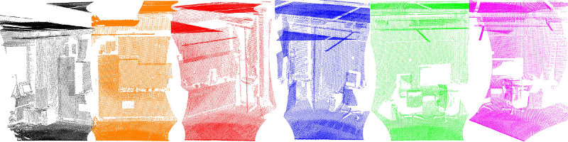
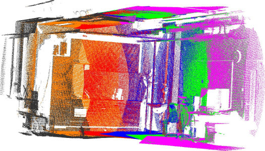
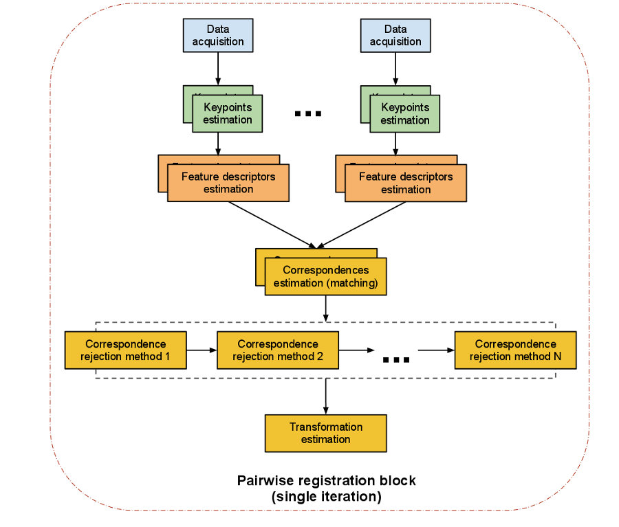

pclpy暂时跳过了registration模块儿，所以关于点云配准这一块儿暂时无法实现。 

# PCL配准API

将各种 3D 点云数据视图始终对齐到一个完整模型中的问题称为**配准**。它的目标是在全局坐标框架中找到单独获取的视图的相对位置和方向，使得它们之间的交叉区域完美重叠。因此，对于从不同视图获取的每组点云数据集，我们需要一个能够将它们对齐到单个点云模型中的系统，以便可以应用后续处理步骤，例如分割和对象重建。

上图中给出了这个意义上的动机示例，其中使用倾斜的 2D 激光单元获取了一组六个单独的数据集。由于每个单独的扫描仅代表周围世界的一小部分，因此必须找到将它们配准在一起的方法，从而创建完整的点云模型，如下图所示。

PCL 配准库中的算法工作的动机是在给定的输入数据集中找到正确的点对应关系，并估计可以将每个单独的数据集旋转和转换为一致的全局坐标框架的刚性变换。==如果输入数据集中的点对应关系是完全已知的==，那么这种配准范式就很容易解决。这意味着一个数据集中的选定点列表必须==从特征表示的角度==与另一个数据集中的点列表“重合”。此外，如果估计的对应关系是“完美的”，那么配准问题就有一个封闭形式的解。

PCL 包含一组强大的算法，允许估计多组对应关系，以及拒绝不良对应关系的方法，并以稳健的方式从它们估计变换。以下部分将分别介绍它们中的每一个。

## 成对配准概述

我们有时将将一对点云数据集*配准*在一起的问题称为*成对配准*，其输出通常是一个刚性变换矩阵 (4x4)，表示必须应用于其中一个数据集的旋转和平移（让我们称之为它*source*），以便它与其他数据集完美对齐（我们称之为*target*或 *model*）。

在*成对注册*步骤中执行的步骤如下图所示。请注意，我们代表的是算法的一次迭代。程序员可以决定循环任何或所有步骤。

两个数据集的计算步骤很简单：

> - 从一组点中，确定最能代表两个数据集中场景的**兴趣点**（即**关键点**）；
> - 在每个关键点，计算一个**特征描述符**；
> - 根据特征和位置之间的相似性，从**特征描述符**集及其在两个数据集中的 XYZ 位置，估计一组**对应**关系；
> - 假设数据是有噪声的，并非所有对应关系都是有效的，因此拒绝那些对配准过程产生负面影响的不良对应关系；
> - 从剩余的一组良好的对应关系中，估计一个运动变换。

## 配准模块

### 关键点

关键点是在场景中具有“特殊属性”的兴趣点，例如书的角落，或写有“PCL”的书上的字母“P”。PCL 中有许多不同的关键点，如 NARF、SIFT 和 FAST。或者，您也可以将每个点或一个子集作为关键点。“将两个 kinect 数据集直接输入到对应估计中”的问题是每帧中有 300k 个点，因此可以有 300k^2 个对应。

### 特征描述符

基于发现的关键点，我们必须提取[特征](http://www.pointclouds.org/documentation/tutorials/how_features_work.php) ，在那里我们组装信息并生成向量以将它们相互比较。同样，有许多特征选项可供选择，例如 NARF、FPFH、BRIEF 或 SIFT。

### 对应估计

给定来自两次采集扫描的两组特征向量，我们必须找到相应的特征以找到数据中的重叠部分。根据特征类型，我们可以使用不同的方法来查找对应关系。

对于*点匹配*（使用点的 xyz 坐标作为特征），有组织和无组织的数据存在不同的方法：

- 蛮力匹配，
- kd-tree最近邻搜索（FLANN），
- 在有组织的数据的图像空间中搜索，以及
- 在组织数据的索引空间中搜索。

对于*特征匹配*（不使用点的坐标，而是使用某些特征），仅存在以下方法：

- 蛮力匹配和
- kd-tree 最近邻搜索 (FLANN)。

除了搜索之外，还区分了两种类型的对应估计：

- 直接对应估计（默认）为云 A 中的每个点搜索云 B 中的对应点。
- “Reciprocal”（相互）对应估计搜索从云 A 到云 B 和从 B 到 A 的对应关系，并且只使用交集。

### 对应关系舍弃

当然，并非所有估计的对应关系都是正确的。由于错误的对应关系会对最终转换的估计产生负面影响，因此需要舍弃它们。这可以使用 RANSAC 或通过减少数量并仅使用找到的对应关系的特定百分比来完成。

一种特殊情况是一对多的对应关系，其中模型中的一个点对应于源中的多个点。这些可以通过仅使用距离最小的一个或通过检查附近的其他匹配来过滤。

### 变换估计

最后一步是实际计算转换。

- 基于对应关系评估一些错误度量
- 估计相机姿势之间的（刚性）变换（运动估计）并最小化误差度量
- 优化点的结构
- 示例： - 用于运动估计的 SVD；- 使用不同内核进行运动估计的 Levenberg-Marquardt；
- 使用刚性变换将源旋转/平移到目标上，并可能使用所有点或点的子集或关键点运行内部 ICP 循环
- 迭代直到满足某个收敛标准

### 示例

### 迭代最近点

1. 搜索对应关系。
2. 拒绝不良对应。
3. 使用良好的对应关系估计转换。
4. 迭代。

### 基于特征的配准

1. 使用 SIFT 关键点 (pcl::SIFT...something)
2. 在关键点使用 FPFH 描述符（pcl::FPFHEstimation）（请参阅我们的教程，例如 http://www.pointclouds.org/media/rss2011.html）
3. 使用 pcl::CorrespondenceEstimation 获取 FPFH 描述符并估计对应关系
4. 使用一种或多种 pcl::CorrespondenceRejectionXXX 方法拒绝不良对应
5. 最终得到如上所述的转换

示例 1：办公场景，Kinect 数据

示例 2：户外场景，激光 (Riegl) 数据

示例 3：室内场景，激光 (SICK) 数据

。

