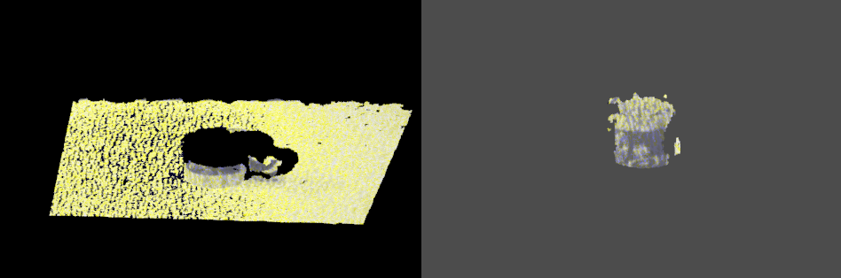
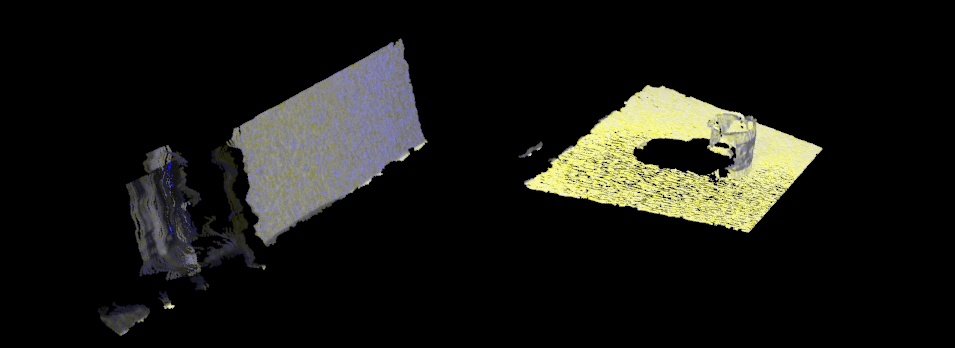
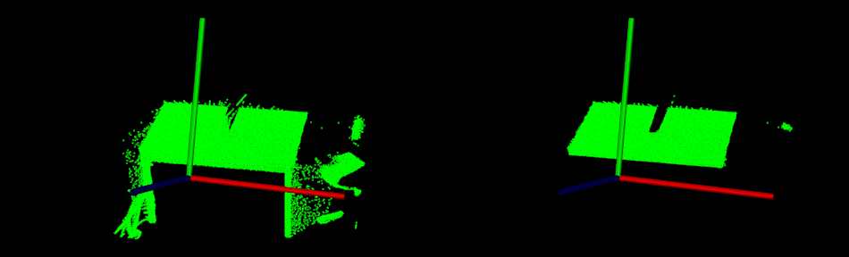
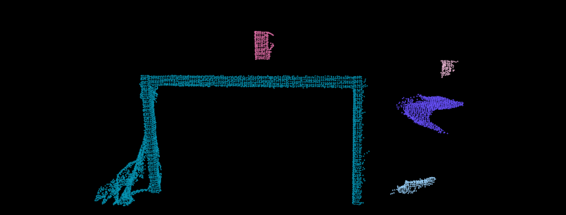

# 平面模型分割

在本教程中，我们将学习如何对一组点进行简单的平面分割，即找到支持平面模型的点云中的所有点。本教程支持滤波教程中介绍的[从 PointCloud](https://pcl.readthedocs.io/projects/tutorials/en/latest/extract_indices.html#extract-indices)中[提取索引](https://pcl.readthedocs.io/projects/tutorials/en/latest/extract_indices.html#extract-indices)。

## 代码

见[01_planar_segmentation.py](./01_planar_segmentation.py)

```python
import pclpy
from pclpy import pcl
import numpy as np

if __name__ == '__main__':
    # 生成点云
    cloud_size = 15
    a = np.zeros((cloud_size, 3))
    cloud = pcl.PointCloud.PointXYZ().from_array(a)
    for point in cloud.points:
        point.x = np.random.ranf() * 1024
        point.y = np.random.ranf() * 1024
        point.z = 1.0
    # 设置一些外点
    cloud.points[0].z = 2.0
    cloud.points[3].z = -2.0
    cloud.points[6].z = -4.0

    print('Point cloud data:', cloud.size(), 'points')
    for point in cloud.points:
        print(point.x, ' ', point.y, ' ', point.z)

    coefficients = pcl.ModelCoefficients()
    inliers = pcl.PointIndices()

    # 分割类实例化
    seg = pcl.segmentation.SACSegmentation.PointXYZ()
    # 可选项
    seg.setOptimizeCoefficients(True)
    # 必须要指定的参数
    seg.setModelType(0)  # 0为pcl::SACMODEL_PLANE
    seg.setMethodType(0)  # 0为pcl::SAC_RANSAC
    seg.setDistanceThreshold(0.01)

    seg.setInputCloud(cloud)
    seg.segment(inliers, coefficients)

    if len(inliers.indices) == 0:
        print('Could not estimate a planar model for the given dataset.')
        exit()

    print('Model coefficients:',
          coefficients.values[0], ' ',
          coefficients.values[1], ' ',
          coefficients.values[2], ' ',
          coefficients.values[2])

    print('Model inliers: ', len(inliers.indices))
    for idx in inliers.indices:
        print(idx, '    ',
              cloud.points[idx].x, ' ',
              cloud.points[idx].y, ' ',
              cloud.points[idx].z)

    # 可视化内点和外点
    viewer = pcl.visualization.PCLVisualizer("3D viewer")
    viewer.setBackgroundColor(0, 0, 0)
    # 内点
    inliers_cloud = pcl.PointCloud.PointXYZ(cloud, inliers.indices)
    single_color = pcl.visualization.PointCloudColorHandlerCustom.PointXYZ(inliers_cloud, 0.0, 255.0, 0.0)  # 内点设为绿色
    viewer.addPointCloud(inliers_cloud, single_color, "inliers cloud")
    # 外点
    outliers_cloud = pcl.PointCloud.PointXYZ()
    extract = pcl.filters.ExtractIndices.PointXYZ()
    extract.setInputCloud(cloud)
    extract.setIndices(inliers)
    extract.setNegative(True)  # 提取出来外点点云
    extract.filter(outliers_cloud)

    single_color = pcl.visualization.PointCloudColorHandlerCustom.PointXYZ(outliers_cloud, 255.0, 0.0, 0.0)  # 外点设为红色
    viewer.addPointCloud(outliers_cloud, single_color, "outliers cloud")

    viewer.setPointCloudRenderingProperties(0, 3, "inliers cloud")
    viewer.setPointCloudRenderingProperties(0, 3, "outliers cloud")
    viewer.addCoordinateSystem(1)
    viewer.initCameraParameters()

    while not viewer.wasStopped():
        viewer.spinOnce(10)
```

## 说明

首先是构建点云，并加入若干外点：

```python
# 生成点云
cloud_size = 15
a = np.zeros((cloud_size, 3))
cloud = pcl.PointCloud.PointXYZ().from_array(a)
for point in cloud.points:
point.x = np.random.ranf() * 1024
point.y = np.random.ranf() * 1024
point.z = 1.0
# 设置一些外点
cloud.points[0].z = 2.0
cloud.points[3].z = -2.0
cloud.points[6].z = -4.0

print('Point cloud data:', cloud.size(), 'points')
for point in cloud.points:
print(point.x, ' ', point.y, ' ', point.z)
```

然后创建 pcl.segmentation.SACSegmentation.PointXYZ()对象并设置模型和方法类型。这也是我们指定“距离阈值”的地方，它决定了一个点必须离模型多近才能被视为内点。在本教程中，我们将使用 RANSAC 方法 (pcl::SAC_RANSAC) 作为选择的稳健估计器。我们的决定是出于 RANSAC 的简单性（其他稳健的估计器将其用作基础并添加其他更复杂的概念）。有关 RANSAC 的更多信息，请查看其[维基百科页面](http://en.wikipedia.org/wiki/RANSAC)。

其次是输出显示内点集的内容，以及估计的平面参数$ax+by+cz+d=0$.

```python
coefficients = pcl.ModelCoefficients()
inliers = pcl.PointIndices()

# 分割类实例化
seg = pcl.segmentation.SACSegmentation.PointXYZ()
# 可选项
seg.setOptimizeCoefficients(True)
# 必须要指定的参数
seg.setModelType(0)  # 0为pcl::SACMODEL_PLANE
seg.setMethodType(0)  # 0为pcl::SAC_RANSAC
seg.setDistanceThreshold(0.01)

seg.setInputCloud(cloud)
seg.segment(inliers, coefficients)

if len(inliers.indices) == 0:
    print('Could not estimate a planar model for the given dataset.')
    exit()

print('Model coefficients:',
      coefficients.values[0], ' ',
      coefficients.values[1], ' ',
      coefficients.values[2], ' ',
      coefficients.values[2])

print('Model inliers: ', len(inliers.indices))
for idx in inliers.indices:
    print(idx, '    ',
          cloud.points[idx].x, ' ',
          cloud.points[idx].y, ' ',
          cloud.points[idx].z)
```

最后就是可视化内点和外点，比较简单，不再赘述。

## 运行

运行代码：

```bash
python 01_planar_segmentation.py
```

结果：

> Point cloud data: 15 points
> 221.09796142578125   190.82125854492188   2.0
> 700.376708984375   306.92431640625   1.0
> 693.7754516601562   924.7059936523438   1.0
> 360.8123474121094   1020.7657470703125   -2.0
> 682.8381958007812   857.310791015625   1.0
> 485.5827941894531   444.12451171875   1.0
> 201.10165405273438   526.590087890625   -4.0
> 742.3724975585938   685.0823974609375   1.0
> 706.4700317382812   705.3656616210938   1.0
> 800.8279418945312   639.457275390625   1.0
> 621.3114624023438   461.4114074707031   1.0
> 105.48615264892578   940.4956665039062   1.0
> 79.97904205322266   933.0923461914062   1.0
> 819.8399047851562   434.0813293457031   1.0
> 333.2424621582031   279.7982482910156   1.0
> Model coefficients: -0.0   -0.0   1.0   1.0
> Model inliers:  12
> 1      700.376708984375   306.92431640625   1.0
> 2      693.7754516601562   924.7059936523438   1.0
> 4      682.8381958007812   857.310791015625   1.0
> 5      485.5827941894531   444.12451171875   1.0
> 7      742.3724975585938   685.0823974609375   1.0
> 8      706.4700317382812   705.3656616210938   1.0
> 9      800.8279418945312   639.457275390625   1.0
> 10      621.3114624023438   461.4114074707031   1.0
> 11      105.48615264892578   940.4956665039062   1.0
> 12      79.97904205322266   933.0923461914062   1.0
> 13      819.8399047851562   434.0813293457031   1.0
> 14      333.2424621582031   279.7982482910156   1.0

可视化结果：


> 注意，为了内点和外点区别更明显，这里其实我增大了外点的偏离程度。实际情况中偏离点可能没有这么明显。

# 圆柱模型分割

本教程举例说明了如何使用圆柱模型进行点云分割。按如下步骤进行（按顺序）：

- 过滤掉 1.5 米以外的数据点
- 估计每个点的表面法线
- 平面模型（描述我们演示数据集中的表）被分割并保存到磁盘
- 圆柱模型（描述我们演示数据集中的杯子）被分割并保存到磁盘

> 由于数据中存在噪声，圆柱模型并不完美。


## 代码

见[02_cylinder_segmentation.py](./02_cylinder_segmentation.py)

```python
import pclpy
from pclpy import pcl
import numpy as np

if __name__ == '__main__':
    # 所有需要的类实例化
    reader = pcl.io.PCDReader()
    ps = pcl.filters.PassThrough.PointXYZRGBA()
    ne = pcl.features.NormalEstimation.PointXYZRGBA_Normal()
    seg = pcl.segmentation.SACSegmentationFromNormals.PointXYZRGBA_Normal()
    writer = pcl.io.PCDWriter()
    extract = pcl.filters.ExtractIndices.PointXYZRGBA()
    extract_normals = pcl.filters.ExtractIndices.Normal()
    tree = pcl.search.KdTree.PointXYZRGBA()

    #  Datasets
    cloud = pcl.PointCloud.PointXYZRGBA()
    cloud_filtered = pcl.PointCloud.PointXYZRGBA()
    cloud_normals = pcl.PointCloud.Normal()
    cloud_filtered2 = pcl.PointCloud.PointXYZRGBA()
    cloud_normals2 = pcl.PointCloud.Normal()
    coefficients_plane = pcl.ModelCoefficients()
    coefficients_cylinder = pcl.ModelCoefficients()
    inliers_plane = pcl.PointIndices()
    inliers_cylinder = pcl.PointIndices()

    # 加载点云
    reader.read("../../data/table_scene_mug_stereo_textured.pcd", cloud)
    print('PointCloud has: ', cloud.size(), 'data points.')

    # 使用带通滤波器去除无效点（外点和无穷点）
    ps.setInputCloud(cloud)
    ps.setFilterFieldName('z')
    ps.setFilterLimits(0, 1.5)
    ps.filter(cloud_filtered)
    print('PointCloud after filtering has: ', cloud_filtered.size(), 'data points.')

    # 估计法线
    ne.setInputCloud(cloud_filtered)
    ne.setSearchMethod(tree)
    ne.setKSearch(50)
    ne.compute(cloud_normals)

    # 实例化平面分割类并设置参数
    seg.setOptimizeCoefficients(True)
    seg.setModelType(0)  # 0为pcl::SACMODEL_PLANE
    seg.setMethodType(0)  # 0为pcl::SAC_RANSAC
    seg.setNormalDistanceWeight(0.1)
    seg.setMaxIterations(100)
    seg.setDistanceThreshold(0.03)
    seg.setInputCloud(cloud_filtered)
    seg.setInputNormals(cloud_normals)
    # 获取平面内点和系数
    seg.segment(inliers_plane, coefficients_plane)
    print('Plane coefficients:', coefficients_plane.values)

    # 提取平面内点
    extract.setInputCloud(cloud_filtered)
    extract.setIndices(inliers_plane)
    extract.setNegative(False)
    # 将内点存入磁盘
    cloud_plane = pcl.PointCloud.PointXYZRGBA()
    extract.filter(cloud_plane)
    print('PointCloud representing the planar component: ', cloud_plane.size(), ' data points.')
    writer.write('table_scene_mug_stereo_textured_plane.pcd', cloud_plane, False)

    # 去除平面内点，提取剩余点
    extract.setNegative(True)
    extract.filter(cloud_filtered2)

    extract_normals.setInputCloud(cloud_normals)
    extract_normals.setNegative(True)
    extract_normals.setIndices(inliers_plane)
    extract_normals.filter(cloud_normals2)

    # 实例化圆柱分割类并设置参数
    seg.setOptimizeCoefficients(True)
    seg.setModelType(5)     # 5代表SACMODEL_CYLINDER
    seg.setMethodType(0)    # 0代表SAC_RANSAC
    seg.setNormalDistanceWeight(0.1)
    seg.setMaxIterations(10000)
    seg.setDistanceThreshold(0.05)
    seg.setRadiusLimits(0, 0.1)
    seg.setInputCloud(cloud_filtered2)
    seg.setInputNormals(cloud_normals2)

    # 获取椭圆内点和参数
    seg.segment(inliers_cylinder, coefficients_cylinder)
    print('Cylinder coefficients: ', coefficients_cylinder.values)

    # 将椭圆点云写入磁盘
    extract.setInputCloud(cloud_filtered2)
    extract.setIndices(inliers_cylinder)
    extract.setNegative(False)
    cloud_cylinder = pcl.PointCloud.PointXYZRGBA()
    extract.filter(cloud_cylinder)

    if cloud_cylinder.size() == 0:
        print('Can not find the cylindrical component.')
    else:
        print('PointCloud representing the cylindrical component: ', cloud_cylinder.size())
        writer.write('table_scene_mug_stereo_textured_cylinder.pcd', cloud_cylinder, False)

    # 可视化
    viewer = pcl.visualization.PCLVisualizer("viewer")
    v0 = 1
    viewer.createViewPort(0.0, 0.0, 0.5, 1.0, v0)
    viewer.setBackgroundColor(0.0, 0.0, 0.0, v0)
    viewer.addText("plane", 10, 10, "v1 text", v0)
    viewer.addPointCloud(cloud_plane, "plane cloud", v0)

    v1 = 2
    viewer.createViewPort(0.5, 0.0, 1.0, 1.0, v1)
    viewer.setBackgroundColor(0.3, 0.3, 0.3, v1)
    viewer.addText("cylinder", 10, 10, "v2 text", v1)
    viewer.addPointCloud(cloud_cylinder, "cylinder cloud", v1)

    viewer.setPointCloudRenderingProperties(0, 1, "plane cloud", v0)
    viewer.setPointCloudRenderingProperties(0, 1, "cylinder cloud", v1)
    viewer.addCoordinateSystem(1.0)

    while not viewer.wasStopped():
        viewer.spinOnce(10)
```

## 说明

这里只说明一下椭圆分割这一块儿，其他的跟前面大同小异，不再赘述。

```python
# 实例化圆柱分割类并设置参数
seg.setOptimizeCoefficients(True)
seg.setModelType(5)     # 5代表SACMODEL_CYLINDER
seg.setMethodType(0)    # 0代表SAC_RANSAC
seg.setNormalDistanceWeight(0.1)
seg.setMaxIterations(10000)
seg.setDistanceThreshold(0.05)
seg.setRadiusLimits(0, 0.1)
```

正如所见，我们使用 RANSAC 鲁棒估计器来获得圆柱系数，并且我们对每个内点到模型的距离阈值不超过 5 厘米。此外，我们将表面法线影响设置为 0.1 的权重，并将圆柱模型的半径限制为小于 10 厘米。

## 运行

运行代码：

```bash
python 01_planar_segmentation.py
```

结果：

> PointCloud has:  307200 data points.
> PointCloud after filtering has:  139897 data points.
> Plane coefficients: Float[0.015758, -0.838789, -0.544229, 0.527018]
> PointCloud representing the planar component:  126168  data points.
> Cylinder coefficients:  Float[0.0585808, 0.279481, 0.900414, -0.0129607, -0.843949, -0.536267, 0.0387611]
> PointCloud representing the cylindrical component:  9271

可视化：



也可以使用PCL bin/下面的可视化工具`pcl_viewer_release`可视化本地的pcd文件：

比如可视化原始点云。

```
pcl_viewer_release table_scene_mug_stereo_textured.pcd
```

> 注意：PCL1.8.1是pcl_viewer_release，PCL1.11.1是pcl_viewer

结果：



同样可以可视化分割出来的平面和圆柱，在此不再赘述。

# 欧几里得聚类提取

在本教程中，我们将学习如何使用 `pcl::EuclideanClusterExtraction`提取**欧几里得聚类**。为了不使教程复杂化，这里将不解释其中的某些步骤，例如平面分割算法。请查看[平面模型分割](https://pcl.readthedocs.io/projects/tutorials/en/latest/planar_segmentation.html#planar-segmentation) 教程以获取更多信息。

## 理论入门

聚类方法需要将无组织的点云模型`P` 分成更小的部分，以便显着减少`P`的整体处理时间。欧几里得意义上的简单数据聚类方法可以通过使用空间的 3D 网格细分来实现，使用固定宽度的框，或更一般地说，八叉树数据结构。这种特殊表示的构建速度非常快，对于需要占用空间的体积表示或每个结果 3D 框（或八叉树叶）中的数据可以用不同的结构进行近似的情况非常有用。然而，在更一般的意义上，我们可以利用最近的邻居并实现一种本质上类似于洪水填充算法的聚类技术。

假设我们有一个点云，上面有一张桌子和一个物体。我们想要找到并分割位于平面上的单个对象点簇。假设我们使用 Kd 树结构来寻找最近的邻居，那么算法步骤将是（来自[[RusuDissertation\]](https://pcl.readthedocs.io/projects/tutorials/en/latest/how_features_work.html#rusudissertation)）：

> 1. *为输入点云数据集创建 Kd 树表示* $p$；
>
> 2. *建立一个空的集群列表* $C$，*以及一个需要检查的点的队列* $Q$；
>
> 3. *然后对于每个点* $\boldsymbol{p}_i \in P$，*执行以下步骤：*
>
>    > - *添加* $\boldsymbol{p}_i$*到当前队列* $Q$；
>    >
>    > - *对于每一点，* $\boldsymbol{p}_i \in Q$*请执行以下操作：*
>    >
>    >   > - 在半径为 的球体中搜索$P^k_i$ *点邻居* *的集合*；$P_i r < d_{th}$! 
>    >   > - *对于每个邻居* $\boldsymbol{p}^k_i \in P^k_i$，*检查该点是否已被处理，如果没有将其添加到* $Q$;
>
>    - *当处理完$Q$中所有点的列表后*  *，添加* $Q$ *到集群列表$C$中* ，*并重置* $Q$ *为空列表*
>
> 4. 当所有$\boldsymbol{p}_i \in P$点 都被处理并且现在是点集群列表$C$的一部分时，算法终止 。

## 代码

见[03_cluster_extraction.py](./03_cluster_extraction.py)

```python
import pclpy
from pclpy import pcl
import numpy as np


def compareCloudShow(cloud, cloud_filtered):
    # Open 3D viewer and add point cloud and normals
    viewer = pcl.visualization.PCLVisualizer("viewer")
    v0 = 1
    viewer.createViewPort(0.0, 0.0, 0.5, 1.0, v0)
    viewer.setBackgroundColor(0.0, 0.0, 0.0, v0)
    single_color = pcl.visualization.PointCloudColorHandlerCustom.PointXYZ(cloud, 0.0, 255.0, 0.0)
    viewer.addPointCloud(cloud, single_color, "sample cloud1", v0)

    v1 = 2
    viewer.createViewPort(0.5, 0.0, 1.0, 1.0, v1)
    viewer.setBackgroundColor(0.0, 0.0, 0.0, v1)
    single_color = pcl.visualization.PointCloudColorHandlerCustom.PointXYZ(cloud_filtered, 0.0, 255.0, 0.0)
    viewer.addPointCloud(cloud_filtered, single_color, "sample cloud2", v1)

    viewer.setPointCloudRenderingProperties(0, 1, "sample cloud1", v0)
    viewer.setPointCloudRenderingProperties(0, 1, "sample cloud2", v1)
    viewer.addCoordinateSystem(1.0)
    while not viewer.wasStopped():
        viewer.spinOnce(10)


if __name__ == '__main__':
    reader = pcl.io.PCDReader()
    cloud = pcl.PointCloud.PointXYZ()
    cloud_f = pcl.PointCloud.PointXYZ()
    reader.read('../../data/table_scene_lms400.pcd', cloud)
    print('PointCloud before filtering has: ', cloud.size(), ' data points.')

    # 下采样 使用leaf size为1cm
    vg = pcl.filters.VoxelGrid.PointXYZ()
    cloud_filtered = pcl.PointCloud.PointXYZ()
    vg.setInputCloud(cloud)
    vg.setLeafSize(0.01, 0.01, 0.01)
    vg.filter(cloud_filtered)
    print('PointCloud after filtering has: ', cloud_filtered.size(), ' data points.')

    # 平面分割
    seg = pcl.segmentation.SACSegmentation.PointXYZ()
    inliers = pcl.PointIndices()
    coefficients = pcl.ModelCoefficients()
    cloud_plane = pcl.PointCloud.PointXYZ()
    writer = pcl.io.PCDWriter()
    seg.setOptimizeCoefficients(True)
    seg.setModelType(0)
    seg.setMethodType(0)
    seg.setMaxIterations(100)
    seg.setDistanceThreshold(0.02)

    nr_points = cloud_filtered.size()
    while cloud_filtered.size() > 0.3 * nr_points:
        # 在剩余的点云中分割出最大的平面成分
        seg.setInputCloud(cloud_filtered)
        seg.segment(inliers, coefficients)
        if len(inliers.indices) == 0:
            print('Could not estimate a planar model for the given dataset.')
            break

        # 提取平面内点
        extract = pcl.filters.ExtractIndices.PointXYZ()
        extract.setInputCloud(cloud_filtered)
        extract.setIndices(inliers)
        extract.setNegative(False)

        extract.filter(cloud_plane)
        # 可视化提取出来的平面
        compareCloudShow(cloud_filtered, cloud_plane)
        print('PointCloud representing the planar component: ', cloud_plane.size(), ' data points.')

        # 去除上面提取到的平面内点，得到剩余点
        extract.setNegative(True)
        extract.filter(cloud_f)
        cloud_filtered = cloud_f

    writer.write('cloud_cluster_source.pcd', cloud_filtered, False)
    # 创建KdTree
    tree = pcl.search.KdTree.PointXYZ()
    tree.setInputCloud(cloud_filtered)

    cluster_indices = pcl.vectors.PointIndices()
    ec = pcl.segmentation.EuclideanClusterExtraction.PointXYZ()
    ec.setClusterTolerance(0.02)  # 2cm
    ec.setMinClusterSize(100)
    ec.setMaxClusterSize(25000)
    ec.setSearchMethod(tree)
    ec.setInputCloud(cloud_filtered)
    ec.extract(cluster_indices)

    j = 0
    for it in cluster_indices:
        cloud_cluster = pcl.PointCloud.PointXYZ()
        for pit in it.indices:
            cloud_cluster.push_back(cloud_filtered.at(pit))
        cloud_cluster.width = cloud_cluster.size()
        cloud_cluster.height = 1
        cloud_cluster.is_dense = True

        print('PointCloud representing the Cluster: ', cloud_cluster.size(), ' data points.')

        ss = 'cloud_cluster_' + str(j) + '.pcd'
        writer.write(ss, cloud_cluster, False)
        j = j + 1
```

## 说明

现在，让我们一块一块地分解代码，跳过显而易见的部分。

平面分割部分不再赘述，分割结果如下：

左图为分割对象，右图为分割结果

分割1


分割2



可见，两次平面分割把地面和桌面两个平面分割了出来。

后面对剩余点云进行欧几里得聚类分割，剩余点云如下：


```python
# 创建KdTree
tree = pcl.search.KdTree.PointXYZ()
tree.setInputCloud(cloud_filtered)
```

我们正在为我们的提取算法的搜索方法创建一个 KdTree 对象。

```python
cluster_indices = pcl.vectors.PointIndices()
```

这里我们创建了一个PointIndices向量，它包含vector<int> 中的实际索引信息。每个检测到的集群的索引都保存在这里 - 请注意，cluster_indices是一个向量，其中包含每个检测到的集群的一个 PointIndices 实例。因此 cluster_indices[0]包含我们点云中第一个集群的所有索引。

```python
ec = pcl.segmentation.EuclideanClusterExtraction.PointXYZ()
ec.setClusterTolerance(0.02)  # 2cm
ec.setMinClusterSize(100)
ec.setMaxClusterSize(25000)
ec.setSearchMethod(tree)
ec.setInputCloud(cloud_filtered)
ec.extract(cluster_indices)
```

这里我们创建了一个点类型为 PointXYZ 的 EuclideanClusterExtraction 对象，因为我们的点云是 PointXYZ 类型。我们也在设置提取的参数和变量。请小心为**setClusterTolerance()**设置正确的值。如果你取一个非常小的值，则可能会将实际*对象*视为多个集群。另一方面，如果你将该值设置得太高，则可能会发生多个*对象* 被视为一个集群的情况。所以我们的建议是测试并尝试哪个值适合你的数据集。

我们约束发现的集群必须至少有**setMinClusterSize()** 点和最大**setMaxClusterSize()**点。

现在我们从点云中提取集群并将索引保存在 **cluster_indices 中**。为了将每个簇从vector<PointIndices> 中分离出来， 我们必须遍历*cluster_indices*，为每个条目创建一个新的PointCloud并将当前簇的所有点写入PointCloud。

```python
j = 0
for it in cluster_indices:
    cloud_cluster = pcl.PointCloud.PointXYZ()
    for pit in it.indices:
        cloud_cluster.push_back(cloud_filtered.at(pit))
    cloud_cluster.width = cloud_cluster.size()
    cloud_cluster.height = 1
    cloud_cluster.is_dense = True

    print('PointCloud representing the Cluster: ', cloud_cluster.size(), ' data points.')

    ss = 'cloud_cluster_' + str(j) + '.pcd'
    writer.write(ss, cloud_cluster, False)
    j = j + 1
```

## 运行

运行代码：

```bash
python 03_cluster_extraction.py
```

结果：

> PointCloud before filtering has:  460400  data points.
> PointCloud after filtering has:  41049  data points.
> PointCloud representing the planar component:  20536  data points.
> PointCloud representing the planar component:  12442  data points.
> PointCloud representing the Cluster:  4857  data points.
> PointCloud representing the Cluster:  1386  data points.
> PointCloud representing the Cluster:  321  data points.
> PointCloud representing the Cluster:  291  data points.
> PointCloud representing the Cluster:  123  data points.

也可以使用PCL bin/下面的可视化工具`pcl_viewer_release`可视化本地的pcd文件：

比如可视化原始点云。

```bash
pcl_viewer_release cloud_cluster_0.pcd cloud_cluster_1.pcd cloud_cluster_2.pcd cloud_cluster_3.pcd cloud_cluster_4.pcd
```

> 注意：PCL1.8.1是pcl_viewer_release，PCL1.11.1是pcl_viewer

结果：



可以看到，点云被分割为5类。

