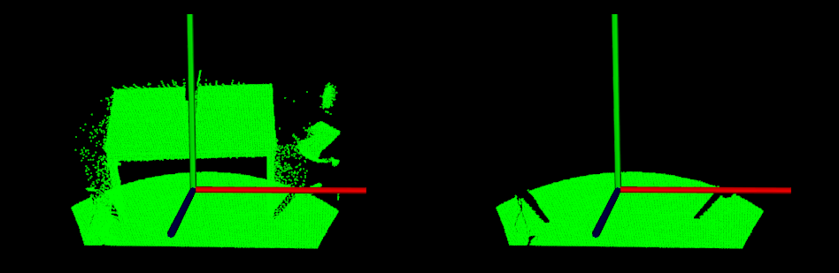

# 平面模型分割

在本教程中，我们将学习如何对一组点进行简单的平面分割，即找到支持平面模型的点云中的所有点。本教程支持滤波教程中介绍的[从 PointCloud](https://pcl.readthedocs.io/projects/tutorials/en/latest/extract_indices.html#extract-indices)中[提取索引](https://pcl.readthedocs.io/projects/tutorials/en/latest/extract_indices.html#extract-indices)。

## 代码

见[01_planar_segmentation.py](./01_planar_segmentation.py)

```python
import pclpy
from pclpy import pcl
import numpy as np

if __name__ == '__main__':
    # 生成点云
    cloud_size = 15
    a = np.zeros((cloud_size, 3))
    cloud = pcl.PointCloud.PointXYZ().from_array(a)
    for point in cloud.points:
        point.x = np.random.ranf() * 1024
        point.y = np.random.ranf() * 1024
        point.z = 1.0
    # 设置一些外点
    cloud.points[0].z = 2.0
    cloud.points[3].z = -2.0
    cloud.points[6].z = -4.0

    print('Point cloud data:', cloud.size(), 'points')
    for point in cloud.points:
        print(point.x, ' ', point.y, ' ', point.z)

    coefficients = pcl.ModelCoefficients()
    inliers = pcl.PointIndices()

    # 分割类实例化
    seg = pcl.segmentation.SACSegmentation.PointXYZ()
    # 可选项
    seg.setOptimizeCoefficients(True)
    # 必须要指定的参数
    seg.setModelType(0)  # 0为pcl::SACMODEL_PLANE
    seg.setMethodType(0)  # 0为pcl::SAC_RANSAC
    seg.setDistanceThreshold(0.01)

    seg.setInputCloud(cloud)
    seg.segment(inliers, coefficients)

    if len(inliers.indices) == 0:
        print('Could not estimate a planar model for the given dataset.')
        exit()

    print('Model coefficients:',
          coefficients.values[0], ' ',
          coefficients.values[1], ' ',
          coefficients.values[2], ' ',
          coefficients.values[2])

    print('Model inliers: ', len(inliers.indices))
    for idx in inliers.indices:
        print(idx, '    ',
              cloud.points[idx].x, ' ',
              cloud.points[idx].y, ' ',
              cloud.points[idx].z)

    # 可视化内点和外点
    viewer = pcl.visualization.PCLVisualizer("3D viewer")
    viewer.setBackgroundColor(0, 0, 0)
    # 内点
    inliers_cloud = pcl.PointCloud.PointXYZ(cloud, inliers.indices)
    single_color = pcl.visualization.PointCloudColorHandlerCustom.PointXYZ(inliers_cloud, 0.0, 255.0, 0.0)  # 内点设为绿色
    viewer.addPointCloud(inliers_cloud, single_color, "inliers cloud")
    # 外点
    outliers_cloud = pcl.PointCloud.PointXYZ()
    extract = pcl.filters.ExtractIndices.PointXYZ()
    extract.setInputCloud(cloud)
    extract.setIndices(inliers)
    extract.setNegative(True)  # 提取出来外点点云
    extract.filter(outliers_cloud)

    single_color = pcl.visualization.PointCloudColorHandlerCustom.PointXYZ(outliers_cloud, 255.0, 0.0, 0.0)  # 外点设为红色
    viewer.addPointCloud(outliers_cloud, single_color, "outliers cloud")

    viewer.setPointCloudRenderingProperties(0, 3, "inliers cloud")
    viewer.setPointCloudRenderingProperties(0, 3, "outliers cloud")
    viewer.addCoordinateSystem(1)
    viewer.initCameraParameters()

    while not viewer.wasStopped():
        viewer.spinOnce(10)
```

## 说明

首先是构建点云，并加入若干外点：

```python
# 生成点云
cloud_size = 15
a = np.zeros((cloud_size, 3))
cloud = pcl.PointCloud.PointXYZ().from_array(a)
for point in cloud.points:
point.x = np.random.ranf() * 1024
point.y = np.random.ranf() * 1024
point.z = 1.0
# 设置一些外点
cloud.points[0].z = 2.0
cloud.points[3].z = -2.0
cloud.points[6].z = -4.0

print('Point cloud data:', cloud.size(), 'points')
for point in cloud.points:
print(point.x, ' ', point.y, ' ', point.z)
```

然后创建 pcl.segmentation.SACSegmentation.PointXYZ()对象并设置模型和方法类型。这也是我们指定“距离阈值”的地方，它决定了一个点必须离模型多近才能被视为内点。在本教程中，我们将使用 RANSAC 方法 (pcl::SAC_RANSAC) 作为选择的稳健估计器。我们的决定是出于 RANSAC 的简单性（其他稳健的估计器将其用作基础并添加其他更复杂的概念）。有关 RANSAC 的更多信息，请查看其[维基百科页面](http://en.wikipedia.org/wiki/RANSAC)。

其次是输出显示内点集的内容，以及估计的平面参数$ax+by+cz+d=0$.

```python
coefficients = pcl.ModelCoefficients()
inliers = pcl.PointIndices()

# 分割类实例化
seg = pcl.segmentation.SACSegmentation.PointXYZ()
# 可选项
seg.setOptimizeCoefficients(True)
# 必须要指定的参数
seg.setModelType(0)  # 0为pcl::SACMODEL_PLANE
seg.setMethodType(0)  # 0为pcl::SAC_RANSAC
seg.setDistanceThreshold(0.01)

seg.setInputCloud(cloud)
seg.segment(inliers, coefficients)

if len(inliers.indices) == 0:
    print('Could not estimate a planar model for the given dataset.')
    exit()

print('Model coefficients:',
      coefficients.values[0], ' ',
      coefficients.values[1], ' ',
      coefficients.values[2], ' ',
      coefficients.values[2])

print('Model inliers: ', len(inliers.indices))
for idx in inliers.indices:
    print(idx, '    ',
          cloud.points[idx].x, ' ',
          cloud.points[idx].y, ' ',
          cloud.points[idx].z)
```

最后就是可视化内点和外点，比较简单，不再赘述。

## 运行

运行代码：

```bash
python 01_planar_segmentation.py
```

结果：

> Point cloud data: 15 points
> 221.09796142578125   190.82125854492188   2.0
> 700.376708984375   306.92431640625   1.0
> 693.7754516601562   924.7059936523438   1.0
> 360.8123474121094   1020.7657470703125   -2.0
> 682.8381958007812   857.310791015625   1.0
> 485.5827941894531   444.12451171875   1.0
> 201.10165405273438   526.590087890625   -4.0
> 742.3724975585938   685.0823974609375   1.0
> 706.4700317382812   705.3656616210938   1.0
> 800.8279418945312   639.457275390625   1.0
> 621.3114624023438   461.4114074707031   1.0
> 105.48615264892578   940.4956665039062   1.0
> 79.97904205322266   933.0923461914062   1.0
> 819.8399047851562   434.0813293457031   1.0
> 333.2424621582031   279.7982482910156   1.0
> Model coefficients: -0.0   -0.0   1.0   1.0
> Model inliers:  12
> 1      700.376708984375   306.92431640625   1.0
> 2      693.7754516601562   924.7059936523438   1.0
> 4      682.8381958007812   857.310791015625   1.0
> 5      485.5827941894531   444.12451171875   1.0
> 7      742.3724975585938   685.0823974609375   1.0
> 8      706.4700317382812   705.3656616210938   1.0
> 9      800.8279418945312   639.457275390625   1.0
> 10      621.3114624023438   461.4114074707031   1.0
> 11      105.48615264892578   940.4956665039062   1.0
> 12      79.97904205322266   933.0923461914062   1.0
> 13      819.8399047851562   434.0813293457031   1.0
> 14      333.2424621582031   279.7982482910156   1.0

可视化结果：


> 注意，为了内点和外点区别更明显，这里其实我增大了外点的偏离程度。实际情况中偏离点可能没有这么明显。

# 圆柱模型分割

本教程举例说明了如何使用圆柱模型进行点云分割。按如下步骤进行（按顺序）：

- 过滤掉 1.5 米以外的数据点
- 估计每个点的表面法线
- 平面模型（描述我们演示数据集中的表）被分割并保存到磁盘
- 圆柱模型（描述我们演示数据集中的杯子）被分割并保存到磁盘

> 由于数据中存在噪声，圆柱模型并不完美。


## 代码

见[02_cylinder_segmentation.py](./02_cylinder_segmentation.py)

```python
import pclpy
from pclpy import pcl
import numpy as np

if __name__ == '__main__':
    # 所有需要的类实例化
    reader = pcl.io.PCDReader()
    ps = pcl.filters.PassThrough.PointXYZRGBA()
    ne = pcl.features.NormalEstimation.PointXYZRGBA_Normal()
    seg = pcl.segmentation.SACSegmentationFromNormals.PointXYZRGBA_Normal()
    writer = pcl.io.PCDWriter()
    extract = pcl.filters.ExtractIndices.PointXYZRGBA()
    extract_normals = pcl.filters.ExtractIndices.Normal()
    tree = pcl.search.KdTree.PointXYZRGBA()

    #  Datasets
    cloud = pcl.PointCloud.PointXYZRGBA()
    cloud_filtered = pcl.PointCloud.PointXYZRGBA()
    cloud_normals = pcl.PointCloud.Normal()
    cloud_filtered2 = pcl.PointCloud.PointXYZRGBA()
    cloud_normals2 = pcl.PointCloud.Normal()
    coefficients_plane = pcl.ModelCoefficients()
    coefficients_cylinder = pcl.ModelCoefficients()
    inliers_plane = pcl.PointIndices()
    inliers_cylinder = pcl.PointIndices()

    # 加载点云
    reader.read("../../data/table_scene_mug_stereo_textured.pcd", cloud)
    print('PointCloud has: ', cloud.size(), 'data points.')

    # 使用带通滤波器去除无效点（外点和无穷点）
    ps.setInputCloud(cloud)
    ps.setFilterFieldName('z')
    ps.setFilterLimits(0, 1.5)
    ps.filter(cloud_filtered)
    print('PointCloud after filtering has: ', cloud_filtered.size(), 'data points.')

    # 估计法线
    ne.setInputCloud(cloud_filtered)
    ne.setSearchMethod(tree)
    ne.setKSearch(50)
    ne.compute(cloud_normals)

    # 实例化平面分割类并设置参数
    seg.setOptimizeCoefficients(True)
    seg.setModelType(0)  # 0为pcl::SACMODEL_PLANE
    seg.setMethodType(0)  # 0为pcl::SAC_RANSAC
    seg.setNormalDistanceWeight(0.1)
    seg.setMaxIterations(100)
    seg.setDistanceThreshold(0.03)
    seg.setInputCloud(cloud_filtered)
    seg.setInputNormals(cloud_normals)
    # 获取平面内点和系数
    seg.segment(inliers_plane, coefficients_plane)
    print('Plane coefficients:', coefficients_plane.values)

    # 提取平面内点
    extract.setInputCloud(cloud_filtered)
    extract.setIndices(inliers_plane)
    extract.setNegative(False)
    # 将内点存入磁盘
    cloud_plane = pcl.PointCloud.PointXYZRGBA()
    extract.filter(cloud_plane)
    print('PointCloud representing the planar component: ', cloud_plane.size(), ' data points.')
    writer.write('table_scene_mug_stereo_textured_plane.pcd', cloud_plane, False)

    # 去除平面内点，提取剩余点
    extract.setNegative(True)
    extract.filter(cloud_filtered2)

    extract_normals.setInputCloud(cloud_normals)
    extract_normals.setNegative(True)
    extract_normals.setIndices(inliers_plane)
    extract_normals.filter(cloud_normals2)

    # 实例化圆柱分割类并设置参数
    seg.setOptimizeCoefficients(True)
    seg.setModelType(5)     # 5代表SACMODEL_CYLINDER
    seg.setMethodType(0)    # 0代表SAC_RANSAC
    seg.setNormalDistanceWeight(0.1)
    seg.setMaxIterations(10000)
    seg.setDistanceThreshold(0.05)
    seg.setRadiusLimits(0, 0.1)
    seg.setInputCloud(cloud_filtered2)
    seg.setInputNormals(cloud_normals2)

    # 获取椭圆内点和参数
    seg.segment(inliers_cylinder, coefficients_cylinder)
    print('Cylinder coefficients: ', coefficients_cylinder.values)

    # 将椭圆点云写入磁盘
    extract.setInputCloud(cloud_filtered2)
    extract.setIndices(inliers_cylinder)
    extract.setNegative(False)
    cloud_cylinder = pcl.PointCloud.PointXYZRGBA()
    extract.filter(cloud_cylinder)

    if cloud_cylinder.size() == 0:
        print('Can not find the cylindrical component.')
    else:
        print('PointCloud representing the cylindrical component: ', cloud_cylinder.size())
        writer.write('table_scene_mug_stereo_textured_cylinder.pcd', cloud_cylinder, False)

    # 可视化
    viewer = pcl.visualization.PCLVisualizer("viewer")
    v0 = 1
    viewer.createViewPort(0.0, 0.0, 0.5, 1.0, v0)
    viewer.setBackgroundColor(0.0, 0.0, 0.0, v0)
    viewer.addText("plane", 10, 10, "v1 text", v0)
    viewer.addPointCloud(cloud_plane, "plane cloud", v0)

    v1 = 2
    viewer.createViewPort(0.5, 0.0, 1.0, 1.0, v1)
    viewer.setBackgroundColor(0.3, 0.3, 0.3, v1)
    viewer.addText("cylinder", 10, 10, "v2 text", v1)
    viewer.addPointCloud(cloud_cylinder, "cylinder cloud", v1)

    viewer.setPointCloudRenderingProperties(0, 1, "plane cloud", v0)
    viewer.setPointCloudRenderingProperties(0, 1, "cylinder cloud", v1)
    viewer.addCoordinateSystem(1.0)

    while not viewer.wasStopped():
        viewer.spinOnce(10)
```

## 说明

这里只说明一下椭圆分割这一块儿，其他的跟前面大同小异，不再赘述。

```python
# 实例化圆柱分割类并设置参数
seg.setOptimizeCoefficients(True)
seg.setModelType(5)     # 5代表SACMODEL_CYLINDER
seg.setMethodType(0)    # 0代表SAC_RANSAC
seg.setNormalDistanceWeight(0.1)
seg.setMaxIterations(10000)
seg.setDistanceThreshold(0.05)
seg.setRadiusLimits(0, 0.1)
```

正如所见，我们使用 RANSAC 鲁棒估计器来获得圆柱系数，并且我们对每个内点到模型的距离阈值不超过 5 厘米。此外，我们将表面法线影响设置为 0.1 的权重，并将圆柱模型的半径限制为小于 10 厘米。

## 运行

运行代码：

```bash
python 01_planar_segmentation.py
```

结果：

> PointCloud has:  307200 data points.
> PointCloud after filtering has:  139897 data points.
> Plane coefficients: Float[0.015758, -0.838789, -0.544229, 0.527018]
> PointCloud representing the planar component:  126168  data points.
> Cylinder coefficients:  Float[0.0585808, 0.279481, 0.900414, -0.0129607, -0.843949, -0.536267, 0.0387611]
> PointCloud representing the cylindrical component:  9271

可视化：


也可以使用PCL bin/下面的可视化工具`pcl_viewer_release`可视化本地的pcd文件：

比如可视化原始点云。

```
pcl_viewer_release table_scene_mug_stereo_textured.pcd
```

> 注意：PCL1.8.1是pcl_viewer_release，PCL1.11.1是pcl_viewer

结果：


同样可以可视化分割出来的平面和圆柱，在此不再赘述。

# 欧几里得聚类提取

在本教程中，我们将学习如何使用 `pcl::EuclideanClusterExtraction`提取**欧几里得聚类**。为了不使教程复杂化，这里将不解释其中的某些步骤，例如平面分割算法。请查看[平面模型分割](https://pcl.readthedocs.io/projects/tutorials/en/latest/planar_segmentation.html#planar-segmentation) 教程以获取更多信息。

## 理论入门

聚类方法需要将无组织的点云模型`P` 分成更小的部分，以便显着减少`P`的整体处理时间。欧几里得意义上的简单数据聚类方法可以通过使用空间的 3D 网格细分来实现，使用固定宽度的框，或更一般地说，八叉树数据结构。这种特殊表示的构建速度非常快，对于需要占用空间的体积表示或每个结果 3D 框（或八叉树叶）中的数据可以用不同的结构进行近似的情况非常有用。然而，在更一般的意义上，我们可以利用最近的邻居并实现一种本质上类似于洪水填充算法的聚类技术。

假设我们有一个点云，上面有一张桌子和一个物体。我们想要找到并分割位于平面上的单个对象点簇。假设我们使用 Kd 树结构来寻找最近的邻居，那么算法步骤将是（来自[[RusuDissertation\]](https://pcl.readthedocs.io/projects/tutorials/en/latest/how_features_work.html#rusudissertation)）：

> 1. *为输入点云数据集 $p$创建 Kd 树表示*；
>
> 2. *建立一个空的集群列表* $C$，*以及一个需要检查的点的队列* $Q$；
>
> 3. *然后对于每个点* $\boldsymbol{p}_i \in P$，*执行以下步骤：*
>
>    > - *添加* $\boldsymbol{p}_i$*到当前队列* $Q$；
>    >
>    > - *对于每一点，* $\boldsymbol{p}_i \in Q$*执行以下操作：*
>    >
>    >   > - *在半径为*$r < d_{th}$的球体中搜索$\boldsymbol{p}_i$的点邻居的集合$P^k_i $；
>    >   > - *对于每个邻居* $\boldsymbol{p}^k_i \in P^k_i$，*检查该点是否已被处理，如果没有将其添加到* $Q$;
>
>    - *当处理完$Q$中所有点的列表后*  *，添加* $Q$ *到集群列表$C$中* ，*并重置* $Q$ *为空列表*
>
> 4. 当所有$\boldsymbol{p}_i \in P$点 都被处理并且现在是点集群列表$C$的一部分时，算法终止 。

## 代码

见[03_cluster_extraction.py](./03_cluster_extraction.py)

```python
import pclpy
from pclpy import pcl
import numpy as np


def compareCloudShow(cloud, cloud_filtered):
    # Open 3D viewer and add point cloud and normals
    viewer = pcl.visualization.PCLVisualizer("viewer")
    v0 = 1
    viewer.createViewPort(0.0, 0.0, 0.5, 1.0, v0)
    viewer.setBackgroundColor(0.0, 0.0, 0.0, v0)
    single_color = pcl.visualization.PointCloudColorHandlerCustom.PointXYZ(cloud, 0.0, 255.0, 0.0)
    viewer.addPointCloud(cloud, single_color, "sample cloud1", v0)

    v1 = 2
    viewer.createViewPort(0.5, 0.0, 1.0, 1.0, v1)
    viewer.setBackgroundColor(0.0, 0.0, 0.0, v1)
    single_color = pcl.visualization.PointCloudColorHandlerCustom.PointXYZ(cloud_filtered, 0.0, 255.0, 0.0)
    viewer.addPointCloud(cloud_filtered, single_color, "sample cloud2", v1)

    viewer.setPointCloudRenderingProperties(0, 1, "sample cloud1", v0)
    viewer.setPointCloudRenderingProperties(0, 1, "sample cloud2", v1)
    viewer.addCoordinateSystem(1.0)
    while not viewer.wasStopped():
        viewer.spinOnce(10)


if __name__ == '__main__':
    reader = pcl.io.PCDReader()
    cloud = pcl.PointCloud.PointXYZ()
    cloud_f = pcl.PointCloud.PointXYZ()
    reader.read('../../data/table_scene_lms400.pcd', cloud)
    print('PointCloud before filtering has: ', cloud.size(), ' data points.')

    # 下采样 使用leaf size为1cm
    vg = pcl.filters.VoxelGrid.PointXYZ()
    cloud_filtered = pcl.PointCloud.PointXYZ()
    vg.setInputCloud(cloud)
    vg.setLeafSize(0.01, 0.01, 0.01)
    vg.filter(cloud_filtered)
    print('PointCloud after filtering has: ', cloud_filtered.size(), ' data points.')

    # 平面分割
    seg = pcl.segmentation.SACSegmentation.PointXYZ()
    inliers = pcl.PointIndices()
    coefficients = pcl.ModelCoefficients()
    cloud_plane = pcl.PointCloud.PointXYZ()
    writer = pcl.io.PCDWriter()
    seg.setOptimizeCoefficients(True)
    seg.setModelType(0)
    seg.setMethodType(0)
    seg.setMaxIterations(100)
    seg.setDistanceThreshold(0.02)

    nr_points = cloud_filtered.size()
    while cloud_filtered.size() > 0.3 * nr_points:
        # 在剩余的点云中分割出最大的平面成分
        seg.setInputCloud(cloud_filtered)
        seg.segment(inliers, coefficients)
        if len(inliers.indices) == 0:
            print('Could not estimate a planar model for the given dataset.')
            break

        # 提取平面内点
        extract = pcl.filters.ExtractIndices.PointXYZ()
        extract.setInputCloud(cloud_filtered)
        extract.setIndices(inliers)
        extract.setNegative(False)

        extract.filter(cloud_plane)
        # 可视化提取出来的平面
        compareCloudShow(cloud_filtered, cloud_plane)
        print('PointCloud representing the planar component: ', cloud_plane.size(), ' data points.')

        # 去除上面提取到的平面内点，得到剩余点
        extract.setNegative(True)
        extract.filter(cloud_f)
        cloud_filtered = cloud_f

    writer.write('cloud_cluster_source.pcd', cloud_filtered, False)
    # 创建KdTree
    tree = pcl.search.KdTree.PointXYZ()
    tree.setInputCloud(cloud_filtered)

    cluster_indices = pcl.vectors.PointIndices()
    ec = pcl.segmentation.EuclideanClusterExtraction.PointXYZ()
    ec.setClusterTolerance(0.02)  # 2cm
    ec.setMinClusterSize(100)
    ec.setMaxClusterSize(25000)
    ec.setSearchMethod(tree)
    ec.setInputCloud(cloud_filtered)
    ec.extract(cluster_indices)

    j = 0
    for it in cluster_indices:
        cloud_cluster = pcl.PointCloud.PointXYZ()
        for pit in it.indices:
            cloud_cluster.push_back(cloud_filtered.at(pit))
        cloud_cluster.width = cloud_cluster.size()
        cloud_cluster.height = 1
        cloud_cluster.is_dense = True

        print('PointCloud representing the Cluster: ', cloud_cluster.size(), ' data points.')

        ss = 'cloud_cluster_' + str(j) + '.pcd'
        writer.write(ss, cloud_cluster, False)
        j = j + 1
```

## 说明

现在，让我们一块一块地分解代码，跳过显而易见的部分。

平面分割部分不再赘述，分割结果如下：

左图为分割对象，右图为分割结果

分割1



分割2


可见，两次平面分割把地面和桌面两个平面分割了出来。

后面对剩余点云进行欧几里得聚类分割，剩余点云如下：


```python
# 创建KdTree
tree = pcl.search.KdTree.PointXYZ()
tree.setInputCloud(cloud_filtered)
```

我们正在为我们的提取算法的搜索方法创建一个 KdTree 对象。

```python
cluster_indices = pcl.vectors.PointIndices()
```

这里我们创建了一个PointIndices向量，它包含vector<int> 中的实际索引信息。每个检测到的集群的索引都保存在这里 - 请注意，cluster_indices是一个向量，其中包含每个检测到的集群的一个 PointIndices 实例。因此 cluster_indices[0]包含我们点云中第一个集群的所有索引。

```python
ec = pcl.segmentation.EuclideanClusterExtraction.PointXYZ()
ec.setClusterTolerance(0.02)  # 2cm
ec.setMinClusterSize(100)
ec.setMaxClusterSize(25000)
ec.setSearchMethod(tree)
ec.setInputCloud(cloud_filtered)
ec.extract(cluster_indices)
```

这里我们创建了一个点类型为 PointXYZ 的 EuclideanClusterExtraction 对象，因为我们的点云是 PointXYZ 类型。我们也在设置提取的参数和变量。请小心为**setClusterTolerance()**设置正确的值。如果你取一个非常小的值，则可能会将实际*对象*视为多个集群。另一方面，如果你将该值设置得太高，则可能会发生多个*对象* 被视为一个集群的情况。所以我们的建议是测试并尝试哪个值适合你的数据集。

我们约束发现的集群必须至少有**setMinClusterSize()** 点和最大**setMaxClusterSize()**点。

现在我们从点云中提取集群并将索引保存在 **cluster_indices 中**。为了将每个簇从vector<PointIndices> 中分离出来， 我们必须遍历*cluster_indices*，为每个条目创建一个新的PointCloud并将当前簇的所有点写入PointCloud。

```python
j = 0
for it in cluster_indices:
    cloud_cluster = pcl.PointCloud.PointXYZ()
    for pit in it.indices:
        cloud_cluster.push_back(cloud_filtered.at(pit))
    cloud_cluster.width = cloud_cluster.size()
    cloud_cluster.height = 1
    cloud_cluster.is_dense = True

    print('PointCloud representing the Cluster: ', cloud_cluster.size(), ' data points.')

    ss = 'cloud_cluster_' + str(j) + '.pcd'
    writer.write(ss, cloud_cluster, False)
    j = j + 1
```

## 运行

运行代码：

```bash
python 03_cluster_extraction.py
```

结果：

> PointCloud before filtering has:  460400  data points.
> PointCloud after filtering has:  41049  data points.
> PointCloud representing the planar component:  20536  data points.
> PointCloud representing the planar component:  12442  data points.
> PointCloud representing the Cluster:  4857  data points.
> PointCloud representing the Cluster:  1386  data points.
> PointCloud representing the Cluster:  321  data points.
> PointCloud representing the Cluster:  291  data points.
> PointCloud representing the Cluster:  123  data points.

也可以使用PCL bin/下面的可视化工具`pcl_viewer_release`可视化本地的pcd文件：

比如可视化原始点云。

```bash
pcl_viewer_release cloud_cluster_0.pcd cloud_cluster_1.pcd cloud_cluster_2.pcd cloud_cluster_3.pcd cloud_cluster_4.pcd
```

> 注意：PCL1.8.1是pcl_viewer_release，PCL1.11.1是pcl_viewer

结果：


可以看到，点云被分割为5类。

# 区域生长分割

在本教程中，我们将学习如何使用`pcl::RegionGrowing`类中实现的区域增长算法。所述算法的目的是合并在平滑约束方面足够接近的点。因此，该算法的输出是一个簇集，其中每个簇是一组点，这些点被认为是同一光滑表面的一部分。该算法的原理是基于点法线之间角度的比较。

## 理论入门

让我们来看看算法是如何工作的。

首先，它按曲率值对点进行排序。之所以需要这样做，是因为该区域从具有最小曲率值的点开始增长。这样做的原因是==曲率最小的点位于平坦区域==（从最平坦区域增长可以减少总段数）。

所以我们对点云进行排序。直到点云中没有未标记的点为止，算法选取曲率值最小的点并开始区域的增长。这个过程发生如下：

> - 选取的点被添加到称为种子的集合中。
>
> - 对于每个种子点，算法找到它的相邻点。
>
>   > - 测试每个邻居的法线和当前种子点的法线之间的角度。如果角度小于阈值，则将当前点添加到当前区域。
>   > - 之后，测试每个邻居的曲率值。如果曲率小于阈值，则将此点添加到种子中。
>   > - 当前种子从种子中移除。

如果种子集变空，这意味着算法已经扩大了区域，并且从头开始重复该过程。您可以在下面找到上述算法的伪代码。

输入：

> - *点云*=
> - *点法线*=
> - *点曲率*=
> - *邻居查找函数* 
> - *曲率阈值* 
> - *角度阈值* 

初始化：

> - *区域列表* 
> - *可用点列表* 

算法：

> > - **while**  *不为空* **do**
> >
> >   > - *当前区域* 
> >   >
> >   > - *当前种子* 
> >   >
> >   > - *具有最小曲率的点* 
> >   >
> >   > - :
> >   >
> >   > - :
> >   >
> >   > - :
> >   >
> >   > - for  to size（) do
> >   >
> >   >   > - *查找当前种子点的最近邻居* 
> >   >   >
> >   >   > - for  to size（) do
> >   >   >
> >   >   >   > - *当前邻居点* 
> >   >   >   >
> >   >   >   > - **if**  *包含*  *和*  *then*
> >   >   >   >
> >   >   >   >   > - :
> >   >   >   >   >
> >   >   >   >   > - :
> >   >   >   >   >
> >   >   >   >   > - **if**  **then**
> >   >   >   >   >
> >   >   >   >   >   > - :
> >   >   >   >   >
> >   >   >   >   > - end if
> >   >   >   >
> >   >   >   > - end if
> >   >   >
> >   >   > - end for
> >   >
> >   > - end for
> >   >
> >   > - *将当前区域添加到全局段列表* 
>
> - end while
> - *return* 

## 代码

见[04_region_growing_segmentation.py](./04_region_growing_segmentation.py)

```python
import pclpy
from pclpy import pcl
import numpy as np

if __name__ == '__main__':
    # 加载点云
    cloud = pcl.PointCloud.PointXYZ()
    if pcl.io.loadPCDFile('../../data/region_growing_tutorial.pcd', cloud) == -1:
        print('Cloud reading failed.')
        exit(-1)
	# 计算法线
    tree = pcl.search.KdTree.PointXYZ()
    normals = pcl.PointCloud.Normal()
    ne = pcl.features.NormalEstimation.PointXYZ_Normal()
    ne.setInputCloud(cloud)
    ne.setSearchMethod(tree)
    ne.setKSearch(50)
    ne.compute(normals)
	# PassThrough滤波器降采样
    indices = pcl.vectors.Int()
    ps = pcl.filters.PassThrough.PointXYZ()
    ps.setInputCloud(cloud)
    ps.setFilterFieldName('z')
    ps.setFilterLimits(13000.0, 15000.0)
    ps.filter(indices)
	# 区域生长算法分割
    reg = pcl.segmentation.RegionGrowing.PointXYZ_Normal()
    reg.setInputCloud(cloud)
    reg.setMinClusterSize(50)
    reg.setMaxClusterSize(1000000)
    reg.setSearchMethod(tree)
    reg.setNumberOfNeighbours(30)
    # reg.setIndices(indices)
    reg.setInputNormals(normals)
    reg.setSmoothnessThreshold(3.0 / 180.0 * np.pi)
    reg.setCurvatureThreshold(1.0)

    clusters = pcl.vectors.PointIndices()
    reg.extract(clusters)
	# 输出部分结果
    print('Number of clusters is equal to ', len(clusters))
    print('First cluster has ', len(clusters[0].indices), ' points.')
    print('These are the indices of the points of the initial')
    print('cloud that belong to the first cluster:')
    counter = 0
    while counter < len(clusters[0].indices):
        print(clusters[0].indices[counter], ' ', end='')
        counter = counter + 1
        if counter % 10 == 0:
            print('')
    # 可视化
    colored_cloud = reg.getColoredCloud()
    viewer = pcl.visualization.CloudViewer('Cluster viewer')
    viewer.showCloud(colored_cloud)
    while not viewer.wasStopped(10):
        pass
```

## 说明

这里只挑重要区域生长算法说一下，法线计算、带通滤波不再赘述。

```python
# 区域生长算法分割
reg = pcl.segmentation.RegionGrowing.PointXYZ_Normal()
```

`pcl::RegionGrowing`是一个模板类，有两个参数：

- PointT - 要使用的点类型（在给定的示例中是`pcl::PointXYZ`）
- NormalT - 要使用的法线类型（在给定的示例中是`pcl::Normal`）

```python
reg.setInputCloud(cloud)
reg.setMinClusterSize(50)
reg.setMaxClusterSize(1000000)
reg.setSearchMethod(tree)
reg.setNumberOfNeighbours(30)
# reg.setIndices(indices)
reg.setInputNormals(normals)
```

之后设置最小和最大簇大小。这意味着在分割完成后，所有点数少于最小值（或多于最大值）的簇都将被丢弃。最小值和最大值的默认值分别为 1 和“尽可能多”。

该算法在其内部结构中需要K个最近搜索，所以这里是提供搜索方法和设置邻居数。之后，它接收需要分割的云、点索引和法线。

```python
reg.setSmoothnessThreshold(3.0 / 180.0 * np.pi)
reg.setCurvatureThreshold(1.0)
```

这两行是算法初始化中最重要的部分，因为它们负责提到的平滑约束。第一种方法以弧度为单位设置角度，该角度将用作法线偏差的允许范围。如果点法线之间的偏差小于平滑度阈值，则建议它们在同一集群中（新点 - 测试的点 - 将添加到集群中）。第二个负责曲率阈值。如果两个点的法线偏差很小，则测试它们的曲率之间的差异。如果该值小于曲率阈值，则算法将使用新添加的点继续集群的增长。

```python
clusters = pcl.vectors.PointIndices()
reg.extract(clusters)
```

启动分割算法。完成工作后，它将返回集群数组。

后面就是输出第一个簇中的点索引，并且可视化。

```python
# 输出部分结果
print('Number of clusters is equal to ', len(clusters))
print('First cluster has ', len(clusters[0].indices), ' points.')
print('These are the indices of the points of the initial')
print('cloud that belong to the first cluster:')
counter = 0
while counter < len(clusters[0].indices):
    print(clusters[0].indices[counter], ' ', end='')
    counter = counter + 1
    if counter % 10 == 0:
        print('')
# 可视化
colored_cloud = reg.getColoredCloud()
viewer = pcl.visualization.CloudViewer('Cluster viewer')
viewer.showCloud(colored_cloud)
while not viewer.wasStopped(10):
    pass
```

`pcl::RegionGrowing`类提供一个返回的着色云，其中每个集群具各自的颜色。所以在这部分代码中，`pcl::visualization::CloudViewer`用于查看分割结果。您可以在[CloudViewer](https://pcl.readthedocs.io/projects/tutorials/en/latest/cloud_viewer.html#cloud-viewer)教程中了解有关云可视化的更多信息。

## 运行

运行代码：

```bash
python 04_region_growing_segmentation.py
```

结果：


在图片中，可以看到彩色点云有许多红点。这意味着这些点属于被拒绝的集群，因为它们有太多/太少的点。

# 基于颜色的区域生长分割（未完成）

在本教程中，我们将学习如何使用`pcl::RegionGrowingRGB`类实现的基于颜色的区域增长算法。该算法基于`pcl::RegionGrowing`与[区域增长分割](https://pcl.readthedocs.io/projects/tutorials/en/latest/region_growing_segmentation.html#region-growing-segmentation)教程中描述的相同的概念。如果你对基本思想的理解感兴趣，请参考上面提到的教程。

基于颜色的区域生长分割算法有两个主要区别。第一个是它使用颜色而不是法线。第二是它使用合并算法进行过分割和欠分割控制。让我们来看看它是如何完成的。分割后，尝试合并颜色相近的簇。两个相邻的平均颜色差异很小的簇被合并在一起。然后进行第二个合并步骤。在此步骤中，每个集群都通过其包含的点数进行验证。如果此数字小于用户定义的值，则当前集群将与最近的相邻集群合并。

## 代码

<font color='red'>注意：pclpy暂未完成pcl::RegionGrowingRGB类。故基于颜色的区域生长分割暂不能实现。</font>

# 基于最小切割的分割

在本教程中，我们将学习如何使用`pcl::MinCutSegmentation`类中实现的基于最小切割的分割算法。该算法对给定的输入云进行二进制分割。以对象为中心及其半径，算法将云分为两组：前景和背景点（属于对象的点和不属于对象的点）。

## 理论入门

该算法的思想如下：

> 1. 对于给定的点云，算法构建的图包含点云的每个点作为一组顶点和另外两个称为源（source）和汇（source）的顶点。图中对应于该点的每个顶点都与源和汇与边相连。除此之外，每个顶点（源点和汇点除外）都有将相应点与其最近的相邻点连接起来的边。
>
> 2. 算法为每条边分配权重。有三种不同类型的权重，如下：
>
>    > - 首先，它为点云点之间的边缘分配权重。这个权重称为平滑成本，由以下公式计算：
>    >
>    >   ****
>    >
>    >   这是点之间的距离。点越远，边缘被切割的可能性就越大。
>    >
>    > - 下一步，算法设置数据成本。它由前景和背景惩罚组成。第一个是将点云点与源顶点连接起来并具有恒定用户定义值的那些边的权重。第二个分配给连接点与汇顶点的边，并通过以下公式计算：
>    >
>    >   ****
>    >
>    >   这是到水平平面中对象的预期中心的距离：
>    >
>    >   ****
>    >
>    >   公式中出现的半径是该算法的输入参数，大致可以认为是从物体中心到其外没有属于前景的点的范围（物体水平半径）。
>
> 3. 在所有准备工作之后，搜索最小切口。基于对这个切割的分析，云被分为前景点和背景点。

有关更全面的信息，请参阅文章 [“基于最小切割的点云分割”](http://gfx.cs.princeton.edu/pubs/Golovinskiy_2009_MBS/index.php)。

## 代码

见[06_min_cut_segmentation.py](./06_min_cut_segmentation.py)

```python
import pclpy
from pclpy import pcl
import numpy as np

if __name__ == '__main__':
    # 加载点云
    cloud = pcl.PointCloud.PointXYZ()
    if pcl.io.loadPCDFile('../../data/min_cut_segmentation_tutorial.pcd', cloud) == -1:
        print('Cloud reading failed.')
        exit(-1)
        
    # 滤波
    indices = pcl.vectors.Int()
    ps = pcl.filters.PassThrough.PointXYZ()
    ps.setInputCloud(cloud)
    ps.setFilterFieldName('z')
    ps.setFilterLimits(0.0, 1.0)
    ps.filter(indices)
    
    # 使用最小切割分割
    seg = pcl.segmentation.MinCutSegmentation.PointXYZ()
    seg.setInputCloud(cloud)
    seg.setIndices(indices)

    foreground_points = pcl.PointCloud.PointXYZ()
    point = pcl.point_types.PointXYZ()
    point.x = 68.97
    point.y = -18.55
    point.z = 0.57
    foreground_points.push_back(point)
    seg.setForegroundPoints(foreground_points)  # 对象中心点

    seg.setSigma(0.25)  # σ
    seg.setRadius(3.0433856)    # 平滑代价计算所需的对象半径
    seg.setNumberOfNeighbours(14)   # 构建图时要找到的邻居数
    seg.setSourceWeight(0.8)    # 设置前景惩罚

    clusters = pcl.vectors.PointIndices()
    seg.extract(clusters)

    print('Maximum flow is ', seg.getMaxFlow())
    
    # 可视化
    colored_cloud = seg.getColoredCloud()
    viewer = pcl.visualization.CloudViewer('Cluster viewer')
    viewer.showCloud(colored_cloud)
    while not viewer.wasStopped(10):
        pass
```

## 说明

下面一行一行的解释代码。

```python
cloud = pcl.PointCloud.PointXYZ()
if pcl.io.loadPCDFile('../../data/min_cut_segmentation_tutorial.pcd', cloud) == -1:
    print('Cloud reading failed.')
    exit(-1)
```

首先从 .pcd 文件加载点云

```python
indices = pcl.vectors.Int()
ps = pcl.filters.PassThrough.PointXYZ()
ps.setInputCloud(cloud)
ps.setFilterFieldName('z')
ps.setFilterLimits(0.0, 1.0)
ps.filter(indices)
```

这几行不是必需的。它们的唯一目的是表明`pcl::MinCutSegmentation`该类可以使用索引。

```python
seg = pcl.segmentation.MinCutSegmentation.PointXYZ()
```

`pcl::MinCutSegmentation`类实例化。

> pclpy中将模板类的参数以属性的方式给出。如MinCutSegmentation.PointXYZ()表示，MinCutSegmentation的参数为PointXYZ，表示使用PointXYZ类型的点。

    seg.setInputCloud(cloud)
    seg.setIndices(indices)

这几行为算法提供需要分割的点云和索引。

```python
foreground_points.push_back(point)
seg.setForegroundPoints(foreground_points)	# 已知为对象中心的点
seg.setSigma(0.25)	# σ
seg.setRadius(3.0433856)	# 平滑代价计算所需的对象半径
seg.setNumberOfNeighbours(14)	# 构建图时要找到的邻居数
seg.setSourceWeight(0.8)	# 设置前景惩罚
```

设置算法需要已知为对象中心的点、$\sigma$ 、平滑代价计算所需的对象半径、构建图时要找到的邻居数（设置的邻居越多，它包含的边数就越多）、前景惩罚。

```python
clusters = pcl.vectors.PointIndices()
seg.extract(clusters)
```

启动算法。分割后的簇将包含结果。

```python
print('Maximum flow is ', seg.getMaxFlow())
```

在图形切割期间计算的流量值。

```python
# 可视化
colored_cloud = seg.getColoredCloud()
viewer = pcl.visualization.CloudViewer('Cluster viewer')
viewer.showCloud(colored_cloud)
while not viewer.wasStopped(10):
    pass
```

可视化分割结果。

## 运行

运行代码：

```bash
python 06_min_cut_segmentation.py
```

结果：

> Maximum flow is  5050.420105487853


# 条件欧几里得聚类(未完成)

>  <font color='red'>注意：pclpy暂未完成pcl::ConditionalEuclideanClustering类。故基条件欧几里得聚类暂不能实现。</font>

类`pcl::ConditionalEuclideanClustering`：一种基于欧几里德距离和需要满足的用户可自定义条件对点进行聚类的分割算法。

此类使用与[欧几里德聚类提取](https://pcl.readthedocs.io/projects/tutorials/en/latest/cluster_extraction.html#cluster-extraction)、[区域增长分割](https://pcl.readthedocs.io/projects/tutorials/en/latest/region_growing_segmentation.html#region-growing-segmentation)和[基于颜色的区域增长分割中](https://pcl.readthedocs.io/projects/tutorials/en/latest/region_growing_rgb_segmentation.html#region-growing-rgb-segmentation)使用的相同的贪婪/区域增长/洪水填充方法。与其他类相比，使用此类的优点是聚类的约束（纯欧几里得、平滑度、RGB）现在可由用户自定义。一些缺点包括：没有初始种子系统，没有过度和欠分割控制，以及从主计算循环内部调用条件函数的时间效率较低的事实。

## 理论入门

在[欧几里德聚类提取](https://pcl.readthedocs.io/projects/tutorials/en/latest/cluster_extraction.html#cluster-extraction)和[区域生长分割](https://pcl.readthedocs.io/projects/tutorials/en/latest/region_growing_segmentation.html#region-growing-segmentation)的教程中已经对区域生长算法进行了详细介绍。除了这些解释之外，唯一需要满足的条件是将邻居合并到当前集群中所需的条件，现在可以完全自定义。

随着集群的增长，它将评估集群内部的点和附近的候选点之间的用户定义条件。候选点（最近邻点）是使用围绕集群中每个点的欧几里德半径搜索找到的。对于生成的集群中的每个点，该条件需要至少与它的一个邻居一起成立，而不是与其所有邻居一起成立。

Conditional Euclidean Clustering 类还可以根据大小约束自动过滤集群。分类为过小或过大的聚类之后仍可检索。

# 基于法线差异分割（未完成）

>  <font color='red'>注意：pclpy暂未完成pcl::DifferenceOfNormalsEstimation类。故基于法线差异分割暂不能实现。</font>


相关理论可参阅：[基于法线差异分割](https://pcl.readthedocs.io/projects/tutorials/en/latest/don_segmentation.html#don-segmentation) 

# 将点云聚类为 Supervoxels（有bug）

在本教程中，我们将展示如何使用 `pcl::SupervoxelClustering`将点云划分为多个超体素簇，然后展示如何使用和可视化邻接信息和超体素本身。


**示例：为点云生成的超体素和邻接图**

## 理论入门

分割算法旨在将图像中的像素分组为符合对象边界的感知上有意义的区域。基于图的方法，例如马尔可夫随机场 (MRF) 和条件随机场 (CRF)，已经变得流行，因为它们将图像中的关系低级上下文与对象级类知识合并。解决像素级图的成本导致了中级推理方案的发展，该方案不直接使用像素，而是使用像素分组（称为超像素）作为节点的基础级别。超像素是通过==基于局部低级特征==将图像过分割成小区域而形成的，减少了推理时必须考虑的节点数量。

由于它们对最终分割的质量有很大的影响，因此超像素具有某些特征是很重要的。其中，避免违反对象边界是最重要的，因为不这样做会降低以后使用的分类器的准确性——因为它们将被迫考虑属于多个类的像素。此外，即使分类器确实管理了正确的输出，最终的像素级分割也必然包含错误。另一个有用的特性是被分割区域的规则分布，因为这将为后续步骤生成更简单的图形。

体素云连接分割 (VCCS) 是最近的一种“超像素”方法，它生成 3D 点云数据的体积过度分割，称为超体素。Supervoxels 比最先进的 2D 方法更好地遵守对象边界，同时保持足够的效率以用于在线应用程序。VCCS 使用 k-means 聚类的区域增长变体来直接在体素八叉树结构内生成点的标记。超级体素有两个重要的特性：它们均匀地分布在 3D 空间中，除非底层体素是空间连接的，否则它们不能跨越边界。前者是通过直接在云中而不是在投影平面中播种超体素来完成的，而后者使用八叉树结构来维护叶子的邻接信息。超体素在体素化的 3D 空间中保持邻接关系；具体来说，26-adjacency-即相邻体素是共享面、边或顶点的体素，如下所示。


**从右到左，6（面）、18（面、边）、26（面、边、顶点）邻接**

通过指定邻居是彼此 R_voxel 内的体素，在八叉树内有效维护超级体素（和底层体素）的邻接图，其中 R_voxel 指定八叉树叶分辨率。该邻接图广泛用于用于生成超体素的区域增长，以及确定生成的超体素本身的邻接。

VCCS 是一种区域生长方法，它从具有分辨率 R_seed 的网格上的空间均匀分布的一组种子点逐步扩展超体素。为了保持效率，VCCS 不会全局搜索，而是只考虑种子中心 R_seed 内的点。此外，通过在每个种子周围建立一个小的搜索半径 R_search 并移除没有足够的相邻体素连接到它们的种子来过滤掉被隔离的种子。


**影响超体素聚类的各种大小参数。R_seed 和 R_voxel 都必须由用户设置。**

来自种子点的扩展由在由空间范围、颜色和法线组成的特征空间中计算的距离度量控制。空间距离 D_s 由播种分辨率归一化，颜色距离 D_c 是归一化 RGB 空间中的欧几里德距离，法线距离 D_n 测量表面法向量之间的角度。


**超体素聚类中使用的加权方程。w_c、w_s 和 w_n，颜色、空间和法线权重分别是用户控制的参数。**

超级体素使用考虑连通性和流量的局部 k 均值聚类迭代增长。一般过程如下。从离聚类中心最近的体素开始，我们向外流动到相邻的体素，并使用上面的距离方程计算从每个体素到超体素中心的距离。如果距离是该体素所见的最小距离，则设置其标签，并使用邻接图，将离中心较远的邻居添加到该标签的搜索队列中。然后我们继续下一个超级体素，以便所有超级体素同时考虑从中心向外的每个级别（下图中可以看到它的 2d 版本）。我们向外迭代进行，直到我们到达每个超体素的搜索量的边缘（或者没有更多的邻居要检查）。


**超体素簇扩展的邻接八叉树中的搜索顺序。不搜索邻接图中的点边，因为它们已经在队列中较早地被考虑过。**

好的，让我们来看看代码……但是如果您想了解有关超级体素如何工作的更多详细信息（以及如果您在学术工作中使用它们），请参考以下出版物：

```
@InProceedings{Papon13CVPR,
  author={Jeremie Papon and Alexey Abramov and Markus Schoeler and Florentin W\"{o}rg\"{o}tter},
  title={Voxel Cloud Connectivity Segmentation - Supervoxels for Point Clouds},
  booktitle={Computer Vision and Pattern Recognition (CVPR), 2013 IEEE Conference on},
  month     = {June 22-27},
  year      = {2013},
  address   = {Portland, Oregon},
}
```

哦，对于使用 Supervoxels 的更复杂的示例，请参阅`pcl/examples/segmentation/supervoxel_clustering.cpp`。

## 代码

需要下载的点云文件：[milk_cartoon_all_small_clorox.pcd](https://github.com/PointCloudLibrary/data/blob/master/tutorials/correspondence_grouping/milk_cartoon_all_small_clorox.pcd?raw=true) 或者在data文件下也能看到该文件。

见[07_supervoxel_clustering.py](./07_supervoxel_clustering.py)

```python
import pclpy
from pclpy import pcl
import numpy as np
import sys

if __name__ == '__main__':
    if len(sys.argv) < 2:
        print("Syntax is: %s <pcd-file> \n" % sys.argv[0],
              "--NT Dsables the single cloud transform \n"
              "-v <voxel resolution>\n-s <seed resolution>\n"
              "-c <color weight> \n-z <spatial weight> \n"
              "-n <normal_weight>\n")
        exit()

    cloud = pcl.PointCloud.PointXYZRGBA()
    print('Loading point cloud...')
    if pcl.io.loadPCDFile(sys.argv[1], cloud) == -1:
        print('"Error loading cloud file!')
        exit(-1)

    disable_transform = '--NT' in sys.argv
    voxel_resolution = 0.008
    voxel_res_specified = '-v' in sys.argv
    if voxel_res_specified:
        index = sys.argv.index('-v') + 1
        voxel_resolution = float(sys.argv[index])

    seed_resolution = 0.1
    seed_res_specified = '-s' in sys.argv
    if seed_res_specified:
        index = sys.argv.index('-s') + 1
        seed_resolution = float(sys.argv[index])

    color_importance = 0.2
    if '-c' in sys.argv:
        index = sys.argv.index('-c') + 1
        color_importance = float(sys.argv[index])

    spatial_importance = 0.4
    if '-z' in sys.argv:
        index = sys.argv.index('-z') + 1
        spatial_importance = float(sys.argv[index])

    normal_importance = 1.0
    if '-n' in sys.argv:
        index = sys.argv.index('-n') + 1
        spatial_importance = float(sys.argv[index])

    # 使用supervoxels
    sv = pcl.segmentation.SupervoxelClustering.PointXYZRGBA(voxel_resolution, seed_resolution)
    if disable_transform:
        sv.setUseSingleCameraTransform(False)

    sv.setInputCloud(cloud)
    sv.setColorImportance(color_importance)
    sv.setSpatialImportance(spatial_importance)
    sv.setNormalImportance(normal_importance)

    supervoxel_clusters = pcl.vectors.map_uint32t_PointXYZRGBA()
    print('Extracting supervoxels!')
    sv.extract(supervoxel_clusters)
    print("Found %d supervoxels" % len(supervoxel_clusters))

    viewer = pcl.visualization.PCLVisualizer('3D Viewer')
    viewer.setBackgroundColor(0, 0, 0)
    voxel_centroid_cloud = sv.getVoxelCentroidCloud()
    viewer.addPointCloud(voxel_centroid_cloud, 'voxel centroids')
    viewer.setPointCloudRenderingProperties(0, 2.0, 'voxel centroids')
    viewer.setPointCloudRenderingProperties(1, 0.95, 'voxel centroids')

    labeled_voxel_cloud = sv.getLabeledVoxelCloud()
    viewer.addPointCloud(labeled_voxel_cloud, 'labeled voxels')
    viewer.setPointCloudRenderingProperties(1, 0.5, 'labeled voxels')

    sv_normal_cloud = sv.makeSupervoxelNormalCloud(supervoxel_clusters)
    # 我们注释了法线可视化，这样图形很容易看到，取消注释可以看到超体素法线
    # 事实上，pclpy可视化法线存在bug，我们先注释掉它。
    # viewer.addPointCloudNormals(sv_normal_cloud, 1, 0.05, "supervoxel_normals")

    print('Getting supervoxel adjacency')
    # supervoxel_adjacency = 0    # std::multimap<std::uint32_t, std::uint32_t>未绑定
    # sv.getSupervoxelAdjacency(supervoxel_adjacency)
    # 因此后面绘制超体素邻接图无法完成

    while not viewer.wasStopped():
        viewer.spinOnce(10)
```


sv.getSupervoxelAdjacency()函数报错

> sv.getSupervoxelAdjacency(supervoxel_adjacency)
> TypeError: getSupervoxelAdjacency(): incompatible function arguments. The following argument types are supported:
>
>     1. (self: pclpy.pcl.segmentation.SupervoxelClustering.PointXYZRGBA, label_adjacency: std::multimap<unsigned int,unsigned int,std::less<unsigned int>,std::allocator<std::pair<unsigned int const ,unsigned int> > >) -> None
>
> Invoked with: <pclpy.pcl.segmentation.SupervoxelClustering.PointXYZRGBA object at 0x00000284B483F998>, 0
>
> Did you forget to `#include <pybind11/stl.h>`? Or <pybind11/complex.h>,
> <pybind11/functional.h>, <pybind11/chrono.h>, etc. Some automatic
> conversions are optional and require extra headers to be included
> when compiling your pybind11 module.

应该是std::multimap<std::uint32_t, std::uint32_t>未绑定未绑定成功。

故这里不再绘制超体素邻接图，只绘制voxel_centroid_cloud，其 包含来自八叉树`colored_voxel_cloud`的体素质心（基本上是下采样的原始云），并且体素是根据它们的超体素标签（随机颜色）着色的

## 说明

首先是加载点云：

```python
cloud = pcl.PointCloud.PointXYZRGBA()
print('Loading point cloud...')
if pcl.io.loadPCDFile(sys.argv[1], cloud) == -1:
    print('"Error loading cloud file!')
    exit(-1)
```

接下来我们检查输入参数并设置默认值。您可以使用各种参数来查看它们如何影响超体素，但简单地说：

- `--NT` 禁用单视图转换（这是无组织云的默认设置，仅影响有组织的云）
- `-v` 设置体素大小，它决定了底层八叉树结构的叶大小（以米为单位）
- `-s` 设置播种大小，这决定了超级体素的大小（以米为单位）
- `-c` 设置颜色的权重 - 多少颜色会影响超体素的形状
- `-z` 设置空间项的权重 - 较高的值将导致超体素具有非常规则的形状（较低将导致超体素遵循法线和/或颜色，但不是很规则）
- `-n` 设置法线的权重 - 多少表面法线会影响超体素的形状

```python
disable_transform = '--NT' in sys.argv
voxel_resolution = 0.008
voxel_res_specified = '-v' in sys.argv
if voxel_res_specified:
    index = sys.argv.index('-v') + 1
    voxel_resolution = float(sys.argv[index])

seed_resolution = 0.1
seed_res_specified = '-s' in sys.argv
if seed_res_specified:
    index = sys.argv.index('-s') + 1
    seed_resolution = float(sys.argv[index])

color_importance = 0.2
if '-c' in sys.argv:
    index = sys.argv.index('-c') + 1
    color_importance = float(sys.argv[index])

spatial_importance = 0.4
if '-z' in sys.argv:
    index = sys.argv.index('-z') + 1
    spatial_importance = float(sys.argv[index])

normal_importance = 1.0
if '-n' in sys.argv:
    index = sys.argv.index('-n') + 1
    spatial_importance = float(sys.argv[index])
```

接下来，开始准备`pcl::SupervoxelClustering`进行聚类，设置相关的参数。

> 注意：
>
> 默认情况下，如果您的输入云是有组织的（例如，来自像 Kinect 这样的 RGBD 传感器），算法将使用特殊的变换来压缩 Z 中的深度。如果您使用的是相机不在 (0,0,0) 且深度为正 Z 的有组织的云，则必须将 use_transform 设置为 false。该变换专门用于通过增加体素 bin 大小来帮助改进 Kinect 数据与相机的距离增加。如果您的云是无组织的，默认情况下不会使用此转换，但可以使用 setUseSingleCameraTransform(true) 启用。

```python
# 使用supervoxels
sv = pcl.segmentation.SupervoxelClustering.PointXYZRGBA(voxel_resolution, seed_resolution)
if disable_transform:
    sv.setUseSingleCameraTransform(False)

sv.setInputCloud(cloud)
sv.setColorImportance(color_importance)
sv.setSpatialImportance(spatial_importance)
sv.setNormalImportance(normal_importance)
```

然后我们初始化将用于提取超体素的数据结构，并运行算法。数据结构是从标签到共享指针的映射[：pcl:`Supervoxel `](https://pcl.readthedocs.io/projects/tutorials/en/latest/supervoxel_clustering.html#id3)以输入点类型为模板。超级体素具有以下字段：

- `normal_` 为包含在超体素中的体素计算的法线
- `centroid_` 超体素的质心 - 平均体素
- `voxels_` 超体素中体素的点云
- `normals_` 超体素中点的法线的点云

```python
supervoxel_clusters = pcl.vectors.map_uint32t_PointXYZRGBA()
print('Extracting supervoxels!')
sv.extract(supervoxel_clusters)
print("Found %d supervoxels" % len(supervoxel_clusters))
```

然后我们进行一些可视化，并使用[:pcl:`SupervoxelClustering ` 的](https://pcl.readthedocs.io/projects/tutorials/en/latest/supervoxel_clustering.html#id5)一些 getter 函数来得到一些点云进行显示。`voxel_centroid_cloud`包含来自八叉树`colored_voxel_cloud`的体素质心（基本上是下采样的原始云），并且体素是根据它们的超体素标签（随机颜色）着色的。`sv_normal_cloud`包含超体素法线的云。

sv.getSupervoxelAdjacency()函数报错

> sv.getSupervoxelAdjacency(supervoxel_adjacency)
> TypeError: getSupervoxelAdjacency(): incompatible function arguments. The following argument types are supported:
>
>        1. (self: pclpy.pcl.segmentation.SupervoxelClustering.PointXYZRGBA, label_adjacency: std::multimap<unsigned int,unsigned int,std::less<unsigned int>,std::allocator<std::pair<unsigned int const ,unsigned int> > >) -> None
>
> Invoked with: <pclpy.pcl.segmentation.SupervoxelClustering.PointXYZRGBA object at 0x00000284B483F998>, 0
>
> Did you forget to `#include <pybind11/stl.h>`? Or <pybind11/complex.h>,
> <pybind11/functional.h>, <pybind11/chrono.h>, etc. Some automatic
> conversions are optional and require extra headers to be included
> when compiling your pybind11 module.

应该是std::multimap<std::uint32_t, std::uint32_t>未绑定未绑定成功。

==故这里不再绘制超体素邻接图==，只绘制voxel_centroid_cloud，其 包含来自八叉树`colored_voxel_cloud`的体素质心（基本上是下采样的原始云），并且体素是根据它们的超体素标签（随机颜色）着色的。


## 运行

运行代码：

```bash
python 07_supervoxel_clustering.py ../../data/milk_cartoon_all_small_clorox.pcd --NT
```

结果：

> Loading point cloud...
> Extracting supervoxels!
> Found 418 supervoxels
> Getting supervoxel adjacency


可尝试使用不同的参数看看这些参数对结果的影响，比如改变voxel_resolution为0.08

```
python 07_supervoxel_clustering.py ../../data/milk_cartoon_all_small_clorox.pcd --NT -v 0.08
```

结果：


同样可以通过`-s`、`-c`、`-z`参数改变其他几个变量的值，在此不再赘述。

# 使用 ProgressiveMorphologicalFilter 分割识别地面

该算法的完整描述可以在K. Zhang、S. Chen、D. Whitman、M. Shyu、J. Yan 和 C.的文章[“A Progressive Morphological Filter for Removing Nonground Measurements from Airborne LIDAR Data”中找到](http://users.cis.fiu.edu/~chens/PDF/TGRS.pdf)。

## 代码

代码中需要用到的点云文件：[samp11-utm.pcd](https://raw.github.com/PointCloudLibrary/data/master/terrain/samp11-utm.pcd) 在data文件夹一下已经下载好了。

源码见[08_bare_earth.py](./08_bare_earth.py)

```python
import pclpy
from pclpy import pcl
import numpy as np

if __name__ == '__main__':
    cloud = pcl.PointCloud.PointXYZ()
    cloud_filtered = pcl.PointCloud.PointXYZ()
    ground = pcl.PointIndices()

    # 加载点云数据
    reader = pcl.io.PCDReader()
    reader.read('../../data/samp11-utm.pcd', cloud)
    print('Cloud before filtering:')
    print(cloud.size())

    # 开始分割
    pmf = pcl.segmentation.ProgressiveMorphologicalFilter.PointXYZ()
    pmf.setInputCloud(cloud)
    pmf.setMaxWindowSize(20)
    pmf.setSlope(1.0)
    pmf.setInitialDistance(0.5)
    pmf.setMaxDistance(3.0)
    pmf.extract(ground.indices)

    extract = pcl.filters.ExtractIndices.PointXYZ()
    extract.setInputCloud(cloud)
    extract.setIndices(ground)
    extract.filter(cloud_filtered)

    print('Object cloud after filtering:')
    print(cloud_filtered.size())

    # 保存地面点云
    writer = pcl.io.PCDWriter()
    writer.write('samp11-utm_ground.pcd', cloud_filtered)

    # 保存非地面点云
    cloud_filtered2= pcl.PointCloud.PointXYZ()
    extract.setNegative(True)
    extract.filter(cloud_filtered2)
    writer.write('samp11-utm_object.pcd', cloud_filtered2)

# 可视化
    viewer = pcl.visualization.PCLVisualizer("viewer")
    viewer.setBackgroundColor(0.0, 0.0, 0.0)
    green = pcl.visualization.PointCloudColorHandlerCustom.PointXYZ(cloud_filtered, 0.0, 255.0, 0.0)
    viewer.addPointCloud(cloud_filtered, green, "ground")

    viewer.setBackgroundColor(0.0, 0.0, 0.0)
    blue = pcl.visualization.PointCloudColorHandlerCustom.PointXYZ(cloud_filtered2, 0.0, 0.0, 255.0)
    viewer.addPointCloud(cloud_filtered2, blue, "object")

    viewer.setPointCloudRenderingProperties(0, 1, "ground")
    viewer.setPointCloudRenderingProperties(0, 1, "object")
    while not viewer.wasStopped():
        viewer.spinOnce(10)
```

##  说明

现在，让我们一块一块地分解代码。

以下代码行将从磁盘读取点云数据。

```python
# 加载点云数据
reader = pcl.io.PCDReader()
reader.read('../../data/samp11-utm.pcd', cloud)
print('Cloud before filtering:')
print(cloud.size())
```

然后，创建一个*pcl::ProgressiveMorphologicalFilter*过滤器。计算输出（地面的索引）并存储在*ground 中*。

```python
# 开始分割
pmf = pcl.segmentation.ProgressiveMorphologicalFilter.PointXYZ()
pmf.setInputCloud(cloud)
pmf.setMaxWindowSize(20)
pmf.setSlope(1.0)
pmf.setInitialDistance(0.5)
pmf.setMaxDistance(3.0)
pmf.extract(ground.indices)
```

为了提取地面点，地面索引被传递到 *pcl::ExtractIndices*过滤器。

```python
extract = pcl.filters.ExtractIndices.PointXYZ()
extract.setInputCloud(cloud)
extract.setIndices(ground)
extract.filter(cloud_filtered)
```

保存地面点云和非地面点云：

```python
# 保存地面点云
writer = pcl.io.PCDWriter()
writer.write('samp11-utm_ground.pcd', cloud_filtered)

# 保存非地面点云
cloud_filtered2= pcl.PointCloud.PointXYZ()
extract.setNegative(True)
extract.filter(cloud_filtered2)
writer.write('samp11-utm_object.pcd', cloud_filtered2)
```

后面是可视化地面点云和非地面点云，不再赘述。

## 运行

运行代码：

```bash
python 08_bare_earth.py
```

结果：

> Cloud before filtering:
> 38010
> Object cloud after filtering:
> 18667


其中绿色部分为ground，蓝色点云为object。

# 使用 ModelOutlierRemoval 过滤点云（未完成）

<font color='red'>注意：pclpy暂未完成pcl::model_outlier_removal类。故暂不能实现。</font>

但是说实话，该类属于filter模块儿中的一个算法，应该放在滤波里面吧。但是滤波和分割其实殊途同归，大差不差。

本教程演示了如何使用具有已知系数的 SAC_Models 从 PointCloud 中提取参数模型，例如用于平面或球体。如果你不知道模型系数，请查看[如何使用随机样本识别模型](https://pcl.readthedocs.io/projects/tutorials/en/latest/random_sample_consensus.html#random-sample-consensus)教程。

