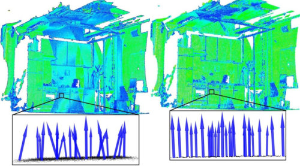
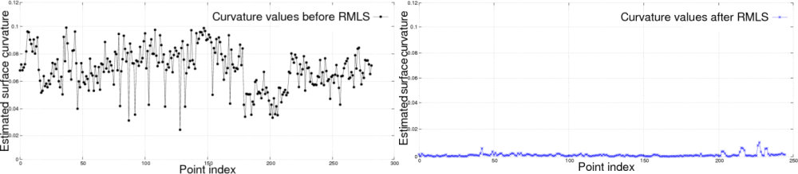
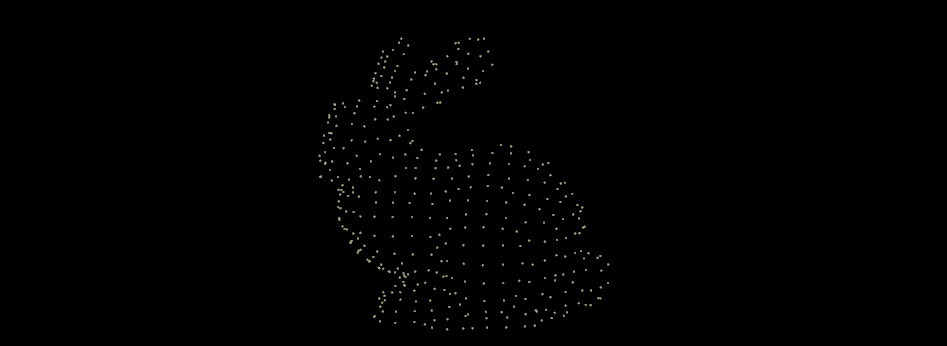
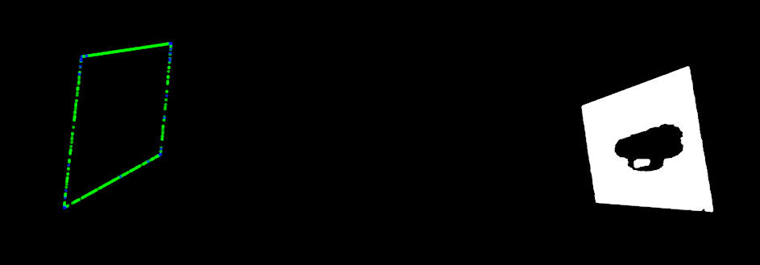

# 基于多项式重构的平滑和法线估计

本教程解释了如何使用移动最小二乘法 (MLS) 表面重建方法来平滑和重新采样噪声数据。请查看以下视频中的示例：

视频：[基于多项式重构的平滑和法线估计](http://www.youtube.com/embed/FqHroDuo_I8?rel=0) 

使用统计分析很难消除某些数据不规则性（由小的距离测量误差引起）。要创建完整的模型，必须考虑数据中的光泽表面和遮挡。在无法获取额外扫描的情况下，解决方案是使用重采样算法，该算法尝试通过周围数据点之间的高阶多项式插值来重新创建表面的缺失部分。通过执行重采样，可以纠正这些小错误，并且可以平滑因多次扫描配准而导致的“双壁”伪影。



在上图的左侧，我们看到了由两个配准点云组成的数据集中的效果或估计表面法线。由于对齐错误，产生的法线是嘈杂的。在右侧，我们看到在使用移动最小二乘算法平滑后，同一数据集中的表面法线估计的效果。绘制每个点的曲率作为重采样前后特征值关系的度量，我们得到：



为了近似由点**p1**、**p2** ... **pk**在点**q**处的局部邻域定义的表面 ，我们使用在稳健计算的参考平面上定义的二元多项式高度函数。

视频： [通过重采样去除噪声数据](http://www.youtube.com/embed/N5AgC0KEcw0?rel=0) 

## 代码

见[01_resampling.py](./01_resampling.py)

```python
import pclpy
from pclpy import pcl
import numpy as np

if __name__ == '__main__':
    # 加载点云数据
    cloud = pcl.PointCloud.PointXYZ()
    if pcl.io.loadPCDFile('../../data/bun0.pcd', cloud) < 0:
        print('Error loading model cloud.')
        exit(-1)

    # 创建一个 KD-Tree
    tree = pcl.search.KdTree.PointXYZ()

    # 输出具有PointNormal类型，以便存储ML计算的法线S
    mls_points = pcl.PointCloud.PointNormal()

    # 初始化对象(第二点类型是法线类型，即使未使用)
    mls = pcl.surface.MovingLeastSquares.PointXYZ_PointNormal()

    mls.setComputeNormals(True)

    # 设置参数
    mls.setInputCloud(cloud)
    mls.setPolynomialOrder(2)
    mls.setSearchMethod(tree)
    mls.setSearchRadius(0.03)

    # 重建
    mls.process(mls_points)

    # 保存结果
    pcl.io.savePCDFile('bun0_mls.pcd', mls_points)
```

运行代码后，在01_resampling.py同级文件夹下，应该就会看到保存的*bun0.pcd*文件。

## 说明

现在，让我们一块一块地分解代码。

```python
# 加载点云数据
cloud = pcl.PointCloud.PointXYZ()
if pcl.io.loadPCDFile('../../data/bun0.pcd', cloud) < 0:
print('Error loading model cloud.')
exit(-1)
```

由于示例 PCD 只有 XYZ 坐标，我们将其加载到 PointCloud<PointXYZ>。这些字段对于该方法是必需的，其他字段是允许的并将被保留。

```python
# 初始化对象(第二点类型是法线类型，即使未使用)
mls = pcl.surface.MovingLeastSquares.PointXYZ_PointNormal()
```

第一种模板类型用于输入和输出云。在输出中仅平滑输入的 XYZ 维度。

```python
mls.setComputeNormals(True)
```

如果不需要发现估计，可以跳过这一步。

```python
mls.setPolynomialOrder (2)
```

2阶多项式拟合，注释掉这行能加速平滑。请查阅代码 API ( [:pcl:`MovingLeastSquares `](https://pcl.readthedocs.io/projects/tutorials/en/latest/resampling.html#id1) ) 了解默认值和控制平滑过程的附加参数。

```python
# 保存结果
pcl.io.savePCDFile('bun0_mls.pcd', mls_points)
```

如果法线和原始维度需要在同一点云中，则必须连接字段。

## 运行

运行代码：

```bash
python 01_resampling.py
```

运行代码后，在01_resampling.py同级文件夹下，应该就会看到保存的*bun0_mls.pcd*文件。进入当前文件夹，使用pcl_viewer_release进行可视化：

```bash
pcl_viewer_release bun0_mls.pcd
```

结果:



# 为平面模型构造凹包或凸包多边形

在本教程中，我们将学习如何为平面支持的一组点计算简单的 2D 外壳多边形（凹面或凸面）。

## 代码

需要用到的点云pcd文件： [table_scene_mug_stereo_textured.pcd](https://raw.github.com/PointCloudLibrary/data/master/tutorials/table_scene_mug_stereo_textured.pcd) 或者在data文件夹下可以看到下载好的。

代码见[02_convex_hull_2d.py](./02_convex_hull_2d.py) 

```python
import pclpy
from pclpy import pcl
import numpy as np

if __name__ == '__main__':
    # 加载点云数据
    cloud = pcl.PointCloud.PointXYZ()
    cloud_filtered = pcl.PointCloud.PointXYZ()
    cloud_projected = pcl.PointCloud.PointXYZ()
    if pcl.io.loadPCDFile('../../data/table_scene_mug_stereo_textured.pcd', cloud) < 0:
        print('Error loading model cloud.')
        exit(-1)
    # 滤波
    ps = pcl.filters.PassThrough.PointXYZ()
    ps.setInputCloud(cloud)
    ps.setFilterFieldName('z')
    ps.setFilterLimits(0, 1.0)
    ps.filter(cloud_filtered)
    print('PointCloud after filtering has: ', cloud_filtered.size(), ' data points.')

    coefficients = pcl.ModelCoefficients()
    inliers = pcl.PointIndices()
    # 实例化分割类
    seg = pcl.segmentation.SACSegmentation.PointXYZ()
    # 可选项
    seg.setOptimizeCoefficients(True)
    # 必需设置的参数
    seg.setInputCloud(cloud_filtered)
    seg.setModelType(0)  # 0为pcl::SACMODEL_PLANE
    seg.setMethodType(0)  # 0为pcl::SAC_RANSAC
    seg.setDistanceThreshold(0.01)

    seg.segment(inliers, coefficients)
    print('PointCloud after segmentation has: ',
          len(inliers.indices), ' inliers.')

    # 投影模型内点
    proj = pcl.filters.ProjectInliers.PointXYZ()
    proj.setModelType(0)  # 0为pcl::SACMODEL_PLANE
    proj.setIndices(inliers)
    proj.setInputCloud(cloud_filtered)
    proj.setModelCoefficients(coefficients)
    proj.filter(cloud_projected)
    print('PointCloud after projection has: ',
          cloud_projected.size(), ' data points.')

    # 创建一个凹壳表示投影内点
    cloud_Concavehull = pcl.PointCloud.PointXYZ()
    Concavehull = pcl.surface.ConcaveHull.PointXYZ()
    Concavehull.setInputCloud(cloud_projected)
    Concavehull.setAlpha(0.1)
    Concavehull.reconstruct(cloud_Concavehull)

    print('Concave hull has: ', cloud_Concavehull.size(), ' data points')

    # 创建一个凸壳表示投影内点
    cloud_Convexhull = pcl.PointCloud.PointXYZ()
    Convexhull = pcl.surface.ConvexHull.PointXYZ()
    Convexhull.setInputCloud(cloud_projected)
    Convexhull.reconstruct(cloud_Convexhull)
    print('Convex hull has: ', cloud_Convexhull.size(), ' data points')

    # 可视化
    viewer = pcl.visualization.CloudViewer("viewer")
    # viewer.showCloud(cloud, "sample cloud")
    viewer.showCloud(cloud_projected, "projected cloud")
    viewer.showCloud(cloud_Concavehull, "Concavehull cloud")
    # viewer.showCloud(cloud_Convexhull, "Convexhull cloud")
    while not viewer.wasStopped(10):
        pass
```

## 说明

在下面的代码行中，创建了一个分割对象并设置了一些参数。我们使用SACMODEL_PLANE来分割这个PointCloud，找到这个模型的方法是SAC_RANSAC。实际分割发生在seg.segment (*inliers, coefficients)。此函数将所有内点（在平面上）存储到inliers，并将系数存储到平面(a * x + b * y + c * z = d)中的 coefficients。

```python
coefficients = pcl.ModelCoefficients()
inliers = pcl.PointIndices()
# 实例化分割类
seg = pcl.segmentation.SACSegmentation.PointXYZ()
# 可选项
seg.setOptimizeCoefficients(True)
# 必需设置的参数
seg.setInputCloud(cloud_filtered)
seg.setModelType(0)  # 0为pcl::SACMODEL_PLANE
seg.setMethodType(0)  # 0为pcl::SAC_RANSAC
seg.setDistanceThreshold(0.01)

seg.segment(inliers, coefficients)
```

下一段代码将内点投影到平面模型上并创建另一个点云。我们可以做到这一点的一种方法是仅提取我们之前找到的内点，但在这种情况下，我们将使用我们之前找到的系数。我们设置我们正在寻找的模型类型，然后设置系数，然后将 cloud_filtered 投影到 cloud_projected。

```python
# 投影模型内点
proj = pcl.filters.ProjectInliers.PointXYZ()
proj.setModelType(0)  # 0为pcl::SACMODEL_PLANE
proj.setIndices(inliers)
proj.setInputCloud(cloud_filtered)
proj.setModelCoefficients(coefficients)
proj.filter(cloud_projected)
```

真正有趣的部分在下面几行中，其中创建了 ConcaveHull/ ConvexHull对象并执行了重建：

```python
# 创建一个凹壳表示投影内点
cloud_Concavehull = pcl.PointCloud.PointXYZ()
Concavehull = pcl.surface.ConcaveHull.PointXYZ()
Concavehull.setInputCloud(cloud_projected)
Concavehull.setAlpha(0.1)
Concavehull.reconstruct(cloud_Concavehull)

print('Concave hull has: ', cloud_Concavehull.size(), ' data points')

# 创建一个凸壳表示投影内点
cloud_Convexhull = pcl.PointCloud.PointXYZ()
Convexhull = pcl.surface.ConvexHull.PointXYZ()
Convexhull.setInputCloud(cloud_projected)
Convexhull.reconstruct(cloud_Convexhull)
print('Convex hull has: ', cloud_Convexhull.size(), ' data points')
```


## 运行

运行代码：

```bash
python 02_convex_hull_2d.py
```

结果：

> PointCloud after filtering has:  124554  data points.
> PointCloud after segmentation has:  108616  inliers.
> PointCloud after projection has:  108616  data points.
> Concave hull has:  509  data points
> Convex hull has:  32  data points



图中右侧点云为投影点云，左侧为其凹壳和凸包表示。

# 无序点云的快速三角剖分

本教程解释了如何在具有法线的 PointCloud 上运行贪婪曲面三角剖分算法，以基于局部邻域的投影获得三角形网格。

演示视频：[表面三角测量和点云分类](http://www.youtube.com/embed/VALTnZCyWc0?rel=0) 

## 算法原理

该方法的工作原理是维护一个可以从中生长网格的点列表（“边缘”点）并扩展它直到连接所有可能的点。它可以处理来自一次或多次扫描以及具有多个连接部分的无组织点。如果表面局部光滑并且具有不同点密度的区域之间存在平滑过渡，则效果最佳。

通过沿点的法线投影点的局部邻域并连接未连接的点，在本地执行三角剖分。因此，可以设置以下参数：

- *setMaximumNearestNeighbors(unsigned)*和*setMu(double)*控制邻域的大小。前者定义了搜索的邻居数量，而后者指定了要考虑的点的最大可接受距离，相对于最近点的距离（以适应不断变化的密度）。典型值为 50-100 和 2.5-3（或网格为 1.5）。
- *setSearchRadius(double)*实际上是每个三角形的最大边长。这必须由用户设置，以便允许最大的三角形应该是可能的。
- *setMinimumAngle(double)*和*setMaximumAngle(double)*是每个三角形的最小和最大角度。虽然不能保证第一个，但第二个是。典型值为 10 和 120 度（以弧度为单位）。
- *setMaximumSurfaceAgle(double)*和*setNormalConsistency(bool)*旨在处理存在锐边或拐角以及曲面的两侧彼此非常靠近的情况。为了实现这一点，如果点的法线偏离超过指定的角度，则点不会连接到当前点（请注意，大多数表面法线估计方法即使在锐边处也能在法线角度之间产生平滑过渡）。如果未设置法线一致性标志，则该角度计算为法线定义的线之间的角度（不考虑法线的方向），因为并非所有法线估计方法都可以保证一致定向的法线。通常，45 度（以弧度为单位）和 false 适用于大多数数据集。

请参阅下面的示例，您可以查阅以下论文及其参考资料以了解更多详细信息：

```bash
@InProceedings{Marton09ICRA,
  author    = {Zoltan Csaba Marton and Radu Bogdan Rusu and Michael Beetz},
  title     = {{On Fast Surface Reconstruction Methods for Large and Noisy Datasets}},
  booktitle = {Proceedings of the IEEE International Conference on Robotics and Automation (ICRA)},
  month     = {May 12-17},
  year      = {2009},
  address   = {Kobe, Japan},
}
```

## 代码

见[03_greedy_projection.py](./03_greedy_projection.py)

```python
import pclpy
from pclpy import pcl
import numpy as np

if __name__ == '__main__':
    # 加载点云数据
    cloud = pcl.PointCloud.PointXYZ()
    if pcl.io.loadPCDFile('../../data/bun0.pcd', cloud) < 0:
        print('Error loading model cloud.')
        exit(-1)

    # 法线估计 normals不包含点，只包含法线+曲面曲率
    ne = pcl.features.NormalEstimation.PointXYZ_Normal()
    normals = pcl.PointCloud.Normal()
    tree = pcl.search.KdTree.PointXYZ()
    tree.setInputCloud(cloud)
    ne.setInputCloud(cloud)
    ne.setSearchMethod(tree)
    ne.setKSearch(20)
    ne.compute(normals)

    # 连接XYZ 和 normal 字段
    cloud_with_normals = pcl.PointCloud.PointNormal(np.hstack((
        cloud.xyz, normals.normals, normals.curvature.reshape(-1, 1))))

    # 开始准备贪婪三角化算法
    tree2 = pcl.search.KdTree.PointNormal()
    tree2.setInputCloud(cloud_with_normals)

    gp3 = pcl.surface.GreedyProjectionTriangulation.PointNormal()
    triangles = pcl.PolygonMesh()

    # 设置连接点之间的最大距离(最大边长)
    gp3.setSearchRadius(0.025)
    # 设置参数
    gp3.setMu(2.5)
    gp3.setMaximumNearestNeighbors(100)
    gp3.setMaximumSurfaceAngle(np.pi / 4)  # 45 degrees
    gp3.setMinimumAngle(np.pi / 18)  # 10degrees
    gp3.setMaximumAngle(2 * np.pi / 3)  # 120 degrees
    gp3.setNormalConsistency(False)

    # 获取结果并保存
    gp3.setInputCloud(cloud_with_normals)
    gp3.setSearchMethod(tree2)
    gp3.reconstruct(triangles)

    save = pcl.io.saveVTKFile('bun0_gp3.vtk', triangles)

    # 顶点信息
    parts = pcl.vectors.Int()
    states = pcl.vectors.Int()
```

你可以在data文件夹下找到的输入文件bun0.pcd

## 说明

现在，让我们一块一块地分解代码。

```python
# 加载点云数据
cloud = pcl.PointCloud.PointXYZ()
if pcl.io.loadPCDFile('../../data/bun0.pcd', cloud) < 0:
    print('Error loading model cloud.')
    exit(-1)
```

由于bun0.pcd只有 XYZ 坐标，我们将其加载到 PointCloud< PointXYZ >。

```python
# 法线估计 normals不包含点，只包含法线+曲面曲率
ne = pcl.features.NormalEstimation.PointXYZ_Normal()
normals = pcl.PointCloud.Normal()
tree = pcl.search.KdTree.PointXYZ()
tree.setInputCloud(cloud)
ne.setInputCloud(cloud)
ne.setSearchMethod(tree)
ne.setKSearch(20)
ne.compute(normals)
```

该方法需要法线，因此使用 PCL 的法线估计方法对其进行估计。

```python
# 连接XYZ 和 normal 字段
cloud_with_normals = pcl.PointCloud.PointNormal(np.hstack((
    cloud.xyz, normals.normals, normals.curvature.reshape(-1, 1))))
```

由于坐标和法线需要在同一个 PointCloud 中，我们创建一个 PointNormal 类型的点云

```python
# 开始准备贪婪三角化算法
tree2 = pcl.search.KdTree.PointNormal()
tree2.setInputCloud(cloud_with_normals)

gp3 = pcl.surface.GreedyProjectionTriangulation.PointNormal()
triangles = pcl.PolygonMesh()

# 设置连接点之间的最大距离(最大边长)
gp3.setSearchRadius(0.025)
# 设置参数
gp3.setMu(2.5)
gp3.setMaximumNearestNeighbors(100)
gp3.setMaximumSurfaceAngle(np.pi / 4)  # 45 degrees
gp3.setMinimumAngle(np.pi / 18)  # 10degrees
gp3.setMaximumAngle(2 * np.pi / 3)  # 120 degrees
gp3.setNormalConsistency(False)

# 获取结果并保存
gp3.setInputCloud(cloud_with_normals)
gp3.setSearchMethod(tree2)
gp3.reconstruct(triangles)
```

上面是贪婪三角化的参数设置以及重建，不再赘述，看注释就行。

```python
# 顶点信息
parts = pcl.vectors.Int()
states = pcl.vectors.Int()
```

对于每个点，可以检索包含连接组件的 ID 及其“状态”（即 gp3.FREE、gp3.BOUNDARY 或 gp3.COMPLETED）。

## 运行

运行代码：

```bash
python 03_greedy_projection.py
```

运行代码后，在03_greedy_projection.py同级文件夹下，应该就会看到保存的*bun0_gp3.vtk*文件。进入当前文件夹，使用pcl_viewer_release进行可视化：

```bash
pcl_viewer_release bun0_gp3.vtk
```

结果:


# 将修剪后的 B 样条拟合到无序点云（未完成）

本教程解释了如何在点云上运行 B 样条拟合算法，以获得平滑的参数化表面表示。该算法由以下步骤组成：

- 使用主成分分析 (PCA) 初始化 B 样条曲面。这假设点云有两个主要方向，即它大致是平面的。
- B 样条曲面的细化和拟合。
- B 样条曲线的圆形初始化。这里我们假设点云是紧凑的，即没有分离的集群。
- B样条曲线的拟合。
- 修剪后的 B 样条曲面的三角剖分。

在这段视频中，算法应用于斯坦福兔的正面扫描（204800分）：

[修剪的 B 样条曲面拟合]()

## 理论背景

该算法的理论信息可以在这份[报告](http://pointclouds.org/blog/trcs/moerwald/index.php)和[博士论文](http://users.acin.tuwien.ac.at/tmoerwald/?site=3)中找到。

## PCL安装设置

请注意，默认情况下未启用 NURBS 和 B 样条的模块。通过将其设置为 ON，确保在 ccmake 配置中启用“BUILD_surface_on_nurbs”。

如果您的许可证允许，还可以启用“USE_UMFPACK”以进行稀疏线性求解。这需要更快的 SuiteSparse（Ubuntu 中的 libsuitesparse-dev），允许更多的自由度（即控制点）和更多的数据点。

> 当然，上述式PCL中需要注意的，pclpy中我们暂时不考虑这些

## 代码

pclpy中，尚未完成以下类：

>  pcl::on_nurbs

<font color='red'>故此例程暂无法完成。</font>

